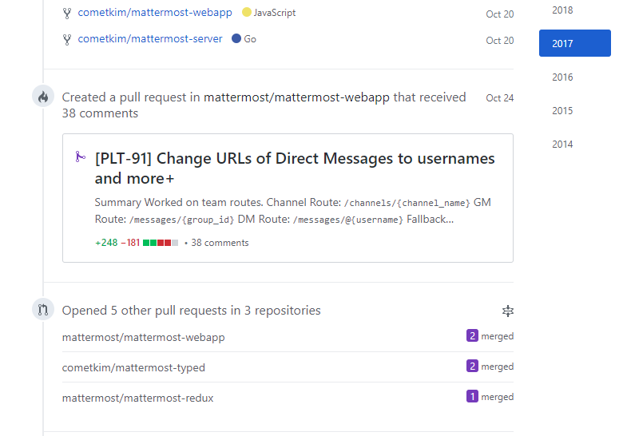
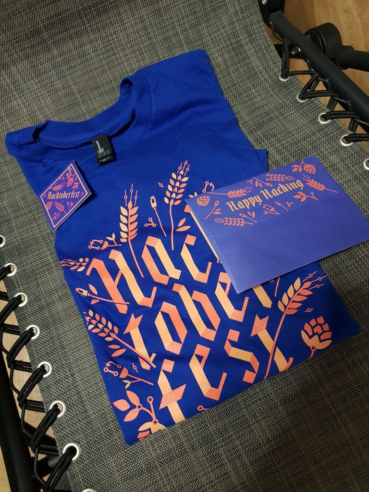
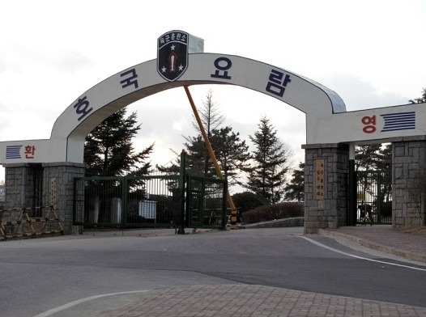

# 2017년을 돌아보며

나는 한 해에 무슨 일들이 있었는지 일일히 기억할 만큼 기억력이 좋지 않다.

회고는 적어 볼 엄두도 못내고 있었는데, 문득 제작년부터 트위터에 의식의 흐름을 풀어놓던게 떠올랐다. 트위터 타임라인을 찬찬히 살펴보니 드문드문 기억이 되살아나는 느낌이들어, 늦었지만 지난 해를 회고해보고자 한다. ~~트위터가 이렇게 이롭습니다~~

> 의식 흘러가는데로 쓰고보니 회고라기 보단 밀려쓰는 일기 같아졌다. 뭐 어쩌겠는가 이렇다 할 데이터 안남긴 내 잘못이지.

2017년의 가장큰 변화는 **자바스크립트**, **리액트**와 친해진 것이다.

그 전 까진 자바스크립트라면 JQuery 밖에 모르던 나는 업무의 일환으로 리액트 코드베이스를 리버싱하는 것을 계기로 리액트에 푹 빠지게 됐다. 그러면서 본격적으로 자바스크립트와 웹도 공부하게 됐으나... 만만한 길은 없다고 했던가, [2016년에 자바스크립트를 배우는 기분](http://www.looah.com/article/view/2054)을 2017년 버전으로 느껴야 했다.

그래도 새로운 모던 자바스크립트(ES6+)를 배우는 것은 매우 즐거웠다. 나는 학교에서 친구들이 C++ 98 스펙으로 프로젝트를 할 때 혼자 모던 C++(11/14) 문법을 파고, 약을 팔러 다녔던 전적이 있는데 왜 항상 이런 쪽으로 빠지는 건지 모르겠다. 깊게 생각해본 적은 없지만 아마 **모던 언어가 제시하는 새로운 패러다임이 시선을 넓혀주는 느낌을 좋아하는 것 같다.**

다만, 관심사가 분산되면서 그 전에 파던 **DevOps/인프라에 대해 소홀해졌다.** 정리해서 남겨둔게 없기 때문에 언제 다시 파보나 하는 불안감이 있다.

어쨋든 계기가 되준 **오픈소스 프로젝트에는 간간히 기여를 했다.**

이슈 리포팅, 번역, 문서화, PR등 조금씩 해보다가 내 힘으로 "첫 삽"을 떠보고 싶다는 욕심에 **[NPM 모듈](https://npm.im/mattermost-typed)도 올려보았는데** 생각보다 주목받지 못한데다가 이 후엔 누가 중복작업을 하고있었다. **여럿이면 뭘하던 커뮤니케이션이 가장 중요한 것 같다.**

어쨋든 별거 아닌 것 같던 내 자그마한 기여로 멋진 티셔츠까지 얻었다.

이쁘다 ㅎㅎ Mattermost는 아니고 Hacktoberfest에 신청해서 받은거긴 하지만 PR은 전부 Mattermost 관련이였으니까, 그리고 Mattermost 머그컵이랑 티셔츠는 이미 제작년에 다 받아버렸으니까. (그런데 겨울이라 반팔티는 못입고 그렇다고 여름에 10월이 테마인 티셔츠 입는 것도 뭔가 이상하다)

이것저것 해보는 와중에 11월이 되었고, 길게 묶었던 머리를 자르고 **훈련소에 4주간 다녀왔다.** 4주내내 수면부족과 허리통증에 시달렸다. 사격훈련은 나름 재밌었다. 동기 분대원들은 모두 좋은 사람들이였지만, 공통관심사가 거의 없어 사회에서 계속 연락하진 않는다. 사실 **이해관계나 관심사 제쳐두고 친구를 만들 수 있으면 좋겠지만 쉽게 그러지 못하는 성격이라 아쉬울 따름이다.**

## 일 얘기는...

아껴두는게 좋겠지만 까먹을지도 모르니까 조금은 적어놔야겠다.

한 가지 확고해진건, **개발자가 되고싶다**라는 생각.

솔루션 회사에 다니면서 내가 이해하고 있던 업무는 어떠냐하면, 그래도 "문제가 생기면 해결하면 된다"는 것이다. 접근 방식은 아무래도 리버스 엔지니어링에 가깝기 때문에 개발자의 그것과는 거리가 있지만, 어쨋든 문제해결 자체에 성취감을 느끼니까, 개발은 취미로 계속하면 되니까 상관없다고 생각했다.

그런데 내가 "문제 해결"을 계속할 수록 뭔가 어긋나는 느낌이 들었다. 아무도 문제가 터지기 전까진 내 생각(직접 Best Practice를 만들어 제공하는 것)에 동의해주지 않았다. 회사의 비즈니스는 철저하게 "영업"이였고, 내가 고객의 문제를 고민하는 것은 회사 입장에선 아무 득도 안되는 재능기부로 보이는 듯 하다.

어쨋든 문제 해결의 일환으로 코드를 자주 만지다 보니까 이제 팀에선 개발자로 불리지만, 사실 내 업무는 해킹이지 개발은 결코 아니다. 남는시간에 개발 공부한다고 해서 내가 어디가서 개발자라고 자처할 수 있을까?

# 2018년엔 뭘할까

이 글을 쓰고 있는 시점에서 벌써 3월이 되었다. 해보고 싶은 건 많은 듯 하면서도 아직 이렇다할 성과가 없는데, 한 번 확실하게 목록을 정리할 필요가 있는 것 같다.

지금 주어진 업무를 계속해도 만족스러운 이력은 안남는다. 그렇담 훌륭한 신입 개발자가 되기 위해선, 뭘 해야할까?

## 블로깅

요새 한창 GatsbyJS로 블로그를 만들고 있다. 직접 만드는 것도 좋지만 사용하지 않으면 의미가 없다.

대략 **2주에 한 번은 포스팅**하는 걸로 목표를 잡아보자.

## 오픈소스

내게 영향을 준건 8할이 오픈소스이다. 나도 오픈소스에 뭔가 공헌해야 바람직하다. 훌륭한 기회를 주었던 Mattermost에 기여가 많이 뜸해졌는데 이참에 바로잡아야겠다.

- 한국어 번역 100%
- Help Wanted 이슈 10개 이상 닫기
- 3rd-party 기여 1개 이상
- 한국에 Mattermost 홍보하기

그리고 이왕이면 다른 오픈소스 프로젝트에도 한 번 참여해보고 싶다.

## 더 깊게, React / React Native

역시 현업 프로그래머분들이라 그런가 리액트로 앱하나 뚝딱 만드시는 것들을 볼 때마다 놀라곤 한다. 리액트에 대해 어느정도 안다고 생각하다가도, 나는 한 번도 저런 생산성을 가져본 적 없다는 사실에 좌절한다.

문서와 업데이트를 열심히 보는 것도 좋지만, 진짜 서비스를 만들어봐야 겠다.

- 리액트 기반으로 서비스 하나 이상
- 리액트 네이티브 앱 하나 이상

## 사이드 프로젝트
리액트 관련 외에도 몇 가지 사이드 프로젝트 생각하던게 있는데 다 할 수 있을진 모르겠지만 일단 올해 목표로 적어둬야 겠다.

- **Windows 내장 Sticky Notes 부가기능**: 예전에 이거 쓰다가 너무 불편한데 다른 앱 깔기 싫어서 하던 프로젝트가 있다. 하다 말았는데 아무래도 완성해보고 싶은 주제 중 하나이다.
- **WebGL 2D Game Framework**: 학교에서 게임 개발 공부할 때 2D만 팠다. GDI+로 한 번, DX9으로 한 번, cocos2d-x로 한 번. WebGL 공부하는 겸 2D게임 프레임웍 한 번 만들어보면 어떨까. 놀랍게도 아직 최신문법을 사용하는 프레임웍은 찾아보기 어렵다. TypeScript로 만들어보면 좋을 것 같다.

## 새로운 프로그래밍 언어

- **Go**: 지금도 살짝살짝 보고 있긴한데 엄청 만족스럽다. 생산성이 나오는 수준까지 파보려고 한다.
- **함수형 언어 1개**: 아예 Haskell을 파보거나 아니면 Elm, ReasonML 같은 JavaScript Interop이 지원되는 언어 중에서 하나 파볼 생각이다.

## 네트워킹

이 때까진 너무 히키코모리로 지냈지만 기회는 집밖에 있으니까, 좀 밖에도 돌아다니고 해야겠다.

개발자가 있는 **모임에 참석**해서 지식도 전수받고, 혹시 내가 공유할 수 있는게 있다면 공유하면서.
