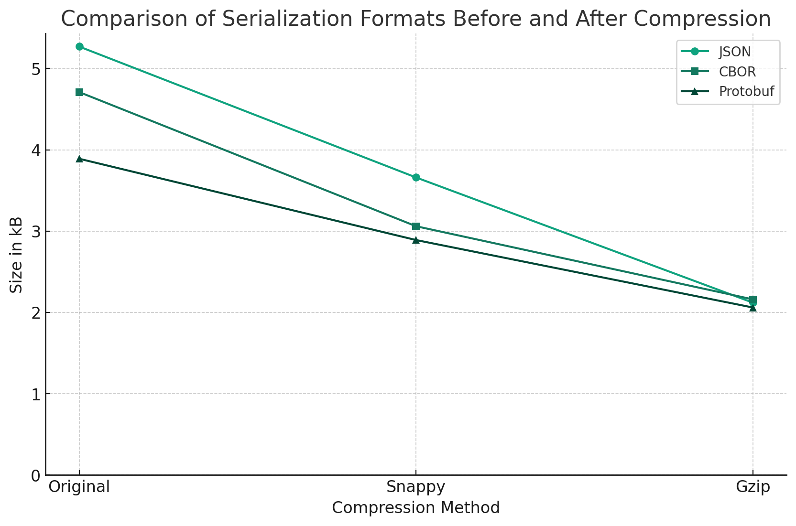

다양한 시스템에서 데이터를 다룰 때 내용물을 더 작은 용량으로 보관/전송하기 위해 컨텐츠를 압축(Compression)하는 것이 일반적입니다.
일상적으로 접하는 미디어 파일부터, 데이터베이스 시스템, 웹 서비스까지 압축 기술이 적용되지 않는 곳을 찾는게 더 어렵습니다.

웹 서버에서도 응답 압축을 적용하는 것 만으로 트래픽 비용이 70%까지 감소하는 등 적용 시 영향도가 매우 큰 편입니다. 그럼 뭐든지 다 압축하면 좋을까요? gzip을 쓰면 될까요? 그렇게 쉽지는 않습니다.

제가 압축 기술 전문가는 아니지만 한 번 알아본 것들을 어딘가 적어두면 나중에 재탐색이 수월해질 것 같아 글로 남깁니다.

**면책조항**: 이 글은 어디까지나 판단에 앞서 도움되는 배경지식을 제공하기 위한 목적으로만 작성되었습니다. 이 글의 내용은 직접 수행한 벤치마크를 포함하지 않으며 "가장 좋은 압축 방식"을 소개하지도 않습니다. 적절한 압축 기술은 대상 컨텐츠의 형식, 시스템 아키텍처, 장치 사양 등 상황에 따라 매우 달라질 수 있습니다. 모든 기술이 그러하듯 압축 적용 전에는 반드시 실제 상황에 가까운 벤치마크가 선행되어야하고, 또 어울리지 않는 곳에 일률적으로 적용하는 것을 피해야 합니다.

## 손실 압축 vs 비손실 압축

컨텐츠를 압축할 때 내용물을 손실을 감수하느냐 여부로 손실(Lossy) 압축과 비손실(Loss-less) 압축으로 구분할 수 있습니다.

컨텐츠 중에서도 시각과 청각에 의존하게 되는 이미지, 오디오, 비디오 같은 미디어 컨텐츠는 잘 알려진 인간의 인지적 한계를 응용하여 불필요한 정보를 버리는 손실 압축 방식을 선택합니다.

반면 부호(code)인 텍스트나 기계들이 주고받는 데이터에서는 작은 손실도 의미를 손상시킬 수 있기 때문에 비손실 압축 방식을 선택합니다. 비손실 압축은 데이터의 일부를 대치하는 등 여러 기법으로 표현을 바꾸고, 사용하는 쪽에서 다시 원래의 표현으로 복원합니다.

당연하게도 비손실 압축이 더 범용적이며, 형식을 가리지 않고 널리 활용되고 있습니다. 손실 압축에 사용되는 기법도 파고들면 굉장히 흥미로운 주제이나, 이 글에서는 비손실 압축을 위주로 다뤄보도록 하겠습니다.

## 비손실 압축 형식 살펴보기

압축 과정에서 인코딩/디코딩의 속도와 결과물을 압축비율은 트레이드오프 관계이며 상황에 따라 필요한 선택이 달라질 수 있습니다.

또한 압축 형식이 얼마나 오래/널리 사용되었냐에 따라 생기는 이식성의 차이도 주요한 고려사항입니다. 현대적인 알고리듬일 수록 성능이 더 좋지만 이식성이 떨어지는 경향이 있습니다. 더 이식성이 높은 형식을 사용하기 위해 오래된 형식을 지원하는 더 최적화된 구현을 만드는 경우도 있습니다. (예시: [pigz](https://github.com/madler/pigz) - 멀티코어를 활용하여 최적화된 gzip 구현)

반드시 어떤 형식이 더 낫거나 빠르다고 단정할 수는 없지만, 잘 알려진 알고리듬/구현체를 살펴보면 탐색에 도움이 됩니다.

### Deflate / Gzip / Zlib

Deflate는 압축 속도와 압축률 사이의 적당한 균형을 추구하는 알고리듬입니다.

[LZ77](https://en.wikipedia.org/wiki/LZ77_and_LZ78)와 [허프만 코딩](https://en.wikipedia.org/wiki/Huffman_coding)이라는 알고리듬을 응용하여, 자주 반복되는 단어를 부호화하는 "동적 사전" 방식을 사용합니다.

관련하여 3가지 파일 형식(Zlib - [RFC 1950](https://datatracker.ietf.org/doc/html/rfc1950), Deflate - [RFC 1951](https://datatracker.ietf.org/doc/html/rfc1951), Gzip - [RFC 1952](https://datatracker.ietf.org/doc/html/rfc1952))을 찾아볼 수 있지만, 무결성 검사 방식 등 사소한 디테일 차이를 제외하면 모두 Deflate(RFC 1951)에서 정의한 방식으로 구현되기 때문에 흔히 "Deflate 알고리듬"으로 통칭됩니다.

이 3가지 형식을 지원하는 [zlib](https://www.zlib.net/)이라는 레퍼런스 구현체가 가장 보편적으로 쓰입니다.

용어가 헷갈릴 수 있는데 정리해보자면,

- 압축 방식 (알고리듬): Deflate
- 압축 형식 (포맷): Zlib(거의 안쓰임), Gzip(가장 널리 쓰임), Deflate
- 레퍼런스 (구현): zlib

레퍼런스 구현체인 zlib은 다양한 언어 런타임/웹 서버 등에 기본적으로 탑재되어 있어, 오늘날 HTTP 기반 대부분의 인프라가 zlib에 의존한다고 봐도 무방할 정도로 보편적입니다. (Node.js 표준 API 중 압축 관련 유틸리티가 `node:zlib`이라는 이름으로 제공되는 이유도 대부분 zlib의 바인딩이기 때문입니다)

zlib은 속도와 압축률을 조정할 수 있도록 1(가장 적게 압축하지만 빠름)부터 9(가장 많이 압축하지만 느림)까지 압축 수준(Compression Level) 옵션을 제공합니다. 압축 수준이 올라갈 수록 압축률이 완만하게 높아지는 대신 속도가 가파르게 떨어지기 때문에 둘 사이의 비율을 보며 상황에 맞춰 적절한 압축 수준을 선택하는 것이 필요합니다.

널리 쓰이는 아카이빙 포맷인 ZIP, 미디어 포맷인 PNG의 압축에도 Deflate 알고리듬이 쓰입니다. 이처럼 Deflate는 대중적이면서도 오래되었기 때문에 많은 환경에서 기본적으로 탑재되어 이식성이 뛰어나다는 장점이 있습니다.

### Brotli

[Brotli](https://github.com/google/brotli)([RFC 7932](https://datatracker.ietf.org/doc/html/rfc7932))는 구글에서 공개한 웹 에셋 최적화된 압축 형식입니다. 마찬가지로 구글에서 공개한 [WOFF2 웹 폰트 형식의 내부 데이터를 위한 압축 기술로 처음 소개](https://developers.googleblog.com/2015/02/smaller-fonts-with-woff-20-and-unicode.html)되었습니다.

Deflate와 마찬가지로 LZ77과 허프만 코딩을 사용합니다. Brotli는 여기에 컨텍스트 모델링이라는 기법과 개선된 사전 기술을 결합합니다.

Brotli는 기존 LZ77에서 사용되는 창(sliding window) 크기를 대폭 키워(최대 16MB) 효율을 개선합니다. 그리고 자주 사용되는 선별된 단어들을 포함한 "정적 사전"을 추가로 사용하여, 작은 페이로드처럼 컨텍스트가 부족한 상황에서의 압축 효율도 개선했습니다.

이런 특징들로 인해 Brotli는 인코딩/디코딩에 필요한 자원 소모량이 일반적으로 Gzip보다 크지만 평균 압축률이 더 뛰어나다는 장점이 있습니다. 특히 정적 사전 덕분에 HTML, CSS, JavaScript, JSON 등 웹에서 쓰이는 형식을 잘 지원하고 작은 페이로드에서도 어느 정도의 품질을 보장합니다.

zlib과 마찬가지로 압축 수준을 조정할 수 있으며 조금 더 세분화된 1–11 값을 제공합니다.

### LZMA

UNIX 계열에서 XZ라는 형식과 7-Zip 프로그램의 7z 형식에서 사용되는 [LZMA](https://en.wikipedia.org/wiki/Lempel%E2%80%93Ziv%E2%80%93Markov_chain_algorithm)라는 알고리듬도 있습니다. 전송 계층에선 거의 사용하지 않지만, 비교를 위해 언급해보겠습니다.

LZMA는 인코딩/디코딩에 더 큰 비용이 들지만 Deflate 보다 더 큰 압축률을 보입니다. 이런 특성에 따라 파일 아카이빙이나 일회성 전송을 목적으로 주로 사용됩니다. (e.g. `*.tar.xz`)

### LZO

반대로 빠른 속도에 중점을 둔 압축 방식도 있으며 대표격으로 [LZO](https://en.wikipedia.org/wiki/Lempel%E2%80%93Ziv%E2%80%93Oberhumer) 알고리듬이 있습니다. 뒤에서도 언급하겠으나 인코딩/디코딩 속도를 높이거나 CPU/메모리 자원을 아끼는 것이 더 주요할 때도 있습니다.

LZO는 Deflate에 비하면 압축 비율이 매우 떨어지는 편이지만(통상 gzip으로 60~70% 압축할 때 20~30% 만 압축됨), 매우 빠른 인코딩/디코딩 속도를 제공합니다.

LZO는 zlib만큼 오래되었고 널리 사용되기 때문에 다양한 플랫폼에 기본적으로 탑재되어 이식성이 뛰어나다는 장점이 있습니다.

### Snappy

[Snappy](https://github.com/google/snappy)는 구글에서 공개한 압축 라이브러리로 LZO와 마찬가지로 빠른 속도를 위해 최적화되어 있습니다. 구글 내부에서 사용하는 Bigtable이나 LevelDB의 내부 데이터 압축을 위해 사용된다고 알려져 있습니다.

### LZ4

[LZ4](https://github.com/lz4/lz4)는 데이터 압축 전문가인 [Yann Collet](https://github.com/Cyan4973)이 개발한 고속 압축 알고리듬/라이브러리입니다. LZO나 Snappy와 마찬가지로 Deflate 대비 압축률이 많이 떨어지지만 인코딩/디코딩 성능만큼은 알려진 구현체 중 가장 빠른 편에 속합니다. 멀티코어에 최적화된 구현으로 추가 자원을 써서 속도를 더욱 가속할 수도 있습니다.

앞서 소개한 LZO와 Snappy보다 대체로 뛰어난 퍼포먼스를 보여주기에 인코딩/디코딩 성능이 중요한 다양한 데이터 시스템의 압축 형식으로 자주 채택됩니다.

### Zstandard

[Zstandard](https://facebook.github.io/zstd/)(줄여서 zstd, [RFC 8788](https://datatracker.ietf.org/doc/html/rfc8878))는 Meta(구 Facebook)에서 공개한 현대적인 비손실 압축 알고리듬입니다. LZ4와 같은 저자(Yann Collet)가 Mercurial의 내부 데이터 압축을 위해 개발했습니다.

허프만 코딩과 FSE(Finite-State Entropy)라는 기법을 결합해서 사용하여 Deflate, Brotli와 마찬가지로 균형잡힌 압축/속도 비율을 추구하면서도, 더 빠른 속도와 더 높은 압축률을 제공합니다.

웹 환경에서 널리 쓰이는 Brotli보다도 나은 압축률을 보여주면서 단일 스레드에서의 인코딩/디코딩 속도가 더 빠릅니다. (창 크기에 따라 달라질 수 있지만 Brotli는 일반적으로 고정된 값을 씁니다)

그 밖에도 다양한 기능들을 제공하고 있습니다.

- 훨씬 더 세분화된 1–22 사이의 압축 수준을 제공합니다. (기본값: 3)
- 학습된 사전(Pre-trained Dictionary) 기능을 제공합니다. 실제 프로덕션 데이터를 학습시켜서 환경에 최적화된 정적 사전을 사용할 수 있습니다.
- 자체적으로 멀티스레드 인터페이스를 제공합니다. 사용자 측에서 코드를 작성하지 않고도 리소스를 투자해 더 나은 성능을 얻을 수 있습니다.

Zstandard는 특별한 목적에서 사용되는 LZ4와 다르게 일반적인 시나리오에서 zlib과 Brotli를 압도하기 때문에 굉장히 주목받고 있습니다.

웹 생태계에서도 이를 지원하기 위한 움직임이 있으며 [Chrome 버전 123부터 공식적으로 지원](https://chromestatus.com/feature/6186023867908096)됩니다. 기본적으로 Brotli 보다 선호되기 때문에 앞으로 다양한 웹 서버나 CDN도 발맞추어 지원을 추가하게 될 것으로 보입니다.

## HTTP와 압축

데이터 압축은 다양한 시스템에서 보편적으로 다뤄집니다. 가장 널리 쓰이는 전송 프로토콜인 HTTP는 컨텐츠 압축을 기본 기능으로 탑재하고 있습니다.

### HTTP 컨텐츠 협상과 압축

HTTP는 웹을 포함한 다양한 에이전트를 지원하기 위해 "컨텐츠 협상(Content Negotiation)"이라는 메커니즘을 제공하며, 본문 압축도 이런 메커니즘을 기반으로 동작합니다.

먼저 클라이언트가 선호하는 압축 형식을 요청 헤더에 `Accept-Encoding` 필드로 명시하면, 그 중 서버가 지원하는 형식을 결정해서 사용하고 응답 헤더에 `Content-Encoding` 필드로 명시합니다.

컨텐츠가 이미 오리진에서 압축되어 `Content-Encoding` 헤더를 명시하고 있는 경우 CDN 같은 중간 노드에서는 추가적인 압축을 진행하지 않습니다 (물론 벤더에 따라 트랜스코딩을 기능으로 지원할 수도 있습니다)

### End-to-End vs Hop-by-Hop 압축

오늘날의 웹은 단일 서버에 바로 연결하기 보다 수많은 중간 서버(리버스 프록시, CDN 등)를 경유합니다.

컨텐츠 협상에 사용되는 `Accpet-*`, `Content-*` 헤더들은 일반적으로 네트워크의 말단에 해당하는 사용자 에이전트와 오리진 서버에서 결정되기 때문에 End-to-End 헤더라고 부릅니다. `Content-Encoding` 헤더도 이런 E2E 헤더 중 하나입니다.

간혹 홉 사이에서만 컨텐츠를 압축해서 전송하는 경우가 있는데 이 때 사용하는 전용 헤더가 `TE`(Accept-Transfer-Encoding)와 `Transfer-Encoding`와 같은 Hop-by-Hop 헤더입니다. 사용하는 방식은 `Accept-Encoding`, `Content-Encoding` 쌍과 동일하지만 다른 맥락과 무관하게 홉 사이에서 필요한 부분만을 추가 명시하는 목적입니다.

오늘날 거의 사용되지 않지만, 혹시나 사용을 검토하더라도 여러 주의가 필요합니다.

- 컨텐츠가 이미 압축되어 있는 경우(Content-Encoding 헤더 있음) 전송 구간에서 추가적으로 압축을 진행하는 것을 피해야합니다.
- HTTP/2와 HTTP/3는 자체적인 데이터 스트리밍 메커니즘을 가지고 있어 `Transfer-Encoding` 헤더와 호환되지 않습니다. 함께 사용하는 경우 명시적인 프로토콜 에러가 발생하기 때문에 프록시에서 이를 다루는 경우 유의해야 합니다.

중간에 프로그램이 응답을 변경하는 경우도 있습니다. 응답을 읽지 않으면 문제가 없지만 응답을 읽는 경우 반드시 압축을 먼저 해제하고 처리 후 다시 압축해야 합니다. 경로에서 재압축이 반복적으로 수행되는 것은 비효율적이므로 네트워크 비용에 문제가 없다면 압축 적용을 앞쪽으로 미루는 것도 검토해볼 수 있습니다.

불가피하게 재압축을 하더라도 스트리밍 처리가 된다면 응답시간에 큰 영향이 없을 수 있습니다. 하지만 컨텐츠를 버퍼링 해야하는 경우 압축 해제를 대기해야하므로 지연시간이 더 커질 수 있습니다.

### `Content-Type` 헤더와 CDN 압축

모든 형식에 압축이 유효한 것이 아니기 때문에 압축을 결정하기 전 형식 정보가 반드시 필요합니다.

하지만 컨텐츠를 제공하는 원본(Origin)이 아닌 측에서는 원본은 형식을 유추(inspect)할 수 있는 방법이 제한됩니다. 그러므로 원본이 아닌 위치에서 압축을 적용하려는 경우, 원본은 컨텐츠의 MIME 정보를 `Content-Type` 헤더로 제공해야 합니다.

정확한 `Content-Type`이 없을 때 사용할 수 있는 대안들이 있지만 부정확하거나 비효율적일 수 밖에 없다는 점을 인지하고 있어야 합니다.

- 경로에 파일명이 포함된 경우 파일 확장자로부터 유추한다.
- 미리 정의된 경로별 배포 정책을 바탕으로 유추한다.
- 본문 데이터(헤더, 매직넘버 등)를 읽어 유추한다.

파일 확장자나 `Content-Type`이 있더라도 그다지 널리 쓰이지 않거나 새로운 형식인 경우 프로그램의 맥락이 부족할 수도 있습니다. 연관 시스템을 운영할 때 MIME 목록을 직접 관리하여 프로그램 맥락에 전달하는 것이 좋습니다.

그 예시로, AWS CLI는 Python의 mimetypes 패키지를 사용해 MIME을 유추하는데, 이 패키지는 몇 가지 하드코딩된 목록을 제외한 정보는 모두 실행환경의 `/etc/mime.types` 파일에서 불러옵니다.

https://github.com/python/cpython/blob/3.12/Lib/mimetypes.py#L396-L595

시스템에서 AWS S3 호스팅 기능을 사용하고 AWS CLI로 파일을 업로드 하는 경우, 이 `/etc/mime.types` 파일을 제공하지 않으면 응답의 `Content-Type` 헤더가 폴백인 `application/octet-stream`으로 결정되어 다른 클라이언트에서 의도치 않은 동작을 유발할 수 있으므로 주의해야 합니다.

`/etc/mime.types` 파일 예시:

```
# 미디어 파일 타입
image/webp    webp
image/avif    avif
vedio/webm    webm

# 웹 폰트 파일 타입
application/x-font-truetype    ttf           # (IANA: March 2013)
application/x-font-opentype    otf           # (IANA: March 2013)
application/font-woff2         woff2         # (W3C W./E.Draft: May 2014/March 2016)
application/font-woff          woff          # (IANA: January 2013)

# 웹 앱 매니페스트 확장
application/manifest+json      webmanifest   # (W3C W./E.Draft: May 2015)

# 웹어셈블리 파일
application/wasm               wasm
```

원본에 정확한 `Content-Type` 헤더가 있으면 AWS CloudFront, Cloudflare 같은 CDN 서비스가 이를 바탕으로 본문의 압축 적용 여부를 결정합니다. (이미 `Content-Encoding` 헤더가 있거나 본문 크기가 매우 작은 경우 생략합니다)

- https://docs.aws.amazon.com/AmazonCloudFront/latest/DeveloperGuide/ServingCompressedFiles.html#compressed-content-cloudfront-file-types
- https://developers.cloudflare.com/speed/optimization/content/brotli/content-compression/

만약 특정 응답에 압축이 적용되지 않는다면, 경로 규칙을 수정하여 강제로 압축을 적용할 수 있습니다.

### HTTP 헤더 압축

앞에 설명한 압축은 HTTP 본문(Body)을 통해 주고받는 컨텐츠에 적용됩니다. 그런데 HTTP에서는 본문 말고도 꽤 많은 메타데이터를 HTTP 헤더를 통해 주고 받습니다.

HTTP는 여러 차례 여러차례 프로토콜이 개선되었습니다. HTTP/1.1, [HTTP/2(RFC 9113)](https://datatracker.ietf.org/doc/html/rfc9113), [HTTP/3(RFC 9114)](https://datatracker.ietf.org/doc/html/rfc9114) 3가지는 모두 HTTP 의미론과 호환되지만 세부적인 구현에는 큰 차이가 있습니다. HTTP/2와 HTTP/3가 기존 HTTP/1.1 대비 개선된 점 한가지가 바로 **전송 시 HTTP 헤더의 압축 여부**입니다.

HTTP/2는 [HPACK(RFC 7541)](https://datatracker.ietf.org/doc/html/rfc7541)이라는 필드 압축 기술을 이용헤서 HTTP 헤더를 압축합니다. HPACK은 Deflate 알고리듬을 그대로 사용하던 SPDY의 잠재적인 보안 위협(뒷부분에서 추가로 설명)을 완화하기 위해 특별히 설계되었으며, HTTP 헤더를 위한 정적 사전을 가지고 있어 헤더 내용을 보다 효율적으로 압축할 수 있습니다.

HTTP/3는 [QPACK(RFC 9204)](https://datatracker.ietf.org/doc/htmlsasaasasqqrfc9204)이라는 필드 압축 기술을 사용합니다. HPACK 구현 상 발생할 수 있는 HOL(Head-of-Line blocking) 문제를 완화하기위해 개선된 버전입니다.

## 와이어 형식과 압축

시스템은 전송 계층에서 데이터를 주고 받기 전에 사용할 수 있는 형식(Wire Format)으로 데이터를 직렬화(Serialization)해야 합니다.

이 때 사용하는 형식들이 데이터를 어떻게 표현하는지, 또는 어떻게 사용되는지에 따라 앞서 소개한 범용 압축 알고리듬들의 적용 가능성과 효율이 달라집니다.

일반적으로 텍스트 기반 형식이 바이너리 기반에 비해 압축이 잘 된다는 인상이 있으나 반드시 그렇지는 않습니다. 실제로는 데이터가 어떤식으로 패킹되어 있는지, 컨텐츠 자체의 엔트로피가 어떤지의 영향을 크게 받습니다.

바이너리 형식이더라도 특별히 패킹되지 않은 raw 바이트열 이라면 같은 내용의 텍스트와 동일한 수준의 압축이 가능하고, 반대로 텍스트 형식이더라도 의미 없는 해시값이나 전체 바이트열을 다시 패킹하는 Base64 문자열 등에 대해서는 대부분의 압축 알고리듬이 잘 동작하지 않습니다.

추가로 컨텐츠 자체와 형식 부분의 압축 적용 비중을 별도로 따져보는 것이 좋습니다. 몇 가지 대표적인 전송 형식을 예로 들어보겠습니다.

### XML / JSON

일반적으로 텍스트 기반 직렬화 형식은 압축 효율이 높은 편입니다. 구조를 표현하기 위해 반복적인 텍스트 패턴을 사용하고, 전체에서 이런 부분의 비중이 높은 편이기 때문입니다.

특히 열린 태그와 닫힌 태그가 반복적으로 나타나는 XML은 압축을 적용했을 때 그 효과가 큰 편입니다. XML을 형식을 따르는 HTML, SVG 같은 형식 또한 마찬가지 입니다.

JSON의 구조는 XML보다는 컴팩트하게 표현되기 때문에 다소 효율이 떨어집니다. 하지만 데이터에 포함되는 일반 텍스트들은 여전히 압축의 영향을 크게 받습니다.

간단한 테스트를 위해 [JSON Generator](https://json-generator.com/)를 통해 데이터를 생성하고, Gzip과 Snappy 압축을 적용한 후 크기를 비교해보겠습니다.

| Format        | Size    | Comp Ratio |
| :------------ | ------: | ---------: |
| JSON (원본)    | 5.27 kB |       1.00 |
| JSON + Gzip   | 2.17 kB |       0.40 |
| JSON + Snappy | 3.66 kB |       0.70 |

### MessagePack / CBOR

[MessagePack](https://msgpack.org/)과 [CBOR](https://cbor.io/)는 JSON 구조와 (거의) 호환되는 대표적인 바이너리 직렬화 형식입니다. 둘 다 각 데이터 값에 자료형과 길이를 인코딩한 헤더 바이트를 함께 배치하여 추가 스키마 없이 데이터를 표현합니다.

컨텐츠 자체는 거의 변형하지 않으므로 압축률은 큰 차이가 없겠으나, 헤더 정보는 형식 자체에서 이미 압축이 고려하고 있는만큼 추가적인 압축을 적용했을 때 압축률이 떨어집니다. 특히 가변 길이 자료형을 적용하는 경우 더욱 효율이 떨어질 수 있습니다.

앞서 생성한 데이터의 코덱을 CBOR로 변경한 후 비교해보겠습니다.

| Format        | Size    | Comp Ratio |
| :------------ | ------: | ---------: |
| CBOR (원본)    | 4.71 kB |       1.00 |
| CBOR + Gzip   | 2.16 kB |       0.46 |
| CBOR + Snappy | 3.06 kB |       0.65 |

### Protocol Buffers / Flatbuffers / Cap'n Proto

[Protocol Buffers](https://protobuf.dev/)(이하 Protobuf)의 경우 MessagePack과 다르게 자료형이나 길이 정보를 같이 인코딩하지도 않고, 값 자체에도 다양한 패킹 메커니즘(Variable Integers, Zig-Zag Encoding 등)을 사용하기 때문에 추가 압축의 효율이 더욱 떨어지게 됩니다.

마찬가지로 생성했던 데이터를 Protobuf로 재인코딩 후 비교해보겠습니다.

| Format            | Size    | Comp Ratio |
| :---------------- | ------: | ---------: |
| Protobuf (원본)    | 3.89 kB |       1.00 |
| Protobuf + Gzip   | 2.06 kB |       0.53 |
| Protobuf + Snappy | 2.89 kB |       0.74 |

이런식으로 직렬화 형식 자체가 압축을 수행하는 경우, 추가적인 압축의 효율성이 감소하는 것을 볼 수 있습니다.



이런 형식에서는 큰 비용을 들여도 압축률이 크게 개선되지 않기 때문에 Gzip, Brotli 보다 Snappy, LZ4와 같은 고속 압축 알고리듬의 채택이 더 합리적일 수 있습니다.

## 압축을 적용하기 전에

### 시스템 특성 고려하기

네트워크와 디스크 사용량이 시스템의 전체 성능에 병목이 될 수 있는 시스템에서는 다소 처리량을 희생해서라도 압축 비율을 높이는게 나은 선택이 될 수 있습니다. 웹 서버가 LZ4 같은 고속 압축보다 Gzip/Brotli 를 선호하는 것이 대표적인 예시이며, 대부분의 경우 밸런스가 가장 뛰어난 Zstandard가 최선의 선택이 됩니다.

한편 IoT 네트워크 환경처럼 저전력 기기끼리 자체적으로 통신하는 경우를 가정하면 상황이 달라집니다. 네트워크 대역폭은 남아도는데 장치 리소스가 부족합니다. 이럴 때는 기존 형식의 압축 수준을 낮추는 것 보다 오버헤드가 적은 LZ4 같은 것을 선택할 수도 있습니다.

RocksDB 같은 스토리지, Kafka와 같은 메시지 브로커도 시스템의 특성에 따라 적절한 압축 형식을 선택할 수 있도록 Gzip/Brotli/Zstandard 등 다양한 압축 형식을 옵션으로 지원합니다.

마이크로서비스를 구현하는 경우, RPC 통신 구간에서 압축을 적용하는 것은 일반적이지만 다소 주의가 필요합니다. RPC 프레임워크가 직접 압축을 지원하지 않는 경우가 많고 (e.g. Cap'n Proto, gRPC), 와이어 형식이 제공하는 특정 고급 최적화 사례와 호환되지 않을 가능성이 있기 때문입니다 (e.g. FlatBuffers mmap-ing)

바이너리 패킹을 사용하는 대부분의 와이어 형식은 이미 상당히 공간효율적이기 때문에 데이터 내부의 큰 텍스트 필드에만 선택적으로 압축을 적용하는 것이 나을 수도 있습니다. 다만 이 경우 사용자 코드에서 직접 인코딩/디코딩을 추가로 수행해야하기 때문에 코드의 복잡도가 증가하는 것이 단점입니다.

### 구현 품질 검토하기

같은 형식이라고 해서 그 품질이 모두 동등한 것은 아닙니다. 당연하게도 실제 구현체의 품질에 따라 성능이 좋다고 알려진 형식이 기대보다 못할 수도 있고, 반대로 느리다고 알려진 형식도 더 빠르게 사용할 수 있습니다. 심지어 내부 구현이 동일하더라도 (C 라이브러리를 링크하는 경우) 바인딩 방식 때문에 성능이 감소될 수 있습니다.

플랫폼이 탑재하고 있지 않은 형식을 지원해야 하는 경우, 라이브러리의 크기가 앱의 크기를 과도하게 키우거나 시작 시간을 지연시킬 수 있기 때문에 클라이언트에서 더 고려할 것이 많습니다. 경우에 따라 적절한 형식이더라도 더 나은 구현을 탐색하거나 새로운 구현을 만들어 사용하는 것도 함께 검토해야 합니다.

[TypeScript Playground](https://www.typescriptlang.org/play)가 코드 공유와 로컬 스토리지 동기화를 위해 사용하는 [lz-string](https://pieroxy.net/blog/pages/lz-string/index.html) 라이브러리가 그러한 예시 중 하나입니다.

저는 긴 텍스트 데이터가 아닌 작은 메타데이터 구조체를 문자열로 압축하기 위해 [urlpack](https://github.com/daangn/urlpack)이라는 라이브러리를 만들어 사용하기도 했습니다.

### 압축 사전 제공하기

일반적인 압축 알고리듬은 자주 등장하는 단어가 많을 수록 효율이 올라갑니다. 페이로드가 작을 수록 반복되는 요소가 적어 압축 효율이 떨어지게 됩니다.

현대적인 압축 형식은 정적 사전을 미리 준비하여 개선할 수 있지만, 플랫폼에 탑재된 사전은 보편적인 형식에 대해서만 학습되어 있어 실제 제품의 컨텐츠나 API 데이터의 필드는 충분히 예측하기 쉬움에도 정적 사전의 혜택을 받지 못합니다.

Zstandard는 직접 입력한 데이터를 바탕으로 정적 사전을 생성하는 기능을 제공하고 있어, 실제 프로덕션 데이터를 학습시켜서 압축 효율을 크게 개선할 수 있습니다. LZ4도 Zstandard로 생성한 사전을 그대로 사용하는 기능을 제공합니다. 따라서 Zstandard나 LZ4를 사용하는 서버/클라이언트는 미리 학습한 "공유 사전"을 탑재하는 것을 고려해보면 좋습니다.

웹 플랫폼에 Zstandard 지원이 추가됨에 따라 공유 사전을 HTTP를 통해 교환할 수 있는 [Compression Dictionary Transport](https://datatracker.ietf.org/doc/draft-meenan-httpbis-compression-dictionary/) 표준이 실험 단계에 있습니다.

### 보안 고려사항

모든 압축 기술은 본질적으로 중복 감소이기 때문에 정보 엔트로피 감소로 인한 정보 유출 위험이 있습니다.

[CRIME(Compression Ratio Info-leak Made Easy)](https://en.wikipedia.org/wiki/CRIME)과 [BREACH(Browser Reconnaissance and Exflitration via Adaptive Compression of Hypertext)](https://en.wikipedia.org/wiki/BREACH)로 알려진 부채널 공격이 이런 컨텐츠 압축의 특성을 응용합니다.

사용자 입력 데이터와 비밀키(보호 리소스)가 혼합된 데이터를 하나의 페이로드로 압축하는 것은 취약하다고 알려져 있기 때문에 유의하여 화면과 API를 설계해야합니다.

## 레퍼런스

- [Squash Compression Benchmark](https://quixdb.github.io/squash-benchmark/)
- [Results of experimenting with Brotli for dynamic web content - Cloudflare Blog](https://blog.cloudflare.com/results-experimenting-brotli)
- [Compression in HTTP - MDN](https://developer.mozilla.org/en-US/docs/Web/HTTP/Compression)
- [Fast compression: Brotli Zstandard comparative speed performances test](https://peazip.github.io/fast-compression-benchmark-brotli-zstandard.html)
- [고속 압축 알고리즘 비교 테스트: LZO/Snappy/SynLZ/LZ4/QuickLZ/Zlib - Imp on Delphi & C++Builder](http://blog.devquest.co.kr/imp/1168)
