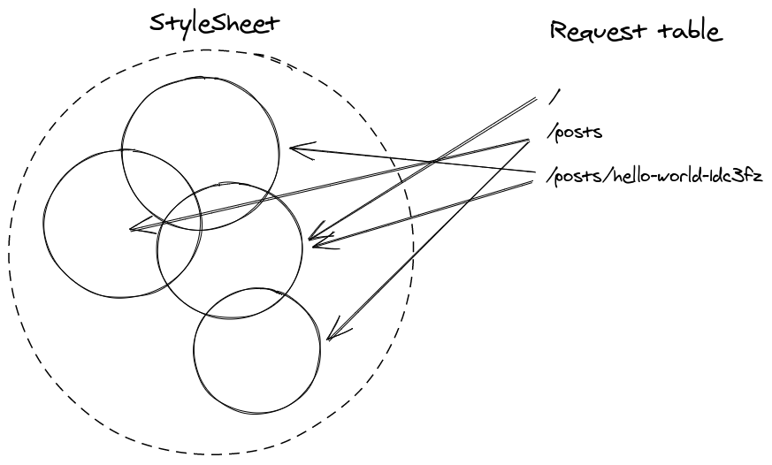

기여하던 [gatsby-plugin-linaria](https://github.com/cometkim/gatsby-plugin-linaria) 프로젝트의 소유권을 최근에 이전 받았습니다.

원 저자인 [Matija Marohnić](https://github.com/silvenon) 가 더 이상 플러그인을 사용하지 않고 다른 기술 스택을 사용하고 있으며, 제가 중간에 대부분의 코드를 새로 작성하면서 이해도 차이가 생기게 되었는데 Matija 가 이 부분을 언급하면서 제게 소유권을 넘겼습니다.

저는 이 프로젝트에 기여하면서 CSS Extraction을 통한 [Critical rendering path](https://developers.google.com/web/fundamentals/performance/critical-rendering-path) 최적화 기법과 이에 따른 trade-off 에 대한 이해도가 높아졌는데 글을 통해 이 부분을 공유해보고자 합니다.

## 기술적인 맥락

설명에 앞서 연관된 프로젝트들 소개를 잠깐 하겠습니다.

### GatsbyJS SSR

GatsbyJS는 이제는 널리 알려진, Jamstack 사이트를 만들기 위한 프레임워크입니다.

Gatsby는 여러가지 놀라운 아이디어를 가지고 있는데 핵심적인 부분 중 하나는 React의 Server-side rendering을 빌드 시간에 딱 한 번 수행하는 것입니다. 이 기법은 [Prerendering 이라고도 불립니다](https://developers.google.com/web/updates/2019/02/rendering-on-the-web).

Gatsby의 플러그인들은 gatsby-ssr.js에서 제공되는 각종 Hooks을 통해 SSR에서 필요한 동작들을 정의합니다.

### Zero-runtime CSS in JS

[Linaria](https://linaria.now.sh/)는 [styled-components](https://styled-components.com/)에서 영감을 받은 아주 유사한 API를 가진 CSS in JS 라이브러리 중 하나 이지만, 특이하게도 **Zero-runtime** CSS in JS 표방하고 있습니다.

Zero runtime? 말 그대로 styled-components 처럼 사용하는데 실제 런타임은 없는 것을 의미합니다. 이게 어떻게 가능한가요?

[문서](https://github.com/callstack/linaria/blob/master/docs/HOW_IT_WORKS.md)에서 설명하는대로 Linaria는 별도의 바벨 플러그인과 웹팩 로더를 통해 사용된 코드를 모두 추출해서 *완전히 정적인* 스타일시트를 생성합니다.

이 전에도 [5 세대까지 구분](https://github.com/streamich/freestyler/blob/master/docs/en/generations.md)이 나뉠 정도로 빠르게 진화해온 CSS in JS 생태계인데, [Astroturf](https://github.com/4Catalyzer/astroturf)와 Linaria가 실현한 Zero-runtime은 이 후 CSS in JS 라이브러리를 선택할 때 고려하는 주요 기능 중 하나로 평가받게 되었습니다.  (그럼 아마 6~7 th generation 쯤 되나요? ㅋㅋㅋ 신경쓰지마세요 아무 의미 없습니다.)

### gatsby-plugin-linaria

gatsby-plugin-linaria는 Linaria를 통합하기 위한 [GatsbyJS](https://www.gatsbyjs.org/) 플러그인 입니다. Gatsby와 CSS in JS 라이브러리, 예를 들면 Styled Components나 Emotion을 쓸  때도 마찬가지로 이런 플러그인들을 만들어 사용해야하는데, 주로 하는 일들은 이렇습니다.

- 함께 사용해야 하는 Babel/Webpack 플러그인을 설정합니다.
- SSR 시에 필요한 처리들을 추가합니다.

## Critical rendering path와 CSS Extraction

"SSR 시에 필요한 처리들" 이라는게 구체적으로 뭘 말하는건가요?

gatsby-plugin-linaria에서는 SSR 처리에서 Critical CSS Extraction이라고 하는 최적화 기법을 적용합니다.

CSS in JS 라이브러리들은 React 런타임에 의해 컴포넌트 트리가 렌더링 될 때 정확히 필요한 CSSOM 객체를 생성하기 때문에 동작이 매우 효율적이라고 할 수 있습니다.

하지만 Client-side Rendering(CSR)을 사용하는 앱은 번들 사이즈가 커지면서 지연되는 First Paint(FP)등의 성능 지표를  최적화 하기 위해 SSR을 고려하기 시작합니다. 그리고 SSR을 도입하는 순간 전에 없던 문제들이 생기기기 시작합니다.

1. 그릴 수 있는 마크업이 먼저 등장하면서 ["Flash of unstyled content" (FOUC) ](https://en.wikipedia.org/wiki/Flash_of_unstyled_content)문제가 발생합니다.

2. FOUC를 방지하기 위해 필요한 CSS 스타일시트를 우선적으로 로딩할 필요가 생깁니다.
3. 마크업과 스타일시트가 각각 들어가면서 Critical rendering path가 길어집니다.

구체적으로는 2번을 위해 [mini-css-extract-plugin](https://github.com/webpack-contrib/mini-css-extract-plugin) 같이 잘 알려진 Webpack 플러그인을 통해 사용될 CSS 스타일시트를 추출하고 [html-webpack-plugin](https://github.com/jantimon/html-webpack-plugin) 등으로 HTML 템플릿 상단에 주입하거나, 혹은 각 CSS in JS 라이브러리가 제공하는 서버 사이드 유틸리티를 통해 동적으로 처리할 수 있을 것 입니다.

하지만 3번에서 설명하듯이 또다른 문제가 차례로 나타납니다. Critical rendering path에 대한 설명은 구글의 웹 개발자 가이드인 [Web Fundamentals의 Performance 섹션](https://developers.google.com/web/fundamentals/performance/get-started)에서 아주 잘 설명하고 있습니다.


(이미지는 [Ciritical rendering path](https://developers.google.com/web/fundamentals/performance/critical-rendering-path) 문서에서 가져왔습니다.)

> 최초 렌더링 시 최대한 빠르게 렌더링하려면 다음 세 가지 변수를 최소화해야 합니다.
>
> - 주요 리소스의 수.
> - 주요 경로 길이.
> - 주요 바이트의 수.
>
([주요 렌더링 경로 최적화](https://developers.google.com/web/fundamentals/performance/critical-rendering-path/optimizing-critical-rendering-path?hl=ko)에서 발췌)

웹 사이트를 최적화하기 위해서는 주요 리소스 바이트의 수를 줄여야 한다고 얘기하지만 실제로는 최적화를 위해서 반대로 주요 렌더링 경로인 `index.html` 파일의 바이트 수를 늘리는 선택을 했습니다.

(이렇듯 모든 최적화는 Trade-off 를 가지고 있기 때문에 반드시 측정과 분석 후에 선택해야 합니다)

리소스 크기를 조금이라도 최소화하기 위해, 추출한 스타일시트 중에서도 정말 "Critical" 한 룰과 그렇지 않은 룰을 구분해서 처리할 필요가 생깁니다.

Linaria는 [Critical CSS 관련 문서](https://github.com/callstack/linaria/blob/master/docs/CRITICAL_CSS.md)에서 이런 것들을 설명하고 있습니다.

```js
import { collect } from 'linaria/server';

const { critical, other }  = collect(html, css);
```

`linaria/server` 모듈에서 제공하는 `collect` API는 HTML과 CSS 문자열을 각각 받아 CSS 중 실제로 HTML 에서 사용된 것을 `critical`, 나머지를 `other`로 구분합니다.

추출된 Critical CSS는 주요 렌더링 경로에서 사용하므로 문서 상단에 주입하고, 나머지는 `<link>` 태그로 비동기로 로딩하는 식으로 처리할 수 있습니다.

## Zero-runtime의 Trade-off

위에 언급한 Linaria의 Critical CSS 문서에서 other 문자열을 서버에서 어떤식으로 다루어야 하는지에 대한 안내를 이어서 하고 있지만, 저는 Gatsby를 사용해서 Prerendering을 하고 있으니 같은 방식을 따를 수 없습니다.

Linaria를 통해 CSS 런타임을 제거하고, Gatsby로 SSR 런타임을 제거헤서 초기 런타임은 훨씬 가벼워졌지만, 이는 동적인 것을 효율적으로 처리할 수 있던 기존 레이어를 희생해서 얻은 최적화였습니다.

모든 유즈케이스가 정적으로 최적화 될 수 있는 것은 아닙니다. 사이트에 모달을 하나 추가하고, 이 모달 코드를 Code-spliting을 통해 분할 했다고 가정해봅시다.



스타일링에 Styled components나 Emotion을 사용하고 있었다면, 스타일링 코드가 렌더링 로직과 함께 앱 번들에 포함되어 있기 때문에 other 문자열 따위는 신경쓸 필요가 없었습니다.

반면 Gatsby와 Linaria 조합은 이런 유즈케이스를 대응하기 굉장히 까다롭습니다.

페이지 동작이 완전히 정적이라면, 즉 렌더 트리가 변경되지 않는 앱에서는 이것만으로 충분하지만 Gatsby에서는 기본적으로 페이지 별로 코드가 분할되어 있고 그 외 렌더 트리가 변경되는 코드도 충분히 사용할 수 있기 때문에 `other`에 대한 처리도 어떤식으로든 해줘야 합니다. 렌더 트리가 변경됐을 때 중복되는 스타일시트 룰 없이 Incremental 하게 나머지만 불러오기 위해서는 무언가 "런타임"이 다시 필요해짐을 깨닫게 됩니다.

**"Critical 하지 않은 리소스"라도 여전히 로딩해야 하는 리소스입니다.**

### gatsby-plugin-linaria의 선택

하아... 그래도 가능한 복잡한 런타임 코드 없이 해보자구요.

저는 실제로 프로젝트에 gatsby-plugin-linaria를 사용하면서 이러한 상황에 직면했기 때문에 그 당시 열러 있던 [이슈](https://github.com/cometkim/gatsby-plugin-linaria/issues/7)에 직접 응답하게 됩니다.

그리고 만든 [Pull Reqest](https://github.com/cometkim/gatsby-plugin-linaria/pull/14)에서 저는 이 플러그인을 거의 재구현하게 됩니다.

일단 Gatsby는 기본적으로 mini-css-extract라는 웹팩 플러그인 설정을 내장하고 있으며 프로덕션 모드에서는 로딩된 CSS 스타일들을 모두 `<head>` 태그에 주입해줍니다. 네 말 그대로 "모든 스타일 (chunk: `all`)" 입니다.

Gatsby는 기본적으로 페이지 단위로 코드 스플리팅을 수행하기 때문에 일반적으로는 크게 문제가 없지만, Linaria의 기본 동작과는 상성이 조금 안좋습니다.

Linaria는 프로젝트의 전체 코드를 먼저 정적분석해서 CSS를 추출하고 `.linaria-cache` 경로에 저장하고 이를 웹팩 로더로 전달하는 구조를 가지고 있는데, 이 때문에 초기 구현에서는 프로젝트 전체의 스타일시트가 모든 페이지 상단에 주입되는 형태가 되어 있었습니다. 페이지에서 사용하는 스타일이 많던 적던 페이지와 컴포넌트가 많아지면 모든 페이지가 무거워지는 겁니다.

이 문제를 해결하기 위해 플러그인이 CSS Extraction을 적용하는 것은 선택이 아니라 필수적인 상황이였습니다.

일단 앞서 소개한 `collect` API를 적용했습니다.

```js
let bodyHTML

exports.replaceRenderer = ({ bodyComponent }) => {
  // extract HTML first
  bodyHTML = renderToString(bodyComponent)
}

exports.onPreRenderHTML = ({
  pathname,
  getHeadComponents,
  replaceHeadComponents,
  getPostBodyComponents,
  replacePostBodyComponents,
}) => {
  let styles = []
  const headComponents = getHeadComponents().filter(/* filter only <style> */)

  // collect critical CSS
  const { critical } = collect(
    bodyHTML,
    styles.map(style => style.text).join('')
  )

  // Attach critical CSS into top of head
  replaceHeadComponents([
    <style
      key="linaria-critical-css"
      data-linaria-critical={pathname}
      dangerouslySetInnerHTML={{ __html: critical }}
    />,
    ...headComponents,
  ])
```

Critical CSS에는 다른 페이지의 스타일시트처럼 사용되지 않는 것들은 제외되어 있을 것이 자명하므로 중복 시트 문제는 해결할 수 있습니다.

이제 `other`를 어떻게 할지 생각해봅시다.

제일 쉬운 구현은 `other` 텍스트를 모두 파일로 저장해서 사용하는 것 입니다. 당시 진행하던 프로젝트에서 성능 측정을 해보았는데 여러모로 좋지 않은 구현 같았습니다.

- 대부분의 페이지에서 other가 critical 보다 큼
- other 스타일 시트끼리는 내용이 거의 겹치지만, 매번 다른 파일로 로딩됨
- 중복되어 분할된 스타일시트를 불러오느라 transfer size가 전체적으로 매우 커짐

주요 렌더링 경로의 바이트 수는 조금 줄였지만, 전체 Transfer size는 큰 폭으로 커졌습니다.

저는 **캐시 히트율이 제일 중요**하다고 판단하고, 전체 스타일시트를 비동기로 로딩하는 것으로 결정했습니다.

이를 위해 먼저 Linaria 스타일시트 청크를 분할했습니다.

```js
if (config.optimization) {
  // Split chunk for linaria stylesheets
  config.optimization.splitChunks.cacheGroups.linaria = {
    name: 'linaria',
    test: /\.linaria\.css$/,
    chunks: 'all',
    enforce: true,
    // Set priority grater than default group
    priority: 1,
  }
}
```

Linaria의 스타일시트는 `.linaria.css` 라는 확장자를 가지고 있기 때문에 어렵지 않게 분할했고, 이를 통해 다른 CSS 라이브러리나 외부 스타일시트를 사용할 때 영향을 주지 않도록 격리할 수 있었습니다.

이렇게 분할한 청크는 mini-css-extract 설정에 의해 별도 파일로 추출되는데 이걸 비동기로 로딩하도록 `<link>` 태그를 삽입합니다.

```js
// Attach other and critical into bottom of body
// This also includes critical css because of cache hit
replacePostBodyComponents([
  ...getPostBodyComponents(),
  styles
    .map(style => style.href)
    .map(href => (
      <link key={href} rel="stylesheet" type="text/css" href={href} />
    )),
])
```

이러면 각 페이지마다의 Critical CSS가 "중복된 바이트"나 마찬가지이지만 어쨋든 FOUT 문제를 해결하기 위해 사용되었고, 전체 스타일시트는 한 번 불러와지고 모든 페이지에 대해 공유되니 큰 낭비는 없다고 볼 수 있습니다.

## 마무리하며

많은 유즈 케이스에 대응하다보면 종종 ["은총알은 없다"](https://en.wikipedia.org/wiki/No_Silver_Bullet)는 유명한 격언을 되새기게 됩니다.

웹에서 할 수 있는 많은 최적화들이 성능을 위한 은총알처럼 소개되고는 하지만 모든 상황에 통하는 것은 아니며, 당연히 사이즈를 줄이는게 정답이라고 여겨지지만 가끔은 의도적으로 사이즈를 키우는 선택을 해야할 때가 있습니다.

그리고 대부분의 Statically optimized, Zero-runtime 이라고 언급하는 도구들은 큰 제약사항을 기반으로 최적화를 제공하기 때문에 무엇을 잃는지를 제대로 파악하고 실제 사례 분석을 통해 도입을 결정하는 것이 중요합니다.

뭐 이런 것들 말고도 요즘 CSS in JS 커뮤니티는 꾸준히 진화를 거듭해서 요새는 Atomic CSS 라고 하는 기법이 주로 다뤄지고 있고 Zero-runtime의 제약사항을 돌파하기 위해 near zero-runtime을 언급하는 경우가 더 많아졌습니다. 확장성 높은 Theme에 대한 연구도 여전히 활발하게 진행되는 듯 합니다.

이렇게 생태계가 진화하는 것을 배우고 기여하다보면 저도 자연히 성장하게 되는 것 같아 즐겁습니다. 가끔은 너무 자주 바뀐다며 볼맨소리도 하게 되지만 ㅋㅋ; 웹 개발 커뮤니티의 진화에 발 맞추기 위해 다시 한 번 각오를 다져야겠습니다.

그나 저나 1년 2개월 지나 글 쓰는 내가 전설이다 진짜 하...
