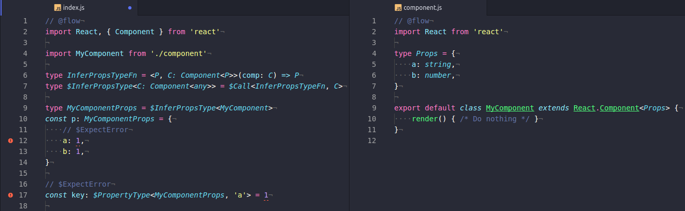

> [타입 이론](https://en.wikipedia.org/wiki/Type_theory)에 대해 무지한 상태입니다.. 공부하면서 고치는데 무지하게 시간 쏟을 것 같으니 이상한 내용 있으면 서슴없이 알려주세요 :pray:

Flow의 고급기능에는 생각보다 잘 알려지지 않은 재밌는 것들이 많다.

미리 빌드되서 제공되는 유틸리티 함수들 중에서도 재밌는 게 많지만, 가장 재밌는 건 Type-level 함수(이하 타입레벨함수)로 직접 유틸리티를 만드는 일 같아 소개하는 글을 써본다.

# Type-level Function

Flow는 오직 Flow 서버에서 다른 타입을 추론하는 용도로만 사용될 특별한 타입의 정의를 지원하는데 이걸 [타입레벨함수라고 부르는 것 같다.](https://github.com/facebook/flow/issues/30#issuecomment-346668903)(비공식)

```flow
type ExtractReturnType = <T>(() => T) => T
```

엥? 이거 그냥 [제네릭](https://en.wikipedia.org/wiki/Generic_programming) 아닌가?

제네릭 템플릿(이하 템플릿)과 비슷한 표현식(`<T>`)이 사용되지만, 그 위치가 약간 다르다.

다음은 템플릿 함께 사용되는 예시이다.

```flow
// Generic
type Either<L, R> = { type: 'Left', value: L } | { type: 'Right', value: R }

// Type-level Function
type EitherF = <L, R>(x: [L, R]) => Either<L, R>
type ArrayF = <A>(x: [A]) => Array<A>

// Build new types via `$Call`
type ArrOfStrings = $Call<ArrayF, [string]>
type EitherOfStringNumber = $Call<EitherF, [string, number]>
```

템플릿의 경우 타입 인자가 선언(Declaration)에 들어가고, 타입레벨함수에서는 정의(Definition)에 들어가는 차이점이 보인다.

타입레벨함수 `F`는 `<...>(...) => ...` 꼴로 정의할 수 있다.

- 컨텍스트: `<...>`
- 파라미터: `(...)`
- 리턴: `=> ...`

템플릿과는 다르게 타입레벨함수에서는 `<>` 키워드 안에 전달한 타입들이 인자로 사용되지 않고 추론에 필요한 컨텍스트로만 사용된다. 실제 함수에 사용할 인자는 `()` 안에 정의하고, 이 인자 타입으로부터 추론될 타입을 `=>` 뒤에 정의한다.

그리고 파라미터 타입과 리턴 타입을 정의하는데 앞서 정의한 컨텍스트를 활용할 수 있는 식이다.

이 설명과 예제로는 이해하기 너무 어려우니, 앞서 정의해놓은 `ExtractReturnType` 통해 어떻게 쓰는지 알아보자.

# [$Call](https://flow.org/en/docs/types/utilities/#toc-call)

`$Call<F, T>` 유틸리티 함수는 Callable한 타입레벨함수 `F`와 그 함수에 인자로 전달할 타입 `T`를 제네릭 인자로 받아 Flow 서버에서 실제로 실행해서 추론된 타입을 반환한다.

```flow
type Fn = () => number
type ReturnType = $Call<ExtractReturnType, Fn>

(5: ReturnType)    // OK

// $ExpectError
(true: ReturnType) // Error: ReturnType is a number
```

# [$ObjMap](https://flow.org/en/docs/types/utilities/#toc-objmap), [$TupleMap](https://flow.org/en/docs/types/utilities/#toc-tuplemap)

`$ObjMap<T, F>`와 `$TupleMap<T, F>`는 `Object`/`Array`와 `F`를 받고, 엔티티 타입들에 대해 일괄적으로 `$Call` 해준다. JavaScript에서 `.map()` 함수가 하는 역할을 생각해보면 이해하기 쉬울 것이다.

그렇게 반환된 타입은 원래의 구조를 유지한 채로 엔티티 타입들이 새롭게 정의된다.

```flow
function run<A, O: {[key: string]: () => A}>(o: O): $ObjMap<O, ExtractReturnType> {
  return Object.keys(o).reduce((acc, k) => Object.assign(acc, { [k]: o[k]() }), {})
}

const o = {
  a: () => true,
  b: () => 'foo'
}

(run(o).a: boolean) // Ok
(run(o).b: string)  // Ok

// $ExpectError
(run(o).b: boolean) // Nope, b is a string

// $ExpectError
run(o).c // Nope, c was not in the original object
```

~~공식 예제 장난하냐 진짜~~

그래서 이 것들을 어디다 써먹을까

# 사용예1. React Component의 PropType 추론하기

얼마전 트위터 타임라인에서 이런 글을 보게되었다.

<blockquote class="twitter-tweet" data-lang="ko"><p lang="ko" dir="ltr">type PropsType&lt;T&gt; = T extends React.Component&lt;infer P&gt; ? P : {};<br>라이브러리에서 PropsType을 export 안하고 있지만 저걸로 뜯어냈다. (ex: PropsType&lt;YouTube&gt;[&#39;opts&#39;]) 타입스크립트 개쩜ㅋㅋㅋㅋㅋ flow는 이런거 못하지 ㅋㅋ</p>&mdash; ㄹ (@disjukr) <a href="https://twitter.com/disjukr/status/984633981973901312?ref_src=twsrc%5Etfw">2018년 4월 13일</a></blockquote>

TypeScript 2.8에서 Conditional Type이라는 ~~사기적인~~ 기능과 함께 `infer` 키워드가 추가되면서, Flow처럼 [리턴 타입을 추론해내거나 하는 일이 가능](https://www.typescriptlang.org/docs/handbook/release-notes/typescript-2-8.html#type-inference-in-conditional-types)해졌다.

추가된 기능을 이용해 `Component<P, S>` 템플릿 파라미터의 실제 타입을 추론해낸건데 이건 Flow로도 되지 않을까?

일단 해보자.


~~작은 삽질 끝에~~ 내가 작성한 타입은 다음과 같다.

```flow
import { Component } from 'react'
import MyComponent from './component'

type InferPropsTypeFn = <P, C: Component<P>>(comp: C) => P
type $InferPropsType<C: Component<any>> = $Call<InferPropsTypeFn, C>

export type MyComponentProps = $InferPropsType<MyComponent>
```

`P`, `C` 두개를 정의하고 `C`는 `React.Component`와 템플릿 인자 `P`로 구성되어 있음을 알린다. 그리고 `C`를 인자로 받으면 `P`를 리턴하도록 정의했다.

솔직히, TypeScript에선 되지만 Flow에서 안되는 것들도 몇 번 봐왔기 때문에 (Conditional Type 이라니 다시 생각해도 너무 사기적인 기능 아닌가?) 안될 수도 있겠다 싶어 불안했지만...



> Flow를 제대로 활용하고 싶다면, VSCode보단 Atom + Nuclide 가 더 나은 선택이다.

성공했다! 저렇게 뜯어 낸 Object 타입에서 프로퍼티 타입을 가져오고 싶을 땐 [`$PropertyType<T, k>`](https://flow.org/en/docs/types/utilities/#toc-propertytype) 유틸리티를 쓰면 된다.

# 사용예2. Reducer 목록으로 부터 State 추론하기

이게 가장 잘 알려진 사용 예시인 것 같다.

참고: [Type-checking React and Redux (+Thunk) with Flow — Part 2](https://blog.callstack.io/type-checking-react-and-redux-thunk-with-flow-part-2-206ce5f6e705)

Redux에서 사용되는 Reducer는 부분적인 State와 Action을 받아 새로운 State를 반환하는 순수 함수이다. 다시 말해 모든 Reducer들이 반환하는 리턴타입을 조합하면 전체 State를 추론해낼 수 있다.

```flow
import type { Reducers } from 'reducers'

type ExtractReturnType = <V>(v: (...args: any) => V) => V

export type State = $ObjMap<Reducers, ExtractReturnType>
```

전체 상태를 힘겹게 다시 정의하지 않아도 되는 유용한 패턴이다.

# 사용예3. Nested 타입 추론하기

좀 더 복잡한 타입의 경우는 어떨까? 엄청나게 중첩된 Nested Object가 있더라도 Flow는 거뜬히 추론해준다.

```flow
// Extracting deeply nested types:
type NestedObj = {|
  +status: ?number,
  +data: ?$ReadOnlyArray<{|
    +foo: ?{|
       +bar: number,
    |},
  |}>,
|};

// If you wanted to extract the type for `bar`, you could use $Call:
type BarType = $Call<
  <T>({
    +data: ?$ReadOnlyArray<{
      +foo: ?{
        +bar: ?T // 여기 이 부분
      },
    }>,
  }) => T,
  NestedObj,
>;

(5: BarType);

// $ExpectError
(true: BarType);  // Error: `bar` is not a boolean
```

된다는 거지 이렇게 쓰는 경우는 없다. (있다면 타입 정의 다시해야한다)

# 마무리 하며

여느 Facebook 라이브러리들이 그렇듯, 문서에는 Concept과 Philosophy 위주로 설명되어 있고 MS처럼 진입장벽을 허물고 사용자를 포섭하려는 노력이 부족한 것 같다.

나날히 발전하는 TypeScript 진영을 보면서, 그리고 이미 종말에 치달은 Flow의 이슈트래커와, 그래도 아직 Flow가 나은점이 있다고 위로하면서도 정작 자신의 프로젝트에는 TypeScript를 셋업하고 있는 나를 보면서, Flow 사용자로서의 자부심이 바닥을 치고 있는 요즘이다.

기능 자체는 Flow에서 먼저 나오고 TypeScript가 따라오는 형태라도, Flow의 코드베이스가 OCaml인 만큼(대체 왜...) 신규 기여자 유입이 많이 힘들어서 다다음 릴리즈 쯤이면 전부 따라잡힐 것 같다.

그래도 타입 이론을 공부하거나 타입 라이브러리를 유지보수할 땐 (아직까진) Flow가 더 많은 확장성을 제공한다고 생각해서 계속 쓰지만, 솔직히 미래는 어둡다. 너무 아쉬운 도구인 것 같아.
