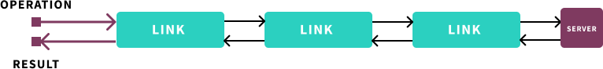
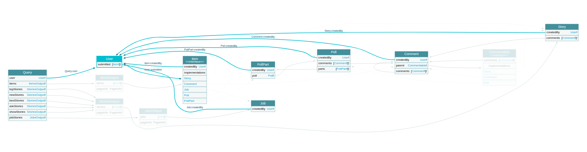

GraphQL을 알게 된지는 꽤 지났습니다. 예전엔 GraphQL을 단순히 요즘 유행하는 새로운 API 개발 방식으로만 이해하고 관심을 가지는 정도였지만, 꾸준히 커뮤니티 동향을 살펴보고, 프로덕션에 사용해보면서 이 기술에 대한 확신이 생겼습니다.

저는 다양한 상태관리 접근법 중에서 Redux를 가장 사랑하지만, 동시에 Apollo Client, Relay Modern 같은 GraphQL 엔진들이 이를 대체할 수 있는 가장 좋은 방법이라고 생각합니다.

그래서 "Client-side GraphQL" 라던가 "State management with GraphQL" 같은 주제를 아직 접해보지 못한 분들에게 영업을 해보는게 이번 포스트의 목표입니다.

잠깐 잠깐, 갑자기 왠 상태관리? GraphQL은 REST를 대체하는 API 개발 방법론 같은거 아니였나요

GraphQL과 상태관리의 연관성을 얘기하려면 먼저 GraphQL이 단순한 "쿼리 언어" 라던지 "API 개발을 위한 서버사이드 런타임" 이라는 인식부터 깨부숴야 합니다.

> GraphQL is a query language for your API, and a server-side runtime for executing queries by using a type system you define for your data.

미친 소리처럼 들릴 수도 있겠지만, 네. GraphQL 소개 첫 문장인 바로 그 부분이요. 오늘날의 GraphQL 은 아주 색다르고 흥미로운 방향으로 발전하고 있습니다. 적절한 예시와 함께 큰 그림을 살펴보겠습니다.

## 예제 프로젝트: HackerNews Client

데모를 위해 [Public API](https://github.com/HackerNews/API)를 제공하는 HackerNews 클라이언트를 ~~굳이 하나 더~~ 만들어 보겠습니다.

> 일부분에 대해서만 포스트에서 소개하고 동작하는 전체 소스코드는 조만간 GitHub에 공개하도록 하겠습니다. (도와주실 분 대환영)

원하는 동작은 다음과 같습니다.

- 현재 순위대로 HackerNews 트렌드를 볼 수 있어야한다.
- 불편한 페이지네이션 대신 무한스크롤로 동작하면 좋겠다.
- 스토리를 "즐겨찾기"에 등록하고 이 목록을 유지했으면 좋겠다.

여기서 한 가지 문제는 저는 GraphQL 예제를 보여주고 싶은데 HackerNews는 GraphQL API를 제공하지 않습니다. 직접 만들어야하나요? 다행히도 일반적인 REST API를 GraphQL 엔드포인트에 통합하는건 아주 쉽게 달성할 수 있습니다.

일단 Apollo Client를 활용해봅시다.

## Apollo Link

Apollo Client는 현재 자바스크립트 생태계에서 가장 인기 있는 GraphQL 클라이언트입니다.

GraphQL 클라이언트는 단순히 요청을 보내고 응답을 파싱하는 것보다 많은 일을 처리해야되기 때문에 그 동작이 결코 단순할 수 없습니다. (Relay의 [Thinking in GraphQL](https://blog.cometkim.kr/posts/thinking-in-graphql-ko/) 포스트를 참고해보세요)

이를 위해 Apollo Client는 `Link`라는 제어흐름 단위를 엮어 행위를 관측가능한 상태로 만드는 것(Operation → Links → Observable)을 핵심 컨셉으로 소개합니다.



> Note that although we have the terminating link requesting GraphQL results from a server in this figure, this doesn't necessarily have to be the case: your GraphQL results can come from anywhere. For example, apollo-link-state allows to use GraphQL operations to query client state.

[본문](https://www.apollographql.com/docs/link/overview/)에서 설명하듯, 흔히 사용하는 apollo-link-http(GraphQL 서버를 연결하는)도 그런 링크들 중 하나이고, 그 밖에도 다양한 구현체들이 있습니다.

그 중 하나인 [graphql-link-rest](https://github.com/apollographql/apollo-link-rest)를 사용하면 GraphQL 쿼리에 REST API 엔드포인트와 엔티티에 대한 힌트가 되는 디렉티브를 추가해서 REST API 클라이언트처럼 사용할 수 있습니다.

<iframe src="https://codesandbox.io/embed/apollo-rest-link-exmaple-yghk6?fontsize=14" title="Apollo REST Link Exmaple" allow="geolocation; microphone; camera; midi; vr; accelerometer; gyroscope; payment; ambient-light-sensor; encrypted-media" style="width:100%; height:500px; border:0; border-radius: 4px; overflow:hidden;" sandbox="allow-modals allow-forms allow-popups allow-scripts allow-same-origin"></iframe>


와 쉽다! 아무 서버 로직 작성 없이 GraphQL로 해커뉴스 클라이언트를 만들었군요!

### 더 나은 스키마

약속한 기능들을 추가하기 전에 짚고 넘어갈 만한 부분들이 있습니다.

해커뉴스의 API는 모델의 단순함을 유지하기 위해 `Item`이라는 추상모델만 제공하고, 이 때문에 클라이언트는 위험한 가정들을 많이 떠안게됩니다. 결국 코드가 더러워질거라는 얘기죠.

GraphQL은 쿼리 언어인 만큼, 쿼리할 수 있는 데이터 형식을 정의하는 스키마를 가지고 있습니다. 이 스키마를 표현하는 언어를 GraphQL **SDL(Schema Definition Language)**이라고 부릅니다.

해커뉴스 API를 SDL로 제가 원하는 형태가 되도록 재정의해보겠습니다. 좀 더 구체적이고, 데이터를 구분하는데 도움이 되는 형태로요.

```graphql
scalar Date
scalar URL

schema {
  query: Query
}

# 커서 기반 페이지네이션의 일부분을 구현합니다.
# 더 불러오기에 필요한 부분만을 선언하고
# 이 외 Edge, Connection에 대한 선언은 생략합니다.
type PageInfo {
  endCursor: String
  hasNextPage: Boolean!
}

type ItemsOutput {
  items: [Item!]!
  pageInfo: PageInfo!
}

type StoriesOutput {
  stories: [Story!]!
  pageInfo: PageInfo!
}

type JobsOutput {
  jobs: [Job!]!
  pageInfo: PageInfo!
}

type Query {
  user(id: ID!): User!
  items(first: Int! = 20, after: ID): ItemsOutput!
  topStories(first: Int! = 20, after: ID): StoriesOutput!
  newStories(first: Int! = 20, after: ID): StoriesOutput!
  bestStories(first: Int! = 20, after: ID): StoriesOutput!
  askStories(first: Int! = 20, after: ID): StoriesOutput!
  showStories(first: Int! = 20, after: ID): StoriesOutput!
  jobStories(first: Int! = 20, after: ID): JobsOutput!
}

type User {
  id: ID!
  createdAt: Date!
  about: String!
  karma: Int!
  submitted: [Item!]!
}

interface Item {
  id: ID!
  createdAt: Date!
  createdBy: User!
}

interface Commentable {
  comments: [Comment!]!
}

# Story and Ask
type Story implements Item & Commentable {
  id: ID!
  createdAt: Date!
  createdBy: User!
  comments: [Comment!]!
  url: URL!
  title: String!
  score: Int!
}

type Comment implements Item & Commentable {
  id: ID!
  createdAt: Date!
  createdBy: User!
  comments: [Comment!]!
  parent: Commentable!
  contentHtml: String!
}

type Job implements Item {
  id: ID!
  createdAt: Date!
  createdBy: User!
  score: Int!
  title: String!
  contentHtml: String!
}

type Poll implements Item & Commentable {
  id: ID!
  createdAt: Date!
  createdBy: User!
  comments: [Comment!]!
  title: String!
  parts: [PollPart!]!
  score: Int!
}

type PollPart implements Item {
  id: ID!
  createdAt: Date!
  createdBy: User!
  poll: Poll!
  text: String!
}
```

자, 이러면 많은 것들이 명확해지네요! API 모델을 좀 더 구체화하고 [커서 기반 페이지네이션](https://graphql.org/learn/pagination/)을 위한 모델을 부분적으로 추가 정의했습니다.

그리고 이 스키마는 자체적으로 기존 API 정의나 추가 문서들을 다 합친거보다 더 구체적으로 API가 제공하는 데이터들과 데이터 사이의 관계, 사용법까지 서술합니다.



기존의 정의방법으로는 이런 수준의 API 제공이 불가능하다는 얘기가 아닙니다.

GraphQL에서 제공하는 필드 수준의 로직 구현, 직관적인 관계 표현, 인터페이스와 유니온, 타입 수준 검증, 커스텀 스칼라 같은 훌륭한 도구들이 이 것을 더 현실적으로 만들어준다는 것입니다.

적어도 엔드포인트와 밸리데이션 로직을 중복 정의할 필요가 없어지니 생산성이 높다고 확신할 수 있습니다. 아마 OpenAPI (Swagger)를 즐겨 사용하시는 분이라면 그 유용함을 바로 이해하실 수 있을 것입니다.

### 리졸버 구현하기

아까 썼던 REST Link를 계속 쓸 수도 있겠지만 타입 정의랑 디렉티브를 일일히 붙이는게 다소 번거로워 보입니다. 타입을 재매핑 하는 것을 어디까지 표현할 수 있을지도 확실하지 않습니다.

차라리 커스텀 리졸버를 만들어 쓰는게 더 편하겠네요. 만들어 보겠습니다.

리졸버의 인터페이스는 이렇게 생겼습니다.

```js
function resolver(root, args, context, info);
```

간단히 설명하자면 각각

- `root`: `parent`라고 쓰는 경우도 많습니다. 바로 이전 리졸버, 그러니까 쿼리상 한계층 위에 있는 리졸버의 리턴값입니다.
- `args`: 해당 필드에 전달된 arguments 값 입니다.
- `context`: 한 쿼리가 실행될 때 리졸버 간에 공유되는 컨텍스트 객체입니다.
- `info`: 쿼리 실행상태에 대한 대부분의 정보를 담고있는 메타데이터 객체입니다. 복잡한 커스텀 디렉티브 리졸버를 구현하는게 아니라면 쓸 일이 거의 없습니다.

리졸버를 작성해 보신적이 없다면 이 것에 대해 아주 자세히 설명해둔 [Prisma Blog의 포스트](https://www.prisma.io/blog/graphql-server-basics-the-schema-ac5e2950214e#9d03)가 있으니 참고해보시는 게 좋습니다.

리졸버 코드는 스키마로부터 생성할 수도 있고, 프레임워크를 사용할 수도 있지만, 가장 기본적인 형태는 Field→Resolver가 매핑되어 있는 오브젝트를 정의하는 것입니다.

```js
const Resolvers = {
  Query: {
    user(_, { id }, { client }) {
      return client.getUser(id);
    },

    async items(_, { first = 20, after }, { client }) {
      // 해커뉴스는 최근 500개 아이템만 일괄적으로 내려주니 일단 이렇게 합시다.
      const allItems = await client.getItems();
      const cursorIndex = after
        ? allItems.findIndex(item => item.id === after)
        : 0;
      const items = allItems.slice(cursorIndex, first);
      const { length: l, [l-1]: endItem } = items;
      const pageInfo = {
        endCursor: endItem?.id ?? null,
        hasNextPage: allItems.lastIndexOf(endItem) < allItems.length - 1,
      };
      return { items, pageInfo };
    },
    // ... 쭉 이어서 쿼리 리졸버 작성
  },

  Item: {
    __resolveType(obj) {
      return obj.type;
    },
  },

  Commentable: {
    __resolveType(obj) {
      return obj.type;
    },
  },
  // ... 쭉 이어서 타입 리졸버 작성
};
```

아까 정의한 스키마 정의와 지금 정의한 리졸버 맵이 있으면 바로 GraphQL API를 실행할 수 있습니다. [graphql-tools](https://github.com/apollographql/graphql-tools) 같은 걸 써서 실행기를 만들고 익숙한 Express 같은 서버에 붙이면 되거든요.

[Apollo Server](https://github.com/apollographql/apollo-server), [GraphQL Yoga](https://github.com/prisma/graphql-yoga) 같은 프로젝트들은 이 모든 것들을 사전 구성으로 제공하고 있습니다.

어쨋든 결국 서버를 띄워야 한다는 소린가요? 그럴 수도 있고, 여전히 아닐 수도 있습니다.

### 리졸버 옮기기?!

리졸버의 인터페이스 선언을 보시고 눈치채셨을 수도 있는데, Context 활용만 주의하면, 나머지는 인자 몇 개 받는 JavaScript 함수 집합에 불과합니다.

리졸버 만들 때 서버에서만 활용되는 DB 컨텍스트 같은 걸 쓴게 아니라 그냥 REST client(대충 fetch나 axios 같은걸 썼다고 가정하죠)를 호출한게 다니까, 저 리졸버는 클라이언트에서 실행하는 데 아무 문제가 없습니다.

Apollo에서는 서버 외 환경, 예를 들면 브라우저에서도 GraphQL 리졸버를 실행할 수 있게 끔 [graphql-anywhere](https://www.npmjs.com/package/graphql-anywhere) 라는 유니버셜한 런타임을 제공하고 있습니다.

그리고 Apollo Client가 이 런타임을 사용해서 "클라이언트 스키마", "클라이언트 리졸버" 를 실행합니다.

그게 바로 [apollo-link-state](https://github.com/apollographql/apollo-link-state) 입니다.

State 링크는 이름 그대로 로컬 상태를 GraphQL 리졸버로 관리하는 도구입니다. 아까 작성한 스키마와 리졸버를 등록해두고 쿼리할 때 `@client` 디렉티브를 추가하면, HTTP 요청이 날라가는 대신 클라이언트 사이드 리졸버가 실행됩니다.

자세한게 궁금하신 분은 [Local state management](https://www.apollographql.com/docs/react/essentials/local-state/) 포스트에서 더 읽어보시는 걸 추천드립니다.

### API 확장하기

예제 프로젝트에서는 전체 스키마가 클라이언트 사이드에서 구현되었지만 사실 서버사이드 GraphQL API가 있을 때가 더 중요합니다. 클라이언트 스키마는 서버 스키마를 확장해서 사용하는 것이 더 일반적이기 때문입니다.

예를 들어 `Item`이라는 타입이 서버에서 제공되고, 하나의 Item에 클라이언트에서만 사용될 `bookmarked` 라는 boolean 값을 추가하고 싶을 때,

```graphql
extend type Item {
  bookmarked: Boolean!
}

extend type Query {
  bookmarkItems: [Item!]!
}
```

클라이언트만 알고 있는 모델 확장이지만 서버의 어떤 데이터로 부터 파생되는지(또는 아예 의존하지 않는지)가 명확합니다.

이렇게 스키마를 정의해두면 마찬가지로 해당 필드에 `@client` 디렉티브를 붙여 서버에 보낼 쿼리와 한꺼번에 실행할 수 있습니다. 더 나아가서는 `@export` 같은 추가적인 디렉티브를 활용해서 배치처리를 하는데 활용할 수도 있습니다.

```graphql
mutation PostBookmarkItems($ids: [ID!]!) {
  # 클라이언트 필드가 먼저 리졸브된다.
  bookmarkItems @client {
    # 이러면 id의 배열로 매핑되는 걸 기대하지만 아직 안될지도 모른다.. 테스트 필요
    id @export(as: "ids")
  }
  # 클라이언트 리졸버에서 채운 캐시 데이터를 활용해서 서버 필드를 리졸브한다.
  # 이보다 더 자연스럽게 클라이언트 상태와 API를 통합하는 방법이 또 있을까
  postItems(ids: $ids) {
    result
  }
}
```

### 클라이언트 상태 저장하기

GraphQL 서버가 Data Loader를 활용해서 응답을 캐시하는 것 처럼 같은 용도로 GraphQL 클라이언트 들도 저마다의 인메모리 캐시 구현을 사용합니다.

하지만 이건 휘발성 캐시기기 때문에 새로고침 한 번으로 초기화될 것 입니다. 서버가 없다고 가정하면, 최소한 북마크 정보 같은걸 보존하기 위해서는 브라우저의 LocalStorage 같은데 데이터를 동기화할 필요가 있습니다.

데이터를 보존하기 위함이 아니더라도 cache persistence로부터 store를 rehydration 하는 것은 일반적인 PWA의 사용성(흔히 Offline-first 라고 하는)을 위해 중요한 동작이지만 redux-offline 같은걸 써보셨다면 조금 귀찮게 느끼실 수도 있습니다.

Apollo Client는 상황이 훨씬 좋은게, 애초에 자체적으로 구현한 인메모리 캐시를 기반으로 하는 cache-first 접근이기에 오프라인 지원을 위해 개발자에게 추가적인 무언가를 거의 요구하지 않습니다. 단 몇 줄의 초기화 코드로 오프라인 지원을 활성화 할 수 있습니다.

```js
import { persistCache } from 'apollo-cache-persist';

const cache = new InMemoryCache({...});

await persistCache({
  cache,
  storage: LocalStorage,
});

const client = new ApolloClient({
  cache,
  ...
});
```

> 아직 top-level await 문법이 stage 3이라서, persistCache를 기다리게 하기 위해서 프레임워크의 라이프사이클에 의존하는 코드로 변경해야 할겁니다 흑흑...

이러면 Apollo Client 는 캐시를 조작하는 모든 오퍼레이션에서 localStorage 데이터와의 동기화를 알아서 수행할 것입니다. 물론 동작방식이나 화이트리스트/블랙리스트 등을 옵션으로 커스텀 할 수 있습니다.

이것만 했을 뿐인데, Offline Support랑 FMP(First Meaningful Paint) Time 개선이 공짜로 굴러들어왔네요!

## REST API, Redux와의 비교

리액트 같은 프론트엔드 프레임워크를 다루다보면 상태를 어디에 둘 것인가로 고민하게 됩니다. 상태를 적절히 배치했더라도 언젠가 상태를 공유하는 새로운 컴포넌트가 등장함에 따라 리팩토링을 요구합니다.

이 케이스를 더 자세히 들여다 보면 상태는 크게 "데이터 의존성"과 "UI 상태"로 나뉩니다. 대부분의 관리 코스트는 외부에서 주입되는 (또는 자체적으로 생산하는) 데이터 의존성에 의해 발생한다는 사실을 깨닫게되고, 프론트엔드 개발자들은 이런 의존성을 효과적으로 관리하기 위해 글로벌 상태관리 전략을 찾게 됩니다.

이런 의존성 데이터가 많은 제품을 개발할 때, 그러니까 비즈니스 로직이 복잡할 수록 모델이 크면 클 수록 백엔드 개발자와 프론트엔드 개발자의 제품에 대한 이해도는 갈라지는데, 대부분의 데이터 모델이 프론트엔드의 "글로벌 상태"와 백엔드의 "데이터베이스"에 정규화되는 형태가 판이하게 다르기 때문입니다.

이는 REST API가 결코 해결해주지 못한 문제입니다. 백엔드와 클라이언트 양쪽 모두 고려하는 이상적인 API는 (적어도 제가 경험한 것 중에는) 없습니다. API 스펙을 작성할 때 어찌됬건 한쪽의 의견이 크게 반영되고 RESTful이냐 BFF냐가 정해짐에 따라 한쪽은 모델 간 바인딩으로 씨름하게 됩니다. 이 문제에서 현대의 프론트엔드 프레임워크가 씨름한 결과가 지금의 Redux 같은 글로벌 상태관리 패턴들이라 볼 수 있습니다.

반면 GraphQL을 Relay나 Apollo Client 같은 라이브러리들은 GraphQL 만을 이용해서 글로벌 상태관리의 핵심 아이디어들을 모두 구현합니다. 그러면서도 서버와 같은 데이터 모델을 공유하고, 같은 로직을 공유하고, 데이터가 어디서 파생되었는지를 다 명시적으로 관리할 수 있고, 좀 더 똑똑하게 캐시를 활용합니다.

이 모든 것을 "알아서 잘" 해결하기 때문에 Redux의 보일러플레이트 지옥도 없습니다.

## 큰 그림 이해하기

이쯤 왔으면 React와 GraphQL을 창시했으며 실제로 가장 활발하게 사용하고 있는 Facebook의 큰그림이 뭔지 다시 한 번 돌아볼 필요가 있습니다.

먼저 리액트의 아이디어는 단순하게 표현하자면 선언적 UI 관리입니다. UI 표현에 특화되면서 동시에 단순한 "어떤 언어"를 제공하고 (React), 개발자가 이 언어로 "선언"한 것을 바탕으로 DOM 등을 알아서 조작합니다. (React DOM, React Native)

하지만 상태를 다루어야하기에 UI 개발은 여전히 복잡했습니다. 페이스북의 처음 시도는 Flux였죠, Flux는 상태→UI, 상호작용→상태변경 이라는 간결한 워크플로우를 제안했고, 현재까지도 리액트 자신과 몇몇 계승자들은 이 아이디어를 계속 확장해나가고 있습니다.

하지만 그럼에도 상태관리가 점점 복잡해지자 진짜 문제는 "데이터"였음을 깨닫고, "데이터를 위한 리액트"가 필요함을 알아차렸을 것입니다. 페이스북은 이를 "Declarative data fetching"이라고 표현합니다. (저는 "똑똑한 의존성 관리"라는 표현을 더 즐깁니다.) 리액트가 UI 조작에 대한 스트레스를 없애준 것과 똑같은 방식으로 GraphQL과 Relay를 통해 데이터 의존성 관리에 대한 고민을 없애버린 것입니다.

(비유하자면 GraphQL이 React 내지는 JSX에 해당하고, Relay가 React DOM이나 RN에 해당하겠네요.)

이를 위해 진짜 새로운 언어를 만들었다는 점만이 다릅니다.

새로운 언어라는 것은 GraphQL이 단순히 웹 서버나 클라이언트만을 생각해서 만든게 아니라는 데이터를 다루는 모든 영역에서 활용될 수 있음을 의미합니다. GraphQL의 유즈케이스를 살펴보면 실제로 데이터베이스, 마이크로서비스, API 서버, 모바일 클라이언트 등 말 그대로 **데이터를 다루는 모든 곳**에서 활용되고 있습니다.

그렇게 GraphQL 기반으로 구성된 애플리케이션에서는 뒷단에서 앞단으로 올 수록 데이터가 어떻게 확장되고, 의존성이 어떻게 뻗어 나가는지 일목요연하게 추적할 수 있는 장점이 생깁니다.

모놀리식 구조가 아닌 이상에야 DB Schema, Domain, Redux Action 등 같이 각 개발 영역에서 파편화된 단위 때문에 백엔드/프론트엔드 라는 양 극단으로 갈라졌던 개발팀이 GraphQL Schema라는 하나의 언어를 가지고 데이터 기반으로 소통할 수 있게 되는 것입니다.

## GraphQL Anywhere

실제로 데이터를 사용하는 모든 곳에서 활용된다는 GraphQL 유즈케이스가 구체적으로는 어떤게 있는지 대략적으로 살펴봅시다.

### Prisma

Prisma는 이전의 Graphcool이라는 BaaS를 제공하려던 조직에서 분리된, GraphQL을 기반 오픈소스 쿼리엔진을 만드는 팀입니다.

MySQL, PostgreSQL 같은 전통적인 RDBMS을 기반으로 GraphQL API를 생성하는 가장 강력한 도구인데 대략 이런식의 워크플로우를 제공합니다.

1. Prisma SDL로 데이터 모델을 작성한다.
2. 데이터 모델 선언을 바탕으로 DB 테이블과 클라이언트 API가 자동으로 생성된다.
자동으로 생성된 GraphQL API를 통해 DB를 조작할 수 있고, 원하는 언어로 바인딩된 코드로 사용할 수도 있다.
3. 이 DB 클라이언트를 빌딩 블럭으로 사용해서 애플리케이션을 개발한다.

Full-feature GraphQL API로 BFF API를 개발하는데 특화되어 굉장히 생산성 높은 개발경험을 자랑하는 프레임워크입니다.

REST API, GraphQL API, gRPC API, 심지어 일반 CLI 앱까지 [다양한 예제](https://github.com/prisma/prisma-examples)를 제공하니 한 번 가볍게 살펴보시는게 좋습니다.

### FaunaDB, EdgeDB

Prisma가 ORM에 비교된다면 아예 태생부터 DB에서 직접 Native GraphQL을 지원하려는 시도도 많이 있습니다.

그 중 대표적인 것이 바로 [FaunaDB](https://fauna.com)와 [EdgeDB](https://edgedb.com)입니다.

FaunaDB는 클라우드 DB 서비스로 자주 소개되서 알고는 있었는데, 솔직히 둘 다 직접 사용은 해보지 않아서 자세한 리뷰가 어렵습니다.

다만 저는 DB들이 SQL 보다 GraphQL을 기본 쿼리 언어로 제공하게 되는 것이 앞으로의 트렌드라고 봅니다. SQL에 비교하면 더 적은 파편화, 오픈소스기반 도구 생태계, 더 강력하고 우아한 표현력 등 그러지 않을 이유가 없거든요.

### GraphQL Code Generator

최근들어 제가 가장 자주 사용하고 있는 범용 도구가 바로 이 코드 제너레이터 입니다.

[GraphQL Code Generator](https://graphql-code-generator.com)

GraphQL SDL이나 Introspection을 주면 그에 맞는 코드를 생성합니다. 생성할 수 있는 코드는 다양한데 주로 타입 언어에서 타입선언이 매핑된 코드를 뽑는데 활용합니다.

GraphQL과 타입언어를 같이 사용하는 코드베이스에서 더블 타이핑 문제를 겪고 계신다면 필수적으로 사용해야할 도구입니다.

### Relay Modern, Apollo Client

아까 클라이언트 사이드에서 서버 스키마를 확장하는 예시를 보여드렸는데 현재까지 이를 지원하는 라이브러리/클라이언트는 Apollo Client와 페이스북의 프레임워크인 [Relay Modern](https://relay.dev) 뿐입니다.

릴레이가 좀 더 원조격이라고 볼 수 있죠.

### Apollo Federation

스키마를 확장해서 사용하는 것은 당연히 서버사이드에서도 가능합니다. 원래는 *Schema Stitching*이라고 불리는 조금 투박하게 여러 스키마를 머지하는 방법을 사용했는데, [Apollo Federation](https://www.apollographql.com/docs/apollo-server/federation/introduction/)은 이를 `extend type` 문법을 사용해 우아하게 해결했습니다.

이걸 사용하면 쉽게 GraphQL 기반의 마이크로 서비스 아키텍처를 달성할 수 있습니다. 각 컴포넌트 서비스에서 GraphQL 스키마를 노출하고 게이트웨이에서 숨기거나, 확장하거나, 통합하거나를 직관적으로 표현이 가능합니다.

### GatsbyJS

제가 이 블로그를 만들 때 사용한 [GatsbyJS](https://gatsbyjs.org)라는 프레임워크도 GraphQL을 아주 창의적으로 사용합니다.

일단 Gatsby가 [Relay 컴파일러 아키텍처](https://relay.dev/docs/en/compiler-architecture.html)를 사용해서 빌드타임에 사용할 스키마를 생성합니다.

Gatsby의 플러그인 시스템은 이 빌드 타임에 생성되는 데이터 노드들을 확장하고, 변환하는 역할을 수행하며, 이를 말단 노드에서 작성한 리액트 컴포넌트에서 Gatsby GraphQL로 의존하면, Gastsby가 이 코드를 컴파일타임에 추출하고 분석해서 알맞는 데이터를 주입합니다.

[사용법에 대한 문서](https://www.gatsbyjs.org/docs/querying-with-graphql/) 말고도 [내부 동작에 대한 문서](https://www.gatsbyjs.org/docs/gatsby-internals/)를 보시면 정말 재밌습니다.

### 조금 특이한 케이스들

- [apollo-link-rest](https://github.com/apollographql/apollo-link-rest): 예제에서 사용했던, REST API를 GraphQL 쿼리로 호출하기 위한 링크입니다.

- [gdom](https://github.com/syrusakbary/gdom): 이게 특이하다면 특이한게, 데이터랑 별 관계없이 GraphQL 쿼리의 표현력만을 이용해서 웹사이트를 크롤링하는 도구입니다.

- [graphql-css](https://github.com/braposo/graphql-css): 심지어 CSS-in-JS와 비슷한 접근법으로써도 소개된적이 있습니다 :joy:

## 마무리하며

이렇게 GraphQL은 API 개발 말고도 정말 다양하게 사용되고 있으며, 여전히 새로운 사용 케이스가 개척되고 있습니다.

이를 가능케 했던 데는, 설계자인 페이스북이 다양한 형태의 데이터를 다루는 것에 대한 높은 이해도와, 개밥먹기 하면서 오픈소스로 공개한 다양한 도구들이 출발이였고, 이후에는 Apollo, Prisma 처럼 GraphQL 활용에 깊게 공감하는 조직의 등장도 있었지만 가장 중요한 건 거대한 오픈소스 커뮤니티의 조성이였습니다.

그러다보니 GraphQL은 하루가 다르게 성장하는 기술이 되었고, 조금 보수적인 입장에서는 아직 안정화되지 않은 기술이라고 보이게도 하는 것 같습니다만, GraphQL이 많은 영역에서 이미 사용되고 있는만큼 GraphQL의 "어떤 부분"을 의심하고 있는지는 돌아볼 필요가 있습니다.

REST API의 대체제로써 GraphQL은 Facebook, GitHub, Shopify, Medium 등등... 더 검증을 언급하는 것이 무의미할 정도로 프로덕션에서 활발하게 사용되고 있습니다.

[GraphQL Production Case Studies](https://www.graphql.com/case-studies/)

저는 서버사이드 API 말고도 프론트엔드 개발자로서 **데이터 기반 개발 방법론**, **클라이언트 상태관리의 대체**, **공유가능한 코드 런타임**으로써의 GraphQL에 좀 더 관심을 가지고 다양한 걸 시도해볼 생각입니다.

GraphQL의 미래는 정말 밝습니다. 이 글을 읽어주시는 분들도 서버 개발자라면 꼭 시도해보시는 걸 추천드립니다. 클라이언트 개발자라면, 서버가 아니더라도 활용할 여지가 많으니 역시 시도해보시는 걸 추천드립니다.

혹시 GraphQL 관련 스터디 하실 분 있으면 메일이나 트윗 주세요 :)
