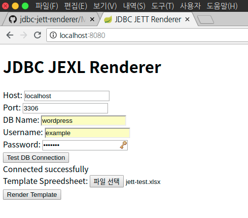
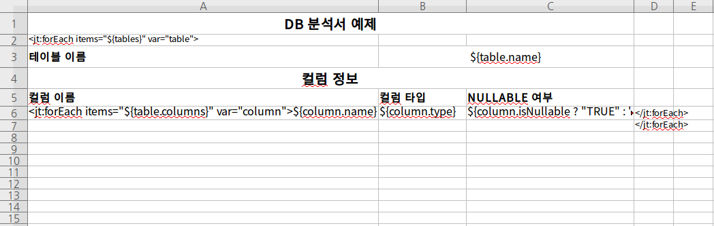
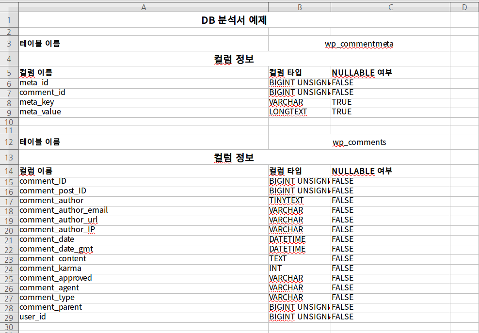

저번 한 주 동안 진행한 프로젝트의 소개 포스트임.

[JETT](http://jett.sourceforge.net)라는 템플릿 엔진을 이용해서 DB 문서를 생성하는 것이 목표이다. Spring Boot 2, 언어는 Groovy를 메인으로 사용했다.

[README 바로보기](https://github.com/cometkim/jdbc-jett-renderer)

## 동기

현재 회사에서는 MySQL RDBMS를 메인으로 사용한다. 내가 파악한 거의 모든 프로젝트들이 DB 테이블과 관계로 도메인을 표현하고 있다.

이렇게 도메인과 비즈니스가 DB상에서 표현되다 보니 DB 관련 문서도 굉장히 중요하게 다루어지는데, 보통 설계서를 작성하고 그걸 스펙 문서로 활용하지만, 옛날 프로젝트를 건드리거나 SI 프로젝트를 하다보면 역공학 분석서가 나오는 경우도 잦은 것 같다.

일단 전자던 후자던 나는 손으로하는 문서화를 정말 싫어하고, 그 중에서도 분석서는 정말 싫다. 역공학 자체는 단순한 업무가 아니어도 이 경우는 DB 테이블 정보를 특정 양식에 기계적으로 옮겨 적는 일이 되고는 한다.

이런 식의 일은

1. 귀찮기도 더럽게 귀찮고,
2. 꾸준한 업데이트가 필요하다. 하지만 테이블 마이그레이션 마다 문서를 업데이트 하는 건 빼먹기 쉽다.

얼마전 회사 동료가 비슷한 일로 하루를 보내는 것을 보고, 난 절대 저런 일 절대 성실히 못할거라 생각했다.

혹시 모를 일을 대비해서 미리 자동화해두면 어떨까?

## 어떻게?

나는 첫 직장에서 솔루션 기술 지원을 했다. ALM 솔루션의 수많은 기능 중에서도 아무도 모르는 숨겨진 기능을 가이드하기 위해 역공학하는 경우가 더러 있었는데, 엑셀 템플릿 커스터마이징이 그랬다.

온라인에서 작업한 스펙을 엑셀 스프레드시트로 내보내기 할 수 있었는데, 내보내는 양식을 커스터마이징 할 수 있는 기능이였다.

다만 온갖 내부적인 모델코드를 처음보는 표현식으로 표현해야 하는데 어떤 고객님이 그걸 직접 하고 있을까.. 대신 해주는 일이 많다보니 JEXL 기반의 표현식이 익숙해지고 JETT라는 엔진의 존재와 거기서 쓰이는 태그도 익숙해질 수 밖에 없었다.

문득 잊고 지내던 그 친구들이 떠올랐고, 끄집어 내놓으면 다시 쓸일이 있겠거니 싶었다.

## JETT? JEXL?

[JEXL](http://commons.apache.org/proper/commons-jexl)(**J**ava **EX**pression **L**anguage)은 Apache Commons 소속 프로젝트 중 하나로, Java 애플리케이션에서 동적 스크립팅을 지원하기 위한 표현식을 만드는 라이브러리이다.

JSP에서 JSTL이나 Apache Velocity 같은 템플릿 엔진에 쓰이는 표현식과 비슷한 것을 지원한다.

그리고 [JETT](http://jett.sourceforge.net)(**J**ava **E**xcel **T**emplate **T**ranslator)는 이러한 표현식을 엑셀 스프레드시트 파일 내에서 사용하게 해주는 특별한 템플릿 엔진이다.

## 스프링 부트

전부 Apache 라이브러리 기반, Java 기반이고 너무 오래된 고대의 기술들인 것이 맘에 안들어 비슷한 다른 것을 찾아보려고 했다.

스프레드시트를 다루는 것 정도는 Apache POI를 대체할만한 라이브러리들이 많이 있지만 템플릿까지는 지원하는 것이 없어보인다. 있었으면 코딩할 일도 없었을텐데 ~~아쉽다~~

아무튼 자바 기반 프로젝트는 진행한 경험이 없기 때문에 최대한 쉬운 방법을 선택했고 그게 Spring Boot 2 였다.

사실 MVC고 뭐고 다 필요없고 Gradle로 종속성 관리되고 웹 라우트 1~2개 정도 들어가는게 전부라 마이크로 웹 프레임워크 하나만 있으면 충분하겠지만 Java로 작성하는 웹 프레임워크는 Spring 밖에 들어본게 없다.

지금 생각하니 [Grails](https://grails.org)라는게 있었지 참... (이 것도 어차피 스프링 부트란다 ㅋㅋ)

## 왜 Groovy?

스프링 부트를 시작하려니 선택지가 3개나 주어지더라

- Java
- Groovy
- Kotlin(!!)

당연히 자바로 할거라 생각 중이였는데 막상 다른 선택지가 주어지니 자바는 쓰기 싫었다.

역시 요즘 기세등등한 코틀린을 쓸까 했다만..

일단 써보지 않아서 문법을 전혀 모르고 Java API와의 호환성을 확신할 수 없었다. (몰라서)

반면 그루비는 이전에 업무 때문에 써본적도 있고, 간결하고 (상당히) 모던한 문법을 지원하면서도, 자바 코드를 그대로 옮겨놔도 된다는 것도 알고 있었기 때문에 부담없이 선택할 수 있었다.

## 시간날 때 잠깐잠깐 코딩

뭐 스프링 프로젝트 세팅할 때만 해도 분석이 아니라 처음부터 만들어보는 건 첨이라 신나서 의욕 충만했지만, 당장 쓸일이 없는 프로젝트다보니 빠르게 식었다.

아래 메서드 하나가 전부라고 볼 수 있는데 프로젝트 세팅한 당일 날 끝났다.

그리고 일주일 간 천천히, 그냥 짬 날때마다 필요한 조금씩 코드를 더했다.

```groovy
@PostMapping('/render')
ResponseEntity<ByteArrayResource> renderTemplate(
    @RequestParam('host') String host,
    @RequestParam('port') Integer port,
    @RequestParam('database') String dbname,
    @RequestParam('username') String username,
    @RequestParam('password') String password,
    @RequestParam('template') MultipartFile template
) {
    def conn = null
    def fileOut = null
    try {
        conn = DriverManager.getConnection(
            "jdbc:mysql://${host}:${port}/${dbname}",
            username,
            password,
        )
        def jdbc = new JDBCExecutor(conn)
        def metadata = conn.metaData
        def tables = getTableInfoList(metadata)

        def ctx = [
            jdbc  : jdbc,
            tables: tables,
        ]

        fileOut = new ByteArrayOutputStream()

        new ExcelTransformer()
            .transform(template.inputStream, ctx)
            .write(fileOut)

        ResponseEntity
            .ok()
            .contentType(MediaType.APPLICATION_OCTET_STREAM)
            .header(HttpHeaders.CONTENT_DISPOSITION, "attachment; filename=\"${template.originalFilename}\"")
            .body(new ByteArrayResource(fileOut.toByteArray()))

    } catch (Exception e) {
        e.printStackTrace()

        ResponseEntity
            .status(HttpStatus.INTERNAL_SERVER_ERROR)
            .contentType(MediaType.TEXT_PLAIN)
            .body(e.message)

    } finally {
        conn?.close()
        fileOut?.close()
    }
}
```

거의 자바 코드와 유사하면서도 풍부한 신택틱 슈가 덕에 약간 간결한 표현이 가능한 그루비. 써보니 스트레스 없이 나름 만족스러운 수준

## 데모



Gradle로 빌드하고 실행하면 위처럼 ~~못~~생긴 폼이 나온다. (CSS 입혀서 좀 꾸밀걸...)

저기에 DB 커넥션 정보를 입력하고 템플릿 파일을 업로드하면 DB 메타데이터가 렌더링된 파일이 뽑혀 나온다.

Wordpress DB가지고 테스트해보자.



위 처럼 템플릿을 만든다. `<jt:forEach ...>`, `${column.name}` 같은 표현식이 눈에 띈다.



표현식이 알맞게 작성되었다면 이런 식으로 뽑혀져 나온다.

## 마무리하며

프레임워크도 모르고 JDBC에서 뽑을만한 정보가 뭐가 있는지도 모른체 일단 만들어본거라 제대로 짰는지, 뭐가 더 필요할 지 알 수가 없다.

어쨋든 다른 프로젝트도 많고 이건 당장 필요한 만큼은 동작하니 일단 이 상태에서 동결해야겠다. 피드백없이 상상으로만 프로젝트를 진행하는 건 역시 재미가 떨어지니 이게 필요할 일이 실제로 생기면 그 때가서 다시 개선해서 사용해야겠다.

혹은!! 이게 필요하신 분은 자유롭게 쓰고 피드백 남겨주시면 좋겠습니다.

100% 오픈소스이며 [GitHub 레파지토리](https://github.com/cometkim/jdbc-jett-renderer)에서 더 자세한 정보 볼 수 있습니다. 이슈 제시나 PR 등 적극 환영합니다.
