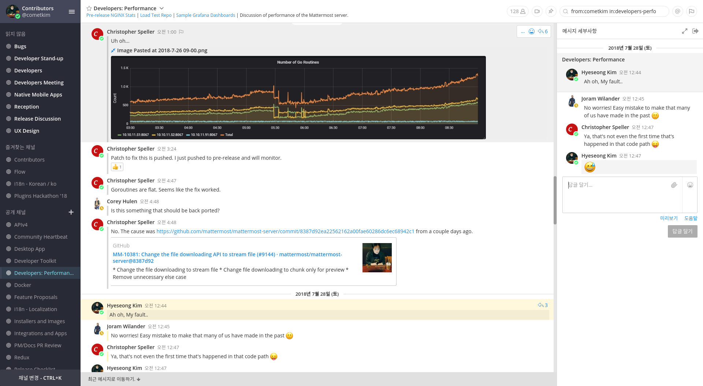

# 들어가며

Mattermost에 대해 궁금하신 분은 [이전 글](/posts/mattermost-contribution/introduction-to-mattermost)을 참고해주세요 :)

제가 Mattermost 커뮤니티에 발들인지 어느새 2년이 되었습니다. 지금은 오픈소스 기여 활동에 대해 그렇게 어렵게 받아들이지 않고 부딫힐 수 있게 되었습니다. 그렇게 잘 하는 편은 아닙니다만... 근자감이 생겼다고나 할까. 어쨋든 뭐든지 첫 단추가 중요하다는 말이 맞는 것 같습니다.

오픈소스 문화에 매료되어 주변사람들에게 막 전파하고 ~~약을 팔고~~ 싶지만 사실 어느날 갑자기 커다란 프로젝트에 뛰어들어 이슈를 파악하고 PR을 보낸다는 것은 쉬운일만은 아닙니다. 저도 막상 돌아보면 시작하게 된 계기가 있었습니다.

이야기를 읽기 좋은 순서로 각색해서 시간순서는 사실과 다를 수도 있습니다. ~~목적은 사실전달이 아니라 약팔이거든요~~

# 시작하게 된 계기

솔직히 처음 시작했던 계기는 타의가 더 컸습니다. 이러니 저러니 해도 계기가 없으면 시작하기 힘든법이지요.

저와 Mattermost는 좀 복잡한 관계가 있었지만 사실 이 중 하나만 있더라도 시작하는데 부족함은 없다고 생각합니다.

## 사용자, 시스템 관리자, 비즈니스 파트너

제 첫 직장은 소프트웨어 개발 회사가 아니라 솔루션 영업과 기술 지원을 제공하는 회사였습니다. 게임개발이 아니여도 괜찮다라고 생각했지만 막상 들어간 회사에서 하게되는 일이 소프트웨어 개발과 관련 없게 될 줄은 몰랐습니다. 간단한 코딩이나 서드파티 개발은 종종해야 했지만 풀타임 개발과는 거리가 많이 멀었습니다. (주업무는 못된다는 느낌)

그렇게 솔루션 기술지원 업무를 하던 와중 2014년부터 실리콘밸리에서 Slack이 엄청난 인기를 끌었고, 2015~2016년에는 국내에서도 이메일을 대신한 메시징 기반 커뮤니케이션에 대한 관심이 뜨거워졌습니다. 저도 트렌드를 따라가기 위해 리서치를 해야 했습니다.

Slack은 On-premise 계획이 (아마 지금도)없다고 했고, 당시 유력하게 봤던 Atlassian의 (지금은 Slack에 인수된) HipChat은 도저히 쓸만해 보이지 않았습니다.

그 당시 저는 *Open source alternative*라는 키워드에 꽂혀 있었습니다. 비싼 구독모델이 판을 치는 시기에 쓰고 싶은 소프트웨어를 다 구독하기에는 돈이 너무 모자랐다는게 이유였고, 대안으로 사용할 수 있는 무료 오픈소스 소프트웨어를 곶잘 찾아쓰고는 했었습니다.

그러다보니 자연스럽게 슬랙의 오픈소스 대안으로 소개된 Mattermost, Rocket.Chat 등을 알게됐고, 그 중에서 특히 Mattermost가 (적어도 그 당시엔) 가장 완벽한 슬랙의 대안으로 보였습니다.

적극적으로 의견을 알리자 곧 회사에서 Mattermost와 파트너쉽을 맺고 영업을 시작했고, 저는 관련 기술지원을 하게 되었습니다. 그리고 회사 자체에서도 이메일 대신 사용하기 괜찮다고 판단이 됐는지 제가 테스트용으로 올렸던 서버에 그대로 눌러앉아 쓰기 시작했습니다.

이렇게 저는 Mattermost의 사용자이자, 어드민이자, 파트너라는 복잡한 관계에 놓이게 됐습니다.

## 오픈소스와 비즈니스의 갈등

오픈소스 전략을 채택한 많은 회사들은 클라이언트들에게 오픈소스 커뮤니티의 구성원이 되는 것을 요구합니다. 그렇지 않고서야 사용자 지원을 해주지만 로드맵 충돌은 어쩔 수 없는 일입니다.

오픈소스와 엔터프라이즈 비즈니스의 통합은 이상적인 부분만 본다면 조금만 타협해서 서로 오래 윈윈할 수 있는 전략입니다만, 소위 "갑" 문화가 발달해있는 국내에서는 어려운 이야기입니다.

우린 오픈 커뮤니티라는 벤더와 돈 줬으니 무조건 해달라는 고객의 이해가 완전히 엇갈리고(하지만 회사는 그 사실을 잘 모르고), 그 중간에 끼게될 저는 돌파구를 찾아야했습니다. 클라이언트에게 "요구하신 건 이 솔루션 로드맵과는 거리가 멀어서 반영이 어렵겠습니다" 하고, 보스에게 "이건 로드맵을 완전히 무시하는 터무니없는 요구사항입니다"하면서 무시할 수는 없으니까요.

실제로 비즈니스가 시작되고 PoC를 하는 과정에서부터 고객의 요구사항이랑 충돌하는 부분이 많이 나왔습니다.

**"이거 오픈소스니까 소스코드 다 볼 수 있는거 아니냐?"**

중간에서 Mattermost 클라이언트를 커스터마이징해서 제공하는 것으로 결정되면서 제 악몽이 시작되었습니다. 릴리즈 주기인 2달 마다 맞춰서 커스텀 코드를 리베이스 해줘야 했고, 혼자 죽을 맛이였습니다.

비개발자에게 지속적인 코드 리베이스의 어려움을 어떻게 설명해야 했을까요... ㅎㅎ 저는 일찍이 소통을 포기하고 빌드타임 핵을 통해 부분적으로 커스텀 컴포넌트를 덮어씌우는 Workaround를 고안하는 둥 어떻게든 "기술적으로 해결하고자" 열심히 부족한 머리를 굴렸지만, 어떤 핵도 제대로 유지보수가 되지 못했습니다.

Mattermost는 끊임없이 발전하고 있었고, 저는 그 발전을 억지로 따라가다가 지칠대로 지쳐버렸습니다. 여기서 저는 처음으로 Burn-out을 경험합니다.

열심히 발버둥 치던 저는 결국 직접적인 컨트리뷰션 밖에 답이없다고 결론을 냈고, 이 주장으로 인해 회사와는 끊임없이 충돌해야 했습니다.

어쨋든 Mattermost의 엔터프라이즈 로드맵에 의견을 내고, 피드백을 모아 전달하기 시작했고 원래부터가 Community-driven 하게 운영되는 Mattermost에서는 이게 아주 자연스럽게 수용되었습니다. 회사에서는 일 제대로 안하는 사람이 되어가는 것 같았지만 커뮤니티의 분위기가 참 맘에들어 꾸역꾸역 했습니다.

고객으로부터 그리고 내부 사용자로부터 주로 보고되던 문제점 중 "한국어 지원이 미흡한 것 같다"가 있었는데 그 중 한 번은 해시태그의 한국어 지원이 되게 해달라는 요구가 있었습니다. 이미 티켓이 수개월 전에 열려있었지만 개발자 중에서 한국어 사용자가 없다보니 쭉쭉 뒤로 밀린 것 같았습니다. 마냥 기다릴 수는 없었고, 이 이슈가 제게 첫 "코드로써의 기여"가 되었습니다.

- [PLT-2077 Support CJK Hashtags](https://github.com/mattermost/mattermost-server/pull/4555)

하고보니 **"생각보다 할만한데?"** 하는 느낌이 들었습니다.

## 함께하는 개발에 대한 동경

[예전 회고글에서도 썼지만](/posts/2017-to-2018/#일-얘기는), 저는 솔루션 지원 일을 하면서도 개발자가 되고자 하는 목표를 버리지 않았습니다.

이전부터 만들고자 하는게 있다면 만들어 쓰고, 혼자서 개발 공부도 하고 있었지만 개발자가 되기엔 큰 장벽이 하나 있었습니다.

바로 "협업해본 경험이 없다"는 점 입니다. 실제로 신입개발자가 가질 수 밖에 없는 가장 큰 약점이고, 많은 회사들이 신입 뽑기를 꺼려하는게 이유 또한 여기서부터 비롯됩니다. 제가 구직할 때도 "팀 프로젝트 해봤냐", "협업경험은 있냐"가 단골 질문 1순위였네요. 인턴 경험이 있는게 아니면 일개 학생이 어떻게 해보겠습니까, 회사를 가도 개발회사가 아니라면 거의 혼자 개발하게 됩니다.

저에겐 책으로 배운 협업이 전부였고 그 흔한 스터디같은 것도 해본 경험이 없었습니다. 이걸 어디가서 얘기하는 건 "책으로 연애를 배웠습니다" 만큼 부끄럽게 느껴져서 어디가서 자신을 개발자라고 얘기하지 않았습니다. 이 때문에 게임회사 다니는 친구들에게 일 끝나고 프로젝트 해보자고 징징대는 버릇이 생겼습니다. 친구들아 미안해...;

그런 저에게 오픈소스 프로젝트에 PR을 보내고 리뷰받는 경험은 엄청 신선한 것이였고 "나도 할 수 있다"라는 자신감을 주는 일이였습니다.

# 지쳤을 때 보람찾기

"문제 해결"과 "가치 제공"이 제가 일에서 찾을 수 있는 본질 적인 즐거움인데 둘 다 찾지 못하는 순간엔 일이 급격하게 재미없어집니다.

다행히 저는 제가 관심있게 살펴보던 Mattermost가 업무가 되면서 이런 순간들을 어느정도 회피할 수 있었습니다. 문제가 발생하면 스스로 기여해서 해결할 수도 있었고, 고객과 최대한 소통하면서 Mattermost의 가치를 이해시키고 요구와 최대한 통합하고자 노력하다보니 정말 가끔 땅속 깊이 묻혀 보일 기색이 없던 일의 보람이라는 걸 끄집어 낼 수 있었습니다.

그래도 일로 하면 지칩니다, 그런데 심적으로 지쳐있던 시기에 Mattermost에서 이런 편지 한통이 날아옵니다.

<blockquote class="twitter-tweet">
Mattermost 컨트리뷰션 고맙다고 편지받았다. 너무 감동이잖아 ㅠㅠ <a href="https://t.co/bv31QSXRGt">pic.twitter.com/bv31QSXRGt</a>
&mdash; Hyeseong Kim (@KrComet) <a href="https://twitter.com/KrComet/status/988390580928446464?ref_src=twsrc%5Etfw">April 23, 2018</a></blockquote>

솔직히 인생에서 손편지 처음 받아봤습니다. 이 편지는 큰 감동과 원동력을 주었고, 저는 덕분에 힘을내서 곧 이직했습니다. ~~응?~~

# 성장환경 보완하기

수많은 신입 개발자들의 공통 고민이 하나 있습니다. 이건 친구들과 얘기할 때나 국내 개발자 커뮤니티에 가면 항상 보이는 내용이 있습니다.

"가르쳐줄 사수가 없어", "혼자 개발하고 있는데 잘하고 있는지 모르겠어", "뭐부터 해야할지 막막해" 등.. 성장의 갈피를 잡지 못하는 질문입니다.

저 또한 상황은 다를게 없었습니다. 신입개발자나 지망생들은 흔히들 이걸 "잘하는 사수/선배가 없어서"라고 퉁치는 오류를 범합니다. (이게 왜 오류냐면 개발회사가 뽑는 사람은 같이 개발을 할 동료이기 때문입니다) 저는 "나는 이런 생각하지말고 혼자서라도 열심히 해야지" 하면서도 종종 같은 불만을 가졌습니다.

제가 개발자가 되어가는 과정에서 뭘 배웠는지, 뭘 배워야 하는 지 알 수가 없었습니다.

그런데 그렇게 모르는게 많던 시절에 Mattermost의 서버 구성을 보고 배우고, 설정 파일을 보일러플레이트처럼 배껴 썼습니다. 곧 React 공부도 Mattermost 기여를 계기로 시작했고, Docker 사용도 좀 능숙해졌습니다. 고가용성, 모니터링, 스트레스 테스트, 개발 조직 구성, 지향해야할 문화 등등 생각해보면 하나같이 Mattermost로부터 배웠습니다.

그 전에 책으로 보고 배웠다고 생각했던 것과 레벨이 다른 직접적인 관찰과 체험을 통한 "진짜 경험"이였고 Mattermost의 엔지니어들과 커뮤니티의 멤버들은 제 든든한 사수이자 동료가 되어주었습니다. ~~심지어 꼰대도 없습니다. 완벽해~~

그리고 나중엔 급조한 제 초라한 이력서에 "오픈소스 활동" 이라는 다소 그럴싸한 이력이 남아있더군요.

저는 이제 "가르쳐줄 사수가 없어" 고민하는 사람들을 만나면 "오픈소스 커뮤니티 활동을 해봐"라고 조언합니다.

# 오픈소스 커뮤니티의 좋은 점

앞선 내용은 대부분 제 개인적인 환경과 경험을 적은 것이라, 이미 개발자로 경력을 만들어가고 계신 분들에겐 별로 와닿지 않는 내용들일 수도 있습니다.

이번엔 조금 더 보편적인, 오픈소스 개발의 매력을 소개해보겠습니다.

## 서로 존중하는 문화

하지만 제가 경험한 Mattermost의 커뮤니티는 서로를 존중하고 서로에게 친절했습니다. 이건 아마, 코어 팀 멤버들이 선행해서 그런 문화를 주도하고 있기 때문이 아닐까 싶습니다.

쉬운 이슈를 처리하고 있는 개발자라도 전문가이자 그 이슈의 담당자이고, 사용자의 사소한 불편함도 UX의 버그로 취급합니다.

너나 할 것 없이 적극적으로 의견을 나누고 협력해서 끝에가면 "Awesome work at this!"라고 해줍니다.

(이런 오픈소스 문화의 창시자격인 리누스 토발즈의 언행을 보면, 오픈소스라고 해서 이게 꼭 당연한 것은 아닌 것 같습니다만...)

## 함께 성장하는 문화

8월 중순에 CTO인 Corey와의 미팅이 있었는데, 서로 고마움을 전달하는 훈훈한 자리였습니다. 그가 제 커리어 발전을 축하해주며 이런 동반 성장이 오픈소스 커뮤니티의 놀라운 점(Awesomeness of open source community)라고 했던 것이 기억에 남아있습니다.

나중에 보니 아예 링크드인 이력에 너의 기여활동을 추가하라며 [문서](https://docs.mattermost.com/process/community-overview.html?highlight=linkedin#solution-contributors)까지 파뒀더군요. (여담으로 일촌으로 추가하라고 얘기도 해줬는데 프로필을 보니 너무 구름위의 사람인것 같아 신청하지 못했습니다 ㅋㅋ 조만간 용기내서 눌러야겠군요)

확실히 커리어에 도움이 되는 것도 오픈소스의 순기능입니다. 조금 세속적인 것 같지만 제가 오픈소스 커뮤니티 활동을 통해 성장한 걸 생각해보면 부정할 수 없습니다. 설령 대단한 "오픈소스 정신"이 없이 진입한다고 해도 잘 운영되는 커뮤니티에는 아무런 해가 되지 않습니다. 그렇게 조직되었으니까요!

기업에서 산업체에 산업으로의 환원과 채용 증진을 위해 컨퍼런스를 주최하고, 교육이나 인턴쉽을 하는 것과 맥락은 같지만, 기업의 이익에 치중하는 것보다 더 넓게 기여를 환원하고 선순환을 만들어내는 것 같습니다.

## 개발에 집중할 수 있는 시스템

한 번은 PR 중 실수로 `Close()`를 호출하지 않아 메모리 릭이 발생했던 적이 있습니다. 저도 놓치고 리뷰어도 놓쳤습니다, 곧 Pre-release 채널에 배포되고는 모니터링에서 걸렸습니다.

대형사고가 날 수도 있었지만 아무도 제 탓을 하지 않았습니다. 오히려 "자주 있는 일이야 ㅋㅋ" 정도로 위로 받고 끝났습니다.

왠만한 국내 개발회사에서 이런식으로 일하면 책임감 없다고 욕먹을지도 모르겠습니다. 저도 이런 문화에 적응하는 과정에서 햇갈려했었지만 곧 이게 이상적인 형태라고 깨닫게 됐습니다.

Mattermost의 개발 문화와 시스템이 처음부터 잘 되 있던건 아니였습니다. 초기엔 CI도 허접했고, 모니터링 수단도 갖춰져 있지 않았습니다. 하지만 이걸 개인의 책임으로 떠넘기지 않고 서로 협력해서 근본적인 원인을 찾고, 해결하고, 발전해가는 과정을 옆에서 지켜보고 가끔은 참여해보면서 많은 걸 느낄 수 있었습니다.

느끼고 배운 것을 정리해보면 아래와 같습니다.

- 책임은 역할에 따라 분배한다.
- 공통된 역할이라면 그것을 시스템화 한다.
- 시스템의 책임을 개인에게 미루지 않는다.
- 시스템의 유지보수는 모두의 역할이다.

(어찌보면 자주 얘기나오는 "문화로써의 DevOps"라는 것과도 일맥상통하지 않을까요)

하지만 안타깝게도 많은 국내 개발회사들이 도구로 해결할 수 있는 문제나 시스템이 가져가야 할 역할들을 개인에게 떠넘기며 본래 책임보다 더 큰 책임감을 요구하고 있는 것 같습니다. 되려 본래 신경써야할 코드의 퀄리티나 전문가로서의 신념을 포기하게 만들기도 하죠.

뭐 아직 경험이 많다고는 못해 짧은 주관에 불과할지 모릅니다만 어떤 개발 조직이던 이런 걸 궁극적으로 추구해야 하는게 아닌가 합니다. 그렇다면 아직 그럴싸한 커리어가 없는 제가 경험해볼 수 있는 최고의 문화를 경험해보고 있지 않나 하고 감사하게 생각합니다.

# 다시 시작한다면

요즘은 Mattermost가 아닌 다른 오픈소스 프로젝트에도 참여해볼까 하고 있습니다. 눈독들이고 있는 건 GatsbyJS나 Babel 등 입니다.

컨트리뷰션을 했던 일을 회상하다보니 "만약 Mattermost 기여를 처음부터 시작한다면 이렇게 해야지"하는 것들이 있는데, 혹시 다른 오픈소스 프로젝트에 참여하게 될 때도 지켜야 할 것들 입니다.

## 더 적극적으로 소통하기

초반엔 영어가 자신이 없다는 핑계로, 질문할 때 제외하고는 거의 소통하지 않았습니다. 그리고 말할 때마다 영어가 서툴다며 미안해했던 때도 있습니다.

나중에 가서 알게된건데, "영어가 서툰 것" 보다는 "소통을 하지 않는 것"이 더 무례한 것 이였습니다. 사실 당당하게 번역기체로 써서 올려놔도 찰떡같이 이해하고, 혹시 모호한 부분이 있다면 correct 하면서, 이게 맞냐고 물어봐줍니다.

대화 예절을 생각하면 간단한데, 한국에서 얘기하는 권위자와 말할 때의 예절이 아닙니다. 한 번에 이해 못했다고 사과할 필요가 없습니다.

영어가 서툴더라도 적극적으로 의견을 내고, 기능 제안을 주도하고, 이슈의 재현경로를 자세하게 리포트하고, 이슈를 꼼꼼히 챙긴다면 더 환영받을 것 입니다. 하다보니 이런 것들은 영어가 유창하지 않아도 금방 할 수 있는 것이였습니다.

## 내 활동을 드러내기

Mattermost가 자체적으로 Flow 타입을 도입하기 한참 전부터, 저는 Mattermost 관련 업무를 개선하고자 먼저 [Mattermost API 클라이언트와 몇몇 코드들을 Flow로 타이핑](https://github.com/cometkim/mattermost-typed) 했고 NPM에 업로드했습니다.

하지만 이 걸 몇몇에게만 알리고 적극적으로 홍보하지는 않았습니다. 도저히 관심있어 할 것 같지 않아서 최소한의 내용들만 README에 적어두고 말았습니다.

"필요성"을 느껴 만든걸 "인기" 요소가 없어 알리지 않은건 치명적인 판단미스였습니다. Mattermost 팀에서 자체적인 판단으로 mattermost-redux 라이브러리에 Flow 타이핑이 도입되기 시작했을 때, Flow 도입을 제안하고 담당한 Jesus에게 뒤늦게 제 라이브러리에 대한 의견을 물었지만 존재를 모르고 있더군요. 제가 이미 대부분 타이핑 해두었던 것들을 다른 누군가가 중복으로 작업한 겁니다.

그리고 저는 제 라이브러리가 공식의 로드맵과 충돌된다고 판단했고, 짧은 의논끝에 Deprecated를 결정했습니다. 제 첫 NPM 모듈이기도 해서 조금 씁슬한 경험이였습니다.

이 후 저는, 개발자가 자기 활동을 드러내는 것이 단순히 자기자랑이 아니라는 사실을 알게 되었습니다. 하물며 자기자랑 밖에 못되더라도 하는게 낫다는 사실도 함께 말입니다.

## 프로젝트 전체, 힘들다면 적어도 관심 이슈들은 Watch 하기

프로젝트에 참여하고 싶다면, 전체 이력이 아니더라도 최소한의 컨텍스트는 쫓아가야 합니다.

그러기 위해 GitHub에서 한 번 활발한 프로젝트를 Watch 해보면, 곧 엄청난 메일알림을 받게 됩니다.

처음에는 별 생각없이 전체를 f-up 해야 한다는 생각에 Mattermost를 Watch 했다가(이 때는 서버와 웹앱이 하나의 저장소에 있었습니다.) 쏟아지는 Inbox 압박에 3일을 못견디고 꺼버리고는 하루에 수천통씩 메일을 체크할 메인테이너들에 존경심을 가지게 된 기억이 있습니다.

지금은 저도 메일 처리량이 늘어나 두 개 프로젝트를 Watch 하고 있지만, 이상은 아직 힘들 것 같습니다. 대신 관심 있는 이슈와 관련 이슈를 각각 Subscribe 하는 방법을 사용하고 있습니다.

전문적인 이슈 트래킹 도구나 GitHub 알림 앱, 메일 클라이언트의 자동필터 기능 등을 통해 관리하는 것도 방법이 될 수 있습니다.

특히 하루가 멀다하고 릴리즈되고 신규 컨셉이 쏟아지는 프레임워크들은 이게 중요한데, 예를 들면 React에는 Umbrella 이슈라는 것이 있습니다. 중요하거나 영향도가 클법한 변경사항 관련해서 관련 대화나 레퍼런스를 모아두는 일종의 메타 이슈입니다. 저는 이런 종류의 이슈는 되도록 구독해두는 편입니다.

## 더 구체적으로 감사하기

요즘 크게 느끼는건데, 저는 PR 리뷰마다 항상 구체적인 감사를 당하고 있었습니다.

"`id`라고 적혀있는 부분이 햇갈리지 않도록 `index`라고 고쳐준 부분은 인상 깊었어", "jQuery를 제거한 걸 보게되서 기뻐" 등등... 그리고 항상 "Awesome work at this @cometkim" 하고...기분이 좋았습니다. 그런데 그에 비해 제가 평소에 남들에게 해주는 리뷰나 커멘트에는 별로 감사가 느껴지지 않았습니다.

엄연히 같이 한 것인데도 감사할 줄 모르는 것을 넘어서 성의 없음까지 보이더군요. 뼈저리게 반성하고 있습니다.

최대한 일일히 멘션달아서 리뷰어들에게 "Thank you"라고 이야기하는 것으로 시작하고 있는데, "구체적인 감사"는 생각보다 난이도가 높은 것 같습니다.

이 참에 연습하고, 영어공부도 해야겠습니다. 발전해서 일상에서도 좀 "다채롭게" 감사를 표현할 줄 아는 사람이 되고 싶습니다.

# 마무리하며

제가 겪은 어려움이나 성장에 대한 회고를 적어봤는데, 비슷한 어려움을 겪는 분들의 선택에 도움이 되리라는 또는 비슷한 분들과 소통하게되는 계기가 되리라는 소망을 가지고 있습니다.

그런 것 치고는 보편적인 얘기는 못적고 너무 구구절절 자기 얘기 뿐인 것은 아직 경험이나 글 실력이 미숙해서 인 것 같습니다. ~~아님 그냥 꼰대라서..?~~

또는 제가 어떤 사람인지 판단하는데도 도움이 되겠군요. 저는 속마음에 크게 거짓되는 글은 쓰지 않거든요.

어쨋든 정리해놓고 보니 뭔가 뚜렷해지는 느낌입니다. 연간 회고 말고도 종종 경험이 생기면 회고하는 글을 남겨둬야겠습니다.
