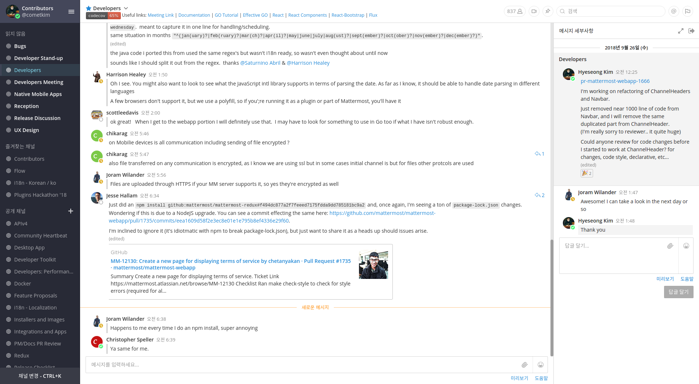
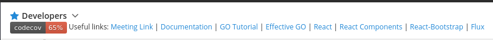
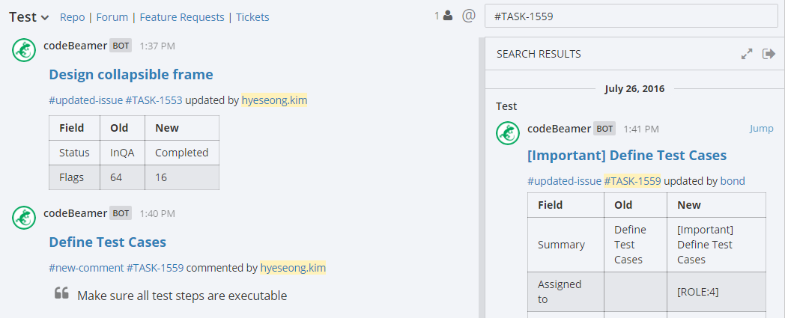
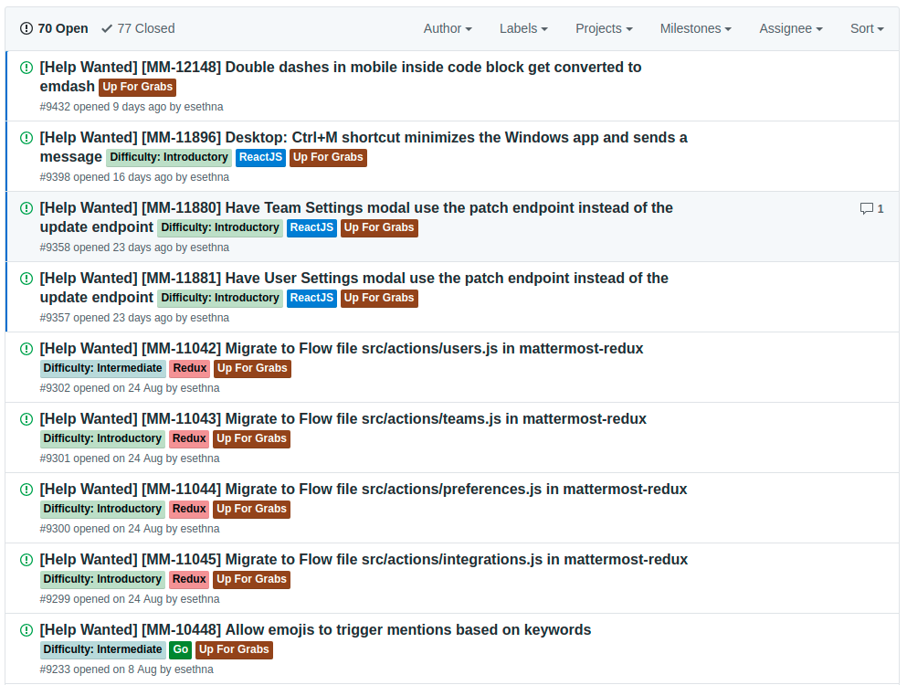
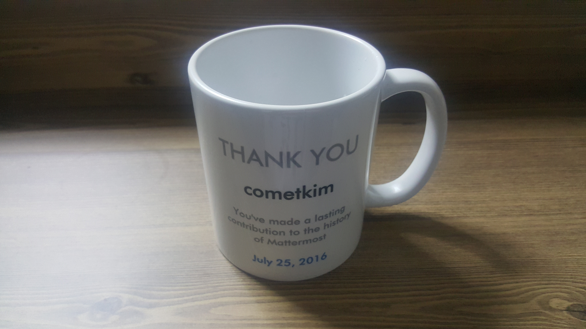
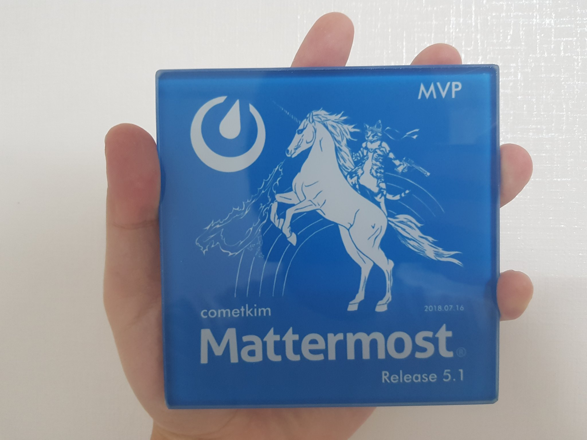

# 들어가며

[2018년 Hacktoberfest가 찾아왔습니다.](https://hacktoberfest.digitalocean.com/) 저는 작년과 마찬가지로 올해도 Mattermost에 기여하게 될 것 같네요.

문득 생각난 것이지만, 국내 개발 커뮤니티에 Mattermost를 소개하고, 스프린트 세션을 만들어 관심있는 분들과 함께하면 좋을 것 같습니다.

하지만 Mattermost가 그만큼 인지도가 있는 프로젝트는 아니지요. 그래서 **슬랙의 대안 솔루션으로써의 Mattermost**와 **오픈소스 프로젝트로써의 Mattermost**를 소개해보고자 합니다.

그리고 곁가지로 제가 [**Mattermost 오픈소스 커뮤니티를 통해 어떻게, 얼마나 성장할 수 있었는지**](/posts/mattermost-contribution/how-i-grow-up-with-mattermost-community)에 대한 이야기도 해보겠습니다. 글 주제가 달라질 것 같아 포스트를 분리했습니다.

# Mattermost가 뭔가요?

[Mattermost](https://mattermost.com/)는 **Open Source, Private Cloud Slack Alternative**로 소개되고 있습니다. 이해하기 쉽게 풀자면 "오픈소스 설치형 슬랙" 정도이고, Mattermost, Inc 회사가 운영하고 있습니다.

많은 오픈소스 솔루션 회사들이 그렇듯, Team Edition / Enterprise Edition으로 나뉘어 있고, 회사의 수익은 대부분 Enterprise Edition에서 옵니다. 주로 Slack 같은 SaaS를 사용하지 못하는 On-premise 환경이 비즈니스 타겟이죠.

그래서인지 당당하게 "Slack Alternative"를 표방하고 있으며, [Why we made Mattermost an open source Slack-alternative](https://www.mattermost.org/why-we-made-mattermost-an-open-source-slack-alternative/)라는 글에서 그 이유가 되는 커뮤니케이션 도구 선택의 실패를 겪었던 경험과 직접 만들고 오픈소스로 공개한 과정에 대한 얘기를 하고 있습니다.

> In 2014, Slack became popular in Silicon Valley, and our company adopted it for messaging. But we had a problem–our archives were in our old messaging app. After our subscription expired, the old app wanted us to pay them to access our own data (and export still didn’t work!). We *hated* being locked in. We fumed. Our discussions, our research, our analyses, and gigabytes of our carefully tagged in-game artwork was all held for ransom by the service we had trusted. Slack was good, but it was another proprietary SaaS app, and we’d just been burned.

팀이 메시지 기반 커뮤니케이션에 완전히 적응했을 무렵 슬랙이 등장했고, 그에 맞춰 모든 커뮤니케이션 이력을 이전하고 싶었지만 기존 서비스가 그 데이터를 독점하고, 추가 비용을 요구했다는 이야기입니다.

팀 커뮤니케이션에서 도구에서는 (이메일이던 메신저던) 대화이력 뿐만 아니라 팀 내에서 오가는 수많은 문서와 자료들도 포함됩니다. 이런 자료들이 특정 SaaS 서비스에 의존하거나 독점되면 안된다고 생각했고, 슬랙도 상황은 크게 다르지 않아 직접 만들게 되었다고 하네요. (일단 슬랙은 데이터 내보내기에 비용을 요구하진 않습니다)

이런 역사로부터, 팀 커뮤니케이션의 중요성을 강조하기 위해, Slack과 의미가 완전 대조되도록 Mattermost라고 이름을 붙였다고 들었습니다. (뭐, 이유는 알겠는데 솔직히 제품명으로 그리 와닿진 않습니다)

# 기능 소개, 슬랙과의 차별 요소

위 스크린샷은 현재(글 쓰는 시점에서 v5.3.0) 공개 컨트리뷰터 채널입니다. 테마는 제가 좀 커스터마이징 했습니다.

대놓고 벤치마킹을 해서 시작했기에, 외관이나 기능, 전체적인 UX는 슬랙과 거의 유사합니다. 이게 장점이죠 사실, 슬랙이 너무 잘나가니...

자세한 기능 목록은 [홈페이지](https://about.mattermost.com/features)에서 확인할 수 있습니다. 핵심은 SaaS가 아닌 직접 구축해서 사용하는 형태라는 점입니다.

그 이외 몇 가지 대표적인 차별점들을 제 취향대로 꼽아보겠습니다.

## 마크다운 지원

마크다운의 유사 스펙만을 조금 지원하는 Slack, Discord 같은 메신저들과 다르게, Mattermost는 마크다운(GFM과 CommonMark 스펙 호환)을 풀 스펙으로 지원합니다.

따라서 그냥 메시지로도 쓸 수 있지만, 조금 더 풍부한 Conversation이 가능하다는 것이 장점입니다. 마치 GitHub의 그 것 처럼요. 개발자들이 특히 좋아할만한 기능입니다.

심지어 채널 헤더에도 마크다운을 쓸 수 있어서, 이런 짓도 가능합니다.

## 태그 검색 지원

본문에 마크다운 이외의 해시태그(#)나 채널태그(~)를 사용할 수 있습니다.

슬랙의 경우 채널을 특정 토픽 단위의 공간으로 정의하고, 해시태그는 그 채널을 가르키는 인디케이터의 역할만 합니다. 제약사항으로 받아들일 수도 있고 개념의 진입장벽도 높습니다.

Mattermost는 SNS에서 흔히 사용되는 형태로, 샵문자로 시작하는 단어가 자동으로 해시태그로 지정되며 검색 단위로 활용할 수 있습니다.

이런 풍부한 컨텍스트가 Integration 만들 때 Markdown 지원과 합해져서 빛을 봅니다. 예를 들면 [이슈트래커 도구와의 Integration을 이런식으로 만들 수도 있습니다.](https://github.com/cometkim/cb-mattermost)

## 스레드 지원

슬랙도 메시지의 스레드를 지원하기 시작하면서 크게 의미가 없어졌을 수도 있겠습니다만, 사실 Slack의 스레드 기능은 Mattermost를 역으로 벤치마킹해서 도입된 기능입니다.

슬랙에 스레드가 없던 시절, 메시지 스레드는 Mattermost의 핵심적인 차별요소였습니다.

지금 굳이 비교하자면 Slack처럼 스레드를 기본적으로 숨기지 않고, 그대로 노출시켜서 조금 더 자연스럽게 스레드 기반의 대화를 유도하는 UX를 가지고 있습니다.

## 다국어 지원

슬랙과 다르게 Mattermost는 채널명을 한국어로 하는데 제약이 없습니다. 위에서 말한 해시태그도 역시 한국어를 지원합니다. ([제 첫 기여이기도 합니다!!](https://github.com/mattermost/mattermost-server/pull/4555))

또한 인터페이스의 다국어 지원을 시작한지 얼마 안된 슬랙과 다르게, Mattermost는 오랫동안 오픈소스 커뮤니티로부터 번역을 기여받았고, 한국어 번역 역시 지원합니다.

[한국어 번역은 일단 제가 Maintainer로 있습니다만](https://docs.mattermost.com/developer/localization.html#translation-maintenance), 오랫동안 관리하지 못해 현재 Alpha 단계인 상태라 많은 기여자들의 참여가 필요한 상황입니다. :pray:

## 슬랙과의 호환성

슬랙의 대안을 표방하는 만큼, UX가 비슷할 뿐만 아니라 슬랙의 핵심적인 기능으로 각광받는 Integration도 거의 똑같습니다. 겉만 비슷한게 아니라 실제로 인터페이스(Incoming/Outgoing Webhook의 Payload)가 대부분 호환됩니다.

때문에 슬랙용으로 만든 Webhook 방식의 Integration의 Incomming Webhook 주소를 Mattermost 것으로만 바꾸면 그대로 동작하는 경우가 종종 있습니다. 실제로 예전에 GitLab을 사용할 때 Mattermost 연동이 없어서 슬랙용을 대신 설정해서 쓴 적 있습니다. (지금은 Mattermost 전용 설정이 있습니다)

또한 주 비즈니스 대상이 슬랙을 수용하지 못하는 On-premise 환경뿐 아니라, **"슬랙을 비용 문제로 무료버전을 쓰고 있는데, 서버를 직접 운용할 여력이 있는"** 사용자들도 포함되기에, 이를 위해 슬랙에서 Export한 모든 데이터를 이전할 수 있는 Slack Migration 기능을 제공합니다. (최근엔 HipChat 데이터 마이그레이션도 준비하더군요) 팀 생성 단계에서 마이그레이션 데이터를 사용하면 슬랙에 있었던 모든 채널들과 사용자, 첨부파일 등이 이전된 상태로 팀을 초기화할 수 있습니다.

## 클라이언트 지원

일단 공식적으로는 웹, 데스크탑, 모바일 클라이언트를 지원합니다.

- [mattermost-webapp](https://github.com/mattermost/mattermost-webapp): React, Redux 기반 웹 클라이언트
- [mattermost-desktop](https://github.com/mattermost/mattermost-desktop): Electron 기반 웹 클라이언트의 래퍼
- [mattermost-mobile](https://github.com/mattermost/mattermost-mobile): React Native 기반의 Android, iOS 네이티브 앱

API를 공개하고 있기 때문에, 커뮤니티에서 다양한 서드파티 클라이언트를 만들기도 합니다.

서드파티 모바일 클라이언트(저도 하나 만들까 생각중입니다)나 터미널 클라이언트, IRC 브릿지 등등...

# 비슷한 프로젝트와의 비교 ([Rocket.Chat](https://rocket.chat))

비슷한 프로젝트 중에서도 Star 수를 압도하는 Rocket.Chat 이라는 프로젝트도 있습니다.

- [Mattermost](https://github.com/mattermost/mattermost-server): 13K Stars
- [Rocket.Chat](https://github.com/RocketChat/Rocket.Chat): 20K Stars
- [Zulip](https://github.com/zulip/zulip): 8K Stars

Rocket.Chat과 비교했을 때 선택한 이유는 이렇습니다.

- 적어도 표면적인 부분에선, 커뮤니티 관리가 더 잘 되고 있습니다. Mattermost의 커뮤니티 관리는 정말 훌륭합니다.

- 두 프로젝트가 8K 쯤에서 서로 업치락 뒤치락 할 때쯤 솔루션 검토를 했었는데, 그 당시 Rocket.Chat은 정말 느리고 버그 투성이인 못쓸 물건이였어요.

- 개인적으로 기술 스택이 Mattermost 쪽이 더 관심사와 맞습니다. 프로젝트 구성도 깔끔하고요.
  - Mattermost: Golang 베이스의 서버와 React 베이스의 클라이언트
  - Rocket.Chat: Meteor.js 베이스의 서버/클라이언트

지금은 Rocket.Chat도 많이 성장했으니 퀄리티를 비교하면 어느쪽이 나을지는 잘 모르겠습니다.

# 오픈소스 커뮤니티로써의 Mattermost

제가 Mattermost를 좋아하는 이유는 소프트웨어의 퀄리티보단 **Community-driven 문화**, **잘 조직되고 관리되는 커뮤니티**입니다.

Mattermost의 CEO, CTO는 제게 **"We are community over company"** 라는 표현으로 Mattermost를 소개했습니다.

홈페이지에는 주력 비즈니스인 엔터프라이즈 에디션에 대한 내용이 가득해서 가려질 수 있지만, Mattermost는 제가 봐왔던 다른 거대한 오픈소스 커뮤니티들과 비교해도 손색이 없는 훌륭한 커뮤니티를 가지고 있고, CEO, CTO, Designer, Core-developer.. 멤버 모두가 그 것에 자부심을 가지고 있습니다.

단순히 솔루션 회사가 사용자 그룹을 지원하는 레벨이 아니라 서버의 엔터프라이즈 에디션 기능을 제외한 대부분의 소스코드가 (대부분 Apache 2.0 라이센스 하에)오픈되어 있고 사용하는 공식 커뮤니케이션 채널, 이슈트래커, 로드맵이나 심지어 정기 개발자 미팅까지 공개된 상태로 진행하고 커뮤니티 멤버의 참여를 독려합니다.

## 커뮤니티 구성요소

[Mattermost Organization in GitHub](https://github.com/mattermost)

투명한 것도 좋지만 이것만으로는 좋은 커뮤니티라고고 할 수 없습니다.

Mattermost는 개발자나 사용자 지원을 살펴보면 꽤 잘 갖춰져있다는 걸 알 수 있습니다.

- [공식 문서](https://docs.mattermost.com/)
- [공식 이슈트래커 (GitHub)](https://github.com/mattermost/mattermost-server/issues)
- [공식 이슈트래커 (Jira)](https://mattermost.atlassian.net/issues/?filter=-4)
- [CONTRIBUTING](https://github.com/mattermost/mattermost-server/blob/master/CONTRIBUTING.md): 워크플로우를 굉장히 자세히 설명해주고 있음
- [공식 개발자 가이드](https://developers.mattermost.com/)
- [공식 채널](https://pre-release.mattermost.com): Mattermost의 공식 업무 채널이자, 컨트리뷰터 채널이자, 릴리즈 미리보기(master)
- [공식 사용자 포럼](https://forum.mattermost.org/): Discourse를 사용한 사용자 커뮤니티
- [공식 기능제안 포럼](https://mattermost.uservoice.com/forums)
- [공식 번역 사이트](https://translate.mattermost.com/): Pootle을 사용한 번역 사이트
- [공식 API 레퍼런스](https://api.mattermost.com): OpenAPI Spectification (Swagger)
- [공식 유튜브 채널](https://www.youtube.com/channel/UCNR05H72hi692y01bWaFXNA)

공식으로 제공되는 문서, 도구나 채널들만해도 여기 정리한 것보다 많을겁니다. 너무 분산되어 있어 보이기도 하지만, 공식 채널로 운영되는 Mattermost가 이 수많은 채널들을 통합해주는 허브 역할을 충실히 수행하고 있기 때문에 생각보다 햇갈리는 일이 없습니다.

이 점에서 Mattermost에서 핵심 가치로 내세우는 **All your team communication in one place, searchable and accessible anywhere.**이 드러나는 것 같습니다.

## Community-driven 문화

Mattermost Core 팀에는 많은 PM, 디자이너, 개발자, 세일즈 등 여러 역할들이 존재합니다. 멤버들은 서로 다른 역할들을 가지지만 "커뮤니티 지원"이라는 한 가지만은 모두가 공유합니다. ([이들의 Handbook 역시 온라인으로 공개되어 있습니다. 개발 조직 운영에 좋은 참고자료이지요](https://docs.mattermost.com/guides/core.html))

잘 관리되는 커뮤니티 덕분에, 컨트리뷰션 경험은 아주 만족스러웠습니다. (이후 다른 프로젝트들을 경험해보니 오픈소스라고 해서 꼭 잘 관리되는 게 아니더라고요!)

기본적으로는 PM 리뷰 -> 개발자 리뷰 -> QA 순으로 진행되고 필요하다면 디자이너 리뷰를 추가적으로 요청할 수도 있고, 공식 채널을 통해 온라인인 멤버들과 실시간으로 의견을 나눌 수도 있습니다.

무엇보다, 항상 친절합니다! 2년동안 (전 회사에서의 세일즈를 포함한)기여 활동 중에서 어색한 영어도 문제가 되는 일은 전혀 없었습니다 :)

# 컨트리뷰션 시작하기

Slack과 거의 유사한 서비스를 만드는 프로젝트에 참여한다는 건 그리 쉽게 접할 수 있는 경험은 아닐겁니다. **오픈소스가 아니라면 말이죠.**

Mattermost의 프로젝트들과 [기여할 수 있는 영역은 아주 다양하게 세분화되어 있어서](https://docs.mattermost.com/process/community-overview.html#contributors) 관심사에 따라 골라먹는 재미가 있습니다.

시작하고 나서 가장 먼저할 일은 [CLA(Contribution License Agreement)를 제출](https://www.mattermost.org/mattermost-contributor-agreement/)하는 것입니다. 그 다음 [이슈트래커에서 Help Wanted 이슈](https://github.com/mattermost/mattermost-server/issues?utf8=%E2%9C%93&q=is%3Aissue+is%3Aopen+Help+Wanted)를 찾아보면 기술별, 난이도별, 상태별로 라벨링이 매우 잘 되있는 걸 볼 수 있습니다.

`Up For Graps`는 아직 Assign된 사람이 없는 이슈를 의미하고, `Difficulty: Introductory`는 수정이 단순하고 쉬운(것으로 예상되는) 이슈를 의미합니다. 이 두 라벨로 필터링하면 입문자도 힘들이지 않고 첫기여를 할 수 있습니다.

## 플랫폼

플랫폼은 프로젝트의 중추이기도 한 [mattermost-server](https://github.com/mattermost/mattermost-server) 프로젝트를 지칭합니다. (예전엔 저장소 이름이 platform이였습니다)

Go 언어로 100% 작성되어 있고, DB는 MySQL 또는 PostgreSQL을 사용합니다. Go 언어로 웹 서비스를 만드는 것 또는 API 디자인, 메인 비즈니스 로직을 다루는데 관심이 있다면 참여해볼만 합니다.

구성 편의성을 고려해 꽤나 간단한 구성으로 되어있지만, 엔터프라이즈 구성이 고려된 복잡한 부분까지 엳볼 수도 있습니다.

## 설치/배포

설치형 솔루션이기 때문에 어떻게 배포하고 운영할 것이냐가 상당히 중요한 이슈입니다.

이를 위한 [도커 이미지](https://github.com/mattermost/mattermost-docker)나 [k8s 클러스터 설정](https://github.com/mattermost/mattermost-kubernetes), 또는 클라우드 VPS의 이미지를 기여하는 것도 커뮤니티에 큰 도움이 될 수 있습니다.

참고:

- [Deployment Solution Program](https://docs.mattermost.com/guides/orchestration.html)

## 웹 클라이언트

Mattermost의 UX 레퍼런스라고도 할 수 있는 웹 클라이언트입니다. React로 큰 규모의 웹 클라이언트를 만드는 데 관심이 있다면 기여해보기 좋습니다.

버전3 초반까지는 Flux 스토어를 사용하다가 Redux 스토어로 마이그레이션이 진행되었습니다. 아직 스토어 마이그레이션이 100% 완료되지 않아 Help Wanted가 다수 열려있는 상태이고 [저도 최근엔 이쪽을 열심히 기여하고 있습니다.](https://github.com/mattermost/mattermost-webapp/pull/1666)

컴포넌트 리팩토링 절차는 가이드라인이 매우 상세히 나와 있기 때문에, 너무 단순하지 않으면서도 막막하지 않습니다.

참고:

- [컴포넌트 마이그레이션 가이드라인](https://developers.mattermost.com/contribute/webapp/webapp-to-redux/)
- [마이그레이션 진행도](https://docs.google.com/spreadsheets/d/1AlFS2F4H74JsONxIS_VNZBxrVJolZxFh7yN46RNCwyg)
- [마이그레이션 이슈 목록](https://github.com/mattermost/mattermost-server/issues?utf8=%E2%9C%93&q=is%3Aissue%20is%3Aopen%20Migrate%20Redux)

## 모바일 클라이언트

React Native로 개발되는 모바일용 네이티브 앱입니다.

참고로 이전엔 그냥 웹앱을 웹뷰로 보여주는 안드로이드 앱과 iOS 앱이 각각 있었는데, Uber에서 RN 모바일앱의 초기 버전을 만들어서 기여했다는 이야기가 전해집니다. ([Uber는 자체적으로 Mattermost를 커스터마이징해서 uChat이라는 이름으로 사용하고 있습니다.](https://eng.uber.com/uchat/))

## 클라이언트 라이브러리

독특하게도 API 클라이언트, Redux 스토어와 리듀서, 셀렉터 등이 mattermost-redux라는 라이브러리 저장소로 분리되어 관리되고 있습니다. 그리고 이 라이브러리를 웹앱과 모바일앱에서 공유해서 사용하고 서드파티에서도 사용할 수 있게 NPM 라이브러리 모듈로 제공되고 있습니다.

여기에 최근 Flow를 사용한 타이핑이 적용되기 시작해서 타이핑 기여도 필요한 상황입니다.

## 문서

문서 기여도 아주 중요합니다. Mattermost는 [공식 문서](https://github.com/mattermost/docs)를 제외하고도 [개발자 가이드](https://github.com/mattermost/mattermost-developer-documentation), [API 레퍼런스](https://github.com/mattermost/mattermost-api-reference) 등 다양한 문서들을 역시 공개 저장소로 운영하고 있습니다.

오탈자를 찾거나 내용을 고치는 일부터 시작해서 유용한 정보를 채워넣어 커뮤니티 발전에 크게 기여할 수 있습니다.

## 번역

[Mattermost 공식 번역 서버](https://translate.mattermost.com)에서 i18n 진행 현황을 보고 참여할 수 있습니다.

한국어 번역의 도움이 절실합니다. 관심이 있으신 분은 공식 [i18n - Korean / ko 채널](https://pre-release.mattermost.com/core/channels/i18n-korean)에서 저를 찾아주세욧 ㅠㅠ

## Integration

Slack의 그것과 마찬가지로 Mattermost에서도 Webhook이나 WebSocket API를 통해 챗봇을 만들거나 시스템 통합을합니다.

Jira의 업데이트 알림을 받거나, 프로젝트 GitHub 저장소에서 알림을 받거나, Jenkins나 Fastlane의 빌드/배포 이벤트에 대한 알림을 받기도 하고, 투표 봇을 만들어 투표를 진행하기도 합니다.

무궁무진하게 아이디어를 펼칠 수 있는 영역입니다.

참고:

- [Integration 디렉토리](https://about.mattermost.com/community-applications/)

## 플러그인

API를 기반으로 한 통합의 가능성은 언제나 열려있지만, 가끔은 아쉬울 때도 있습니다.

Mattermost는 꾸준히 더 많은 사용 시나리오를 만들 수 있는 개발자 SDK와, Mattermost의 API나 UI를 직접 확장할 수 있는 방법을 [만들려는 시도](https://docs.mattermost.com/developer/toolkit.html)를 해왔습니다. Mattermost v5에서 선보인 플러그인 시스템은 그 것의 일환인데, 가상 해커톤에 참여해서 잠깐 만져봤는데 상당히 쓸만했습니다.

- 서버 플러그인을 통해, 추가적인 서버 구성 없이 Mattermost 서버에 플러그인을 설치하는 것으로 미리 빌드된 Integration을 사용할 수 있습니다.
- Mattermost의 기존 API 이외의 추가적인 API를 구성할 수 있습니다.  
  [제가 해커톤에서 시도했던 것은 Mattermost 서버에 GraphQL API를 추가하는 것](https://github.com/cometkim/mattermost-plugin-graphql) 이였습니다.
- 웹 앱 플러그인을 추가해, 버튼을 추가하거나 스타일을 다듬는 식으로 Mattermost UI를 확장할 수 있습니다.

참고:

- [Mattermost 확장(플러그인) 가이드](https://developers.mattermost.com/extend/plugins/)

## 기타 서드파티

웹 앱/모바일 앱이 맘에 안들면 새로운 앱을 만들어 사용할 수도 있습니다. 자신이 쓰는 프로그래밍 언어로 API 클라이언트를 만들 수도 있습니다.

무슨 프로젝트할까 딱히 고민하는 대신 아이디어가 넘쳐 뭐부터 할까 고민하게 되고, 이건 빠져들 수록 즐거운 일인 것 같습니다. ~~고인물 되기~~

# 기여 보상 받기

첫 PR이 머지되거나 Integration을 만들고 공유하면 Mattermost 팀에서 소소한 선물을 보내줍니다.

열심히 기여하다가 릴리즈 MVP에 선정되면 이렇게 추가적인 선물을 보내주기도 합니다. (의미불명인 디자인입니다 ㅋㅋ)

사실 이런 선물수집을 취미로 들이는 것도 좋은 동기부여가 되지만, 더 중요한건 커뮤니티 활동을 통한 성장입니다. 제가 커뮤니티 기여를 어떻게 보상받았는지에 대해 [다른 포스트](/posts/mattermost-contribution/how-i-grow-up-with-mattermost-community)에서 조금 더 구체적으로 얘기해보겠습니다.

그리고 기여활동은 개발자로서 자신을 드러내는데 도움을 주기도 합니다. Mattermost에서는 그걸 아주 적극적으로 권장합니다. [링크드인에 이력으로 추가하라고 친절하게 문서화까지 해둘 정도](https://docs.mattermost.com/process/community-overview.html?highlight=linkedin#solution-contributors)로 말입니다.

# 함께할 컨트리뷰터를 찾습니다

이렇게 오픈소스 커뮤니티 활동을 해오니 한가지 아쉬점이 생겼는데, 바로 커뮤니티에 같은 한국인 개발자가 없다는 점입니다.

다른 개발자들과는 타임존이 크게 차이나다보니 거의 대부분 비동기로 대화하게 되고, 실시간으로 대화할 기회가 많지는 않았습니다. 언어의 장벽 때문에 의견을 주고 받는데 적극성이 떨어지는 것도 사실입니다.

전 회사의 비즈니스 채널로 모 회사에서 쓴다더라 하는 얘기를 종종 들어 기대하고는 했었는데, 아쉽게도 로컬 멤버의 커뮤니티 진입은 없었습니다.

그래서 항상 생각만 미뤄왔던 Mattermost 소개포스트를 작성하게 됐습니다. 이렇게 정리해두는게 진입에 조금이나마 도움이 되면 좋겠습니다.

## 이런 분들께 적극 추천합니다

- 슬랙 대안을 찾고 계시는 분
- 회사에서 Mattermost를 사용/운영 하고 계신 분
- 커다란 오픈소스 프로젝트에 참여해보고 싶으신 분
- 오픈소스 기여 보상(티셔츠, 머그컵 등) 모으는 게 취미이신 분
- 회사에 사수가 없거나 분위기가 안좋아 개인 성장이 걱정되시는 분

모두 제가 시작했던 계기들입니다. 같은 생각을 가지신 분이라면 한 번쯤 관심가져 볼만한 프로젝트라 추천드립니다.

## 2018년 Hacktoberfest 함께하실 분

[Hacktoberfest](https://hacktoberfest.digitalocean.com)는 GitHub와 DisitalOcean에서 매년 주최하는 오픈소스 행사입니다. 10월 한달 간 GitHub 오픈소스 프로젝트에 4 PR이 머지되면 멋진 티셔츠와 스티커를 줍니다.

(요새 입고 출근했는데, 막상 10월에는 추워서 못입고 다닐 것 같네요 ㅋㅋ)

글 시작에서 언급한 것 처럼, 저는 이번 Hacktoberfest도 Mattermost 기여로 도전할 생각입니다.

그리고 이번엔 혼자가 아니라 같이할 사람이 있으면 좋겠다는 생각을 하고 있습니다. 혹시 많이 모이면 스프린트 형식으로 모임을 해도 괜찮겠네요. 혹시 Mattermost에 관심이 있는 분이나, 이번 Hacktoberfest에 도전하고 싶지만 주제가 마땅히 떠오르지 않으시는 분은 부담없이 제게 연락해주시면 감사하겠습니다.

- 이메일: <cometkim.kr@gmail.com>
- 트위터: [@KrComet](https://twitter.com/KrComet)
- Mattermost 멘션: @cometkim

그럼 모두 Happy Hacking!
