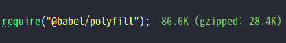

> 주의사항: 이 글은 현재 베타버전인 Babel 7에서의 사용법을 기준으로 설명한다.

# 바벨이란?
바벨은 자바스크립트 표준인 ECMAScript(이하 ES)의 최신 문법으로 작성된 코드를 실행할 수 있는 이전 버전 문법으로 변환해주는 트랜스파일러이다. (core-js 등의 주요 폴리필도 포함하고 있다.)

자바스크립트는 [ECMAScript 표준과, TC39 위원회](http://ahnheejong.name/articles/ecmascript-tc39/), 자바스크립트 커뮤니티를 통해 빠르게 발전해오고 있지만 브라우저들과 노드가 지원하는 자바스크립트는 이 표준을 제대로 호환하지 못하거나 따라잡지 못하고 있다. 특히 구버전의 IE를 지원하거나 해야되는 상황도 많기 때문에 순수히 ES를 사용해 개발하는 것은 그림의 떡같은 상황이다.

> [ES 호환성 테이블](http://kangax.github.io/compat-table)에서 지원현황을 확인할 수 있다.

최신(Current)버전의 노드는 비교적 문법지원이 빠른 편이지만, 서버리스 플랫폼을 사용하는 등 이유로 트랜스폼이나 폴리필이 필요할 수도 있다.

바벨을 사용하면 이런 호환성 걱정 없이 자바스크립트의 최신 문법을 어디서나 자유롭게 사용할 수 있고, 이 후에 포함될 문법도 미리 사용해볼 수 있다.

# 바벨 설정하기
이미 ES 문법을 사용하거나 리액트를 사용하는 프로젝트라면 이미 설정되어 있겠지만, 간단하게 설치하는 법과 설정하는 법을 살펴본 후 어떻게 **최적의 설정** 하는지 살펴보자.

먼저 Yarn을 이용해 AwesomeProject라는 이름으로 프로젝트를 생성하고, 바벨을 사용하기 위한 필수 패키지를 설치한다.

```bash
# Yarn으로 Node.js 프로젝트 생성
mkdir AwesomeProject
cd AwesomeProject
yarn init -y

# 바벨 패키지 설치
yarn add --dev @babel/core @babel/cli @babel/preset-env @babel/polyfill
```

프로젝트 루트에 간단하게 `package.json`이 생성되고 `@babel/core`, `@babel/cli`, `@babel/preset-env` 패키지가 devDependencies에 추가된다. 폴리필 사용도 설명하기 위해 `@babel/polyfill`도 추가했다.

동작을 확인하기 위해 일단 간단한 코드를 `index.js`라는 이름으로 생성한다.

```js
import '@babel/polyfill'

const name = 'World'

const main = async () => {
  console.log(`Hello ${name}`)
}

main().catch(console.error)
```

[ES모듈 임포트](https://nodejs.org/api/esm.html), [화살표 함수](https://developer.mozilla.org/en-US/docs/Web/JavaScript/Reference/Functions/Arrow_functions), [템플릿 리터럴](https://developer.mozilla.org/ko/docs/Web/JavaScript/Reference/Template_literals), [Async 함수](https://developer.mozilla.org/ko/docs/Web/JavaScript/Reference/Statements/async_function) 등의 문법을 사용했다.

이 파일을 설치한 바벨 CLI를 이용해서 트랜스파일 해보자

```bash
npx babel --presets @babel/env index.js
```

트랜스파일 된 코드가 stdout으로 다음과 같이 출력된다.

```js
"use strict";

require("@babel/polyfill");

function _asyncToGenerator(fn) { return function () { var self = this, args = arguments; return new Promise(function (resolve, reject) { var gen = fn.apply(self, args); function step(key, arg) { try { var info = gen[key](arg); var value = info.value; } catch (error) { reject(error); return; } if (info.done) { resolve(value); } else { Promise.resolve(value).then(_next, _throw); } } function _next(value) { step("next", value); } function _throw(err) { step("throw", err); } _next(); }); }; }

var name = 'World';

var main =
/*#__PURE__*/
function () {
  var _ref = _asyncToGenerator(
  /*#__PURE__*/
  regeneratorRuntime.mark(function _callee() {
    return regeneratorRuntime.wrap(function _callee$(_context) {
      while (1) {
        switch (_context.prev = _context.next) {
          case 0:
            console.log("Hello ".concat(name));

          case 1:
          case "end":
            return _context.stop();
        }
      }
    }, _callee, this);
  }));

  return function main() {
    return _ref.apply(this, arguments);
  };
}();

main().catch(console.error);
```

`import` 구문이 commonjs의 `require`로 바뀌고 `async`에 대한 폴리필이 들어가는 등, 언급한 문법들이 조금 더 하위 문법(ES5)의 코드로 변환된 것을 확인할 수 있다.

이렇게 생성된 코드는 노드 버전 4에서 실행하더라도 의도한대로 잘 동작한다. (정확히는 유지보수되고 있는 노드 버전에 대한 동작을 보장한다. 버전 5는 LTS버전이 아니라서 이미 EoL이 지났기 때문에 공식적으로 지원하진 않는다.)

# 플러그인과 프리셋

잠깐, 위 예제에 치명적인 결함이 있는 것 같다. 

내 노드 버전은 무려 9.11이라 `import`만 `require`로 바꿔주면 그냥 돌아갈텐데.. 모듈 문법 하나때문에 이렇게 큰 코드를 생성해서 실행해야만 하는가?

바벨은 각 문법별 트랜스폼을 각각 독립적인 **플러그인(Plugin)**으로 제공하며, 이 플러그인들을 한꺼번에 적용할 수 있도록 모아놓은 것을 **프리셋(Preset)**이라 한다. 

이전에 자주 쓰이던 프리셋으로는 `babel-preset-es2015`(년도별 표준 프리셋), `babel-preset-stage-0`(스테이지 넘버별 프리셋) 등이 있다. 이 프리셋들은 이름대로 어떤 기준에 따라 플러그인을 모아놓고 한번에 적용하기 위한 용도로 많이 사용됐지만, 실제 실행환경을 고려하지 못해 종종 불필요하게 너무 많은 트랜스폼이 포함되는 문제가 있었다. 그렇다고 사용할 플러그인만 일일히 추가하기엔 설정이 매우 귀찮다.

이런 문제를 해결하기 위해 등장한 것이 **Env 프리셋**이다. Env 프리셋의 등장 이 후 이전에 자주 사용되던 년도별, 스테이지별 프리셋들은 사용이 권장되지 않는다.

# Env 프리셋 사용하기 - 플러그인

Env 프리셋은 기본적으로 stage 3 이상 쯤 되는 문법의 플러그인들을 포함하고 있다. 자세한 목록을 확인해보자.

```bash
$ yarn list --pattern @babel/plugin --depth 1
yarn list v1.5.1
├─ @babel/plugin-proposal-async-generator-functions@7.0.0-beta.44
├─ @babel/plugin-proposal-object-rest-spread@7.0.0-beta.44
├─ @babel/plugin-proposal-optional-catch-binding@7.0.0-beta.44
├─ @babel/plugin-proposal-pipeline-operator@7.0.0-beta.44
├─ @babel/plugin-proposal-unicode-property-regex@7.0.0-beta.44
├─ @babel/plugin-syntax-async-generators@7.0.0-beta.44
├─ @babel/plugin-syntax-object-rest-spread@7.0.0-beta.44
├─ @babel/plugin-syntax-optional-catch-binding@7.0.0-beta.44
├─ @babel/plugin-syntax-pipeline-operator@7.0.0-beta.44
├─ @babel/plugin-transform-arrow-functions@7.0.0-beta.44
├─ @babel/plugin-transform-async-to-generator@7.0.0-beta.44
├─ @babel/plugin-transform-block-scoped-functions@7.0.0-beta.44
├─ @babel/plugin-transform-block-scoping@7.0.0-beta.44
├─ @babel/plugin-transform-classes@7.0.0-beta.44
├─ @babel/plugin-transform-computed-properties@7.0.0-beta.44
├─ @babel/plugin-transform-destructuring@7.0.0-beta.44
├─ @babel/plugin-transform-dotall-regex@7.0.0-beta.44
├─ @babel/plugin-transform-duplicate-keys@7.0.0-beta.44
├─ @babel/plugin-transform-exponentiation-operator@7.0.0-beta.44
├─ @babel/plugin-transform-for-of@7.0.0-beta.44
├─ @babel/plugin-transform-function-name@7.0.0-beta.44
├─ @babel/plugin-transform-literals@7.0.0-beta.44
├─ @babel/plugin-transform-modules-amd@7.0.0-beta.44
├─ @babel/plugin-transform-modules-commonjs@7.0.0-beta.44
├─ @babel/plugin-transform-modules-systemjs@7.0.0-beta.44
├─ @babel/plugin-transform-modules-umd@7.0.0-beta.44
├─ @babel/plugin-transform-new-target@7.0.0-beta.44
├─ @babel/plugin-transform-object-super@7.0.0-beta.44
├─ @babel/plugin-transform-parameters@7.0.0-beta.44
├─ @babel/plugin-transform-regenerator@7.0.0-beta.44
├─ @babel/plugin-transform-shorthand-properties@7.0.0-beta.44
├─ @babel/plugin-transform-spread@7.0.0-beta.44
├─ @babel/plugin-transform-sticky-regex@7.0.0-beta.44
├─ @babel/plugin-transform-template-literals@7.0.0-beta.44
├─ @babel/plugin-transform-typeof-symbol@7.0.0-beta.44
└─ @babel/plugin-transform-unicode-regex@7.0.0-beta.44
Done in 0.30s.
```

앞에서 본 것 처럼 별다른 설정없이 Env 프리셋을 사용하면, 기본적으로 이 플러그인들이 적용된다. 하지만 Env 프리셋은 그 이름에 걸맞는 특별한 기능들을 가지고 있다.

Env 프리셋은 타겟이 될 "환경"을 [browserslist](https://github.com/browserslist/browserslist)를 사용해 지정하고, ES호환성 테이블의 정보를 활용해서 필요한 플러그인만 선택해주는 스마트한 프리셋이다.

바벨의 엔트리 설정파일 `.babelrc.js`을 만든다.

```js
module.exports = {
  presets: [
    ['@babel/env', {
      targets: {
        node: 'current',
      },
    }],
  ],
}
```

기본적으로 플러그인이나 프리셋은 `presets: ["@babel/env"]` 식으로 이름(resolve)만 주고 사용하지만, 세세하게 옵션을 지정할 땐 `[resolve: string, option: Option]` 형태로 들어간다.

- `targets`(`{ [string]: number | string }`): 여기서 프로젝트 타겟 환경을 지정할 수 있다. `chrome`, `opera`, `edge`, `firefox`, `safari`, `ie`, `ios`, `android`, `electron` 식별자로 특정 브라우저 버전을 콕 짚어서 지정할 수 있다. 예를 들면 이런식으로:
  ```js
    {
      /* ... */
      targets: {
        ie: 11,
        chrome: 43, // 물론 여기서 'last 2 versions' 같은 브라우저리스트 셀렉터를 쓸 수도 있다.
        firefox: 52,
        edge: 40,
        ios: 9,
        android: 5
      }
      /* ... */
    }
  ```
  - `node`(`number | string | 'current' | true`): 노드의 프로젝트의 경우 `'current'`나 `true`로 지정하면 실제 바벨을 실행하는 노드 환경의 버전(`process.versions.node`)이 선택된다.
  - `browsers`(`Array<string> | string`): 일일히 지정하는게 아니라 이 옵션에서 브라우저리스트 셀렉터를 하나 이상 지정해주면 알아서 골라준다. 물론 명시적으로 특정 브라우저를 지정해서 설정했다면, 이 옵션은 오버라이딩 될 것이다.

이참에 `index.js`는 `src/index.js`로 옮기고 `package.json`에 빌드 스크립트도 추가해줘서 프로젝트 스러운 구조를 만들어보자.

```bash
mkdir src
mv index.js src/
```

```diff
{
  name: AwesomeProject,
  version: 1.0.0,
-  main: index.js,
  license: MIT,
  devDependencies: {
    @babel/cli: ^7.0.0-beta.44,
    @babel/core: ^7.0.0-beta.44,
    @babel/polyfill: ^7.0.0-beta.44,
    @babel/preset-env: ^7.0.0-beta.44
-  }
+  },
+  scripts: {
+    build: babel -d dist src,
+    start: yarn build && node dist/index.js
+  }
}
```

`yarn start`로 간단히 실행할 수 있게 되었다. 출력된 `dist/index.js`를 출력해보면 불필요한 트랜스폼이 싹 없이진게 보인다.

```js
"use strict";

require("@babel/polyfill");

const name = 'World';

const main = async () => {
  console.log(`Hello ${name}`);
};

main().catch(console.error);
```

실제 노드 버전을 따라가게 설정했기 때문에, 다른 사람이 더 낮은 노드 버전에서 이 프로젝트를 실행하더라도 그에 맞게 호환되는 코드가 생성되서 문제없이 동작할 것이다.

# Env 프리셋 사용하기 - 폴리필

하지만, 위 코드에도 여전히 문제가 남아있다. 바로 `require("@babel/polyfill");`이다.



무려 86KB 이다... 물론 전부 실행될 코드는 아니겠지만 적어도 동기적으로 파일을 읽고 구문 분석은 하게 될 것이다. 이거 정말 전부 require할까?

`@babel/polyfill`은 core-js와 regenerator-runtime을 포함하는 폴리필의 프리셋이다. 바벨 플러그인이 그렇듯 폴리필에 대해서도 역시 Env 플러그인이 스마트한 트랜스폼을 제공하고 있다.

`.babelrc.js`를 다음과 같이 수정해보자.

```diff
module.exports = {
  presets: [
    ['@babel/env', {
      targets: {
        node: 'current',
      },
+      useBuiltIns: 'entry',
    }],
  ],
}
```

- `useBuiltIns`(`'usage' | 'entry' | false`, 기본값은 `false`.)
  - `'usage'`: 실제 소스코드에서 사용하여 필요한 폴리필만 포함하도록 트랜스폼한다.
  - `'entry'`: 지정된 환경에서 필요한 폴리필은 일단 포함하도록 트랜스폼한다.

`dist/index.js`가 어떻게 바뀌는지 확인해보자.

```diff
- require("@babel/polyfill");
+ require("core-js/modules/es6.array.sort");
```

그렇다. 내 노드 9.11 환경에서 필요한 폴리필은 고작 `Array.prototype.sort`가 전부였다. 사실 실제 코드에서 `sort()`를 사용하지 않았기 때문에 폴리필 자체가 필요없다. `usage` 옵션을 사용하면 해당 구문자체가 없어진다.

종종 CRA, CRNA 같은 프로젝트를 보면 `usage` 옵션과 비슷한 역할을 하는 바벨 프리셋을 직접 만들어 제공하는 걸 볼 수 있는데 바벨 7으로 업그레이드 후엔 모두 순정으로 대체될 것으로 보인다.

# Env 프리셋 사용하기 - 그 외 옵션들

`targets`와 `useBuiltIns` 설정으로 어느정도 최적의 설정을 가져갈 수 있지만, 가끔 다른 플러그인/프리셋 넣다가 제대로 안들어가는 경우도 있었다. (버그일 것 같은데 지금은 어떨지 모르겠다)

`include`와 `exclude` 옵션으로 예외적으로 포함/제외 할 플러그인들을 지정할 수 있다.

beta-40만 해도 있었던 몇 옵션이 안보인다. 얼마나 더 바뀔지 모르겠으니 나머지 옵션들은 정식 릴리즈 후 다시 보는게 좋을 것 같다.

# 모던 자바스크립트 사용하기

이제 표준은 따라 왔다. 더 나아가 아직 없는 힙한 문법도 사용해보고 싶다. 아니 [데코레이터](https://github.com/tc39/proposal-decorators)만 하더라도 이미 MobX에서 널리 쓰이고 있다.

이런 문법들은 실험적인 기능이라 프리셋단위로 제공되기엔 어렵지만 바벨에 구현된 플러그인이 있는지 여부정도는 [babel/proposals](https://github.com/babel/proposals)에서 확인할 수 있다.

실제로 플러그인이 있는데 이 목록에 없는 문법도 몇 있다. 이름 규칙은 `@babel/plugin-proposal-*` 이니 [NPM에서 검색](https://www.npmjs.com/search?q=%40babel%2Fplugin-proposal)해서 둘러보는 것도 좋겠다.

RxJS나 Lodash에서 활용하기 위해 [파이프라인 연산자](https://github.com/tc39/proposal-pipeline-operator)를 추가해야한다면 플러그인 단위로 추가해준다.

```diff
module.exports = {
  presets: [
    ['@babel/env', {
      targets: {
        node: 'current',
      },
      useBuiltIns: 'entry',
    }],
  ],
  plugins: [
+    '@babel/proposal-pipeline-operator',
  ]
}
```

Env 프리셋에 없는 것 중에도 눈에 띄는 제안들이 아주 많다.

- Optional Chaining
- Nullish Coalescing
- Throw Expressions
- Numeric Separator
- Function Bind
- Decorators
- RegExp Unicode Property Escapes
- RegExp Named Capture Groups
- RegExp DotAll Flag
- do Expressions
- Logical Assignment Operators
- Optional Catch Binding
- Export Extensions

유력한 문법들이니 바벨을 통해 하나씩 미리 써보면 좋을 것 같다. 문법을 직접 쓰지 않더라도 트랜스파일된 코드를 보면 자바스크립트 코딩 패턴을 익히는데 도움이 좀 된다.

# 마무리하며

TypeScript나 Flow 사용하는 등 좀 더 많은 케이스 별 바벨 설정을 다루고 싶다.

그러나 자바스크립트 프로젝트는 웹 프로젝트 비중이 크다보니 바벨만가지고는 내용을 다룰 수가 없다. (React라던가...) 내용 마무리를 못할 것 같아 일단 노드와 자바스크립트로 주제를 좁히게 되었다. 

Webpack 4가 내가 알던거랑 많이 바뀌었다고 하니 그 주제를 다룰 때 다시 바벨을 보게 될 것 같다. 다음엔 Webpack 4로 웹프로젝트 설정하는 부분과, Rollup을 이용해 다른 형태의 라이브러리 모듈을 만드는 것을 탐구해봐야겠다.

확실한 건 **어떤 자바스크립트 프로젝트던 바벨이 포함되 있을 것**이다.
