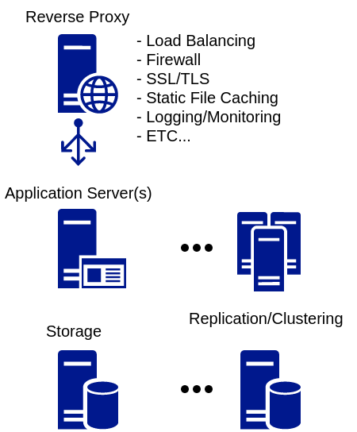

이직한 회사에서 루비 온 레일즈를 처음 쓰게 되어 스터디겸 파일럿 프로젝트를 진행하고 있다.

실제로 사용할 서비스이기 때문에 배포와 운영 단계까지 고려하고 있는데, 프로젝트를 Dockerize하여 [docker-compose](https://docs.docker.com/compose)로 운영하는 방향으로 정했다.

Dockerfile 이미지를 만들고 docker-compose로 서비스를 정의하는 것은 레일즈 뿐 아니라 대부분의 웹 앱이 비슷한 구성을 따라가기 때문에 이번에 하고 있는 레일즈 서비스 구성 과정을 참고 삼아 남겨두려고 한다.

# 일반적인 웹 애플리케이션 구성



일반적으로(적어도 내가 봐온 것들 기준으로) 작은 규모의 웹 서비스는 위 그림같이 프록시, 앱(+런타임) 서버, 스토리지(File, DB, Cache 등)으로 구성된다.

대표적인 예시로, APM(Apach + PHP + MySQL) 또한 이 구성에서 크게 벗어나지 않는다.

다만, APM처럼 하나의 웹서버가 프록시와 앱 실행 역할을 둘 다 수행하고 있다면 두 개의 웹 서버로 분리해주는 것이 서비스 구성성(Composability) 확보에 도움이 된다.

여기서는 NGINX, Ruby on Rails, MariaDB의 단일 인스턴스로만 스택을 구성한다. 서비스 이름을 줄여서 각각 Web, App, DB 라고 별칭한다.

# App 이미지 만들기

## Dockerfile 이미지

웹 애플리케이션의 Dockerfile을 작성하는 것은 패턴이 있기 때문에 단계별로 나눠서 서술해본다

### 먼저 기반 이미지를 지정한다.

```dockerfile
FROM ruby:2.5.1-alpine
```

프로그래밍 언어에서 제공하는 공식 런타임 이미지가 있다면 사용한다. 프로그래밍 언어는 Stable 버전이 있고 호환성에 상당히 민감하기 때문에 `latest`를 사용하지 않고 버전을 지정한다. 

문제가 없다면 가벼운 alpine 기반의 이미지를 사용하는 편이 이미지를 경량화 하고 빌드시간을 최소화할 수 있다.

### Setup: 절차에서 필요한 의존성을 설치한다.

```dockerfile
RUN apk add --update \
    ca-certificates \
    linux-headers \
    build-base \
    libxml2-dev \
    libxslt-dev \
    tzdata \
    nodejs
```

ca-certificates는 컨테이너에서 외부로 HTTPS 요청할 때 필요하므로 반드시 설치해주도록 한다.

그 외 패키지들이 레일즈가 직접 호출하거나 네이티브 모듈을 빌드할 때 사용하는 최소한의 패키지들이다.

원하는 의존성을 위한 설치 패키지가 제공되지 않는다면 다른 설치 옵션을 사용할 수 있다. 해당 의존성 모듈의 홈페이지 등을 참고해서 설치하면 된다. 수동 설치를 해야한다면 소스코드 컴파일을 위한 모듈을 더 받아야 한다.

```diff
RUN apk add --update \
    ca-certificates \
    linux-headers \
    build-base \
    libxml2-dev \
    libxslt-dev \
    tzdata \
-   nodejs
+   nodejs \
+   yarn

+RUN gem install bundler
```

프레임워크에서 사용하는 패키지 매니져를 설치한다. 레일즈에선 [Bundler](https://bundler.io) 를 사용하며, [5.1 버전 부터는 에셋 파이프라인에서 Yarn을 JavaScript 패키지 매니져로 사용](http://guides.rubyonrails.org/5_1_release_notes.html#yarn-support)한다.

### Tip: 버전 잠금(Lock)

컨테이너는 언제 빌드해서 언제 실행하던 몇 번을 수행하던 선언된 동작이 동일하게 수행되도록 불변성과 멱등성을 보장해야한다. 

의존성 설치과정에서 버전 지정이 확실하지 않으면 설치되는 의존성 모듈의 버전에 따라 동작이 바뀔 여지가 있다. 버전 지정을 위한 몇 가지 규칙을 정해놓으면 좋다.

- 호환성이 상관없는(주로 단일 기능만 수행하는 모듈) 경우 마지막 버전을 설치한다.
- 버전에 따른 호환성 변경이 있는 경우, 버전을 지정해서 설치한다.
- `ENV` 디렉티브를 이용한다.

```diff
ENV NODE_VERSION 8.11.2

RUN apk add --update \
    ca-certificates \
    linux-headers \
    build-base \
    libxml2-dev \
    libxslt-dev \
    tzdata \
-   nodejs
+   nodejs\>${NODE_VERSION} \
    yarn
```

프로그래밍 언어에서 제공하는 패키지 매니져를 사용하는 경우 [Semantic Versioning](https://semver.org)을 따라가는 경우가 많아서 마이너 버전이 매번 다르게 설치될 수도 있다. 패키지 매니져에서 제공하는 버전 잠금 기능을 활용하자 

```diff
-RUN gem install bundler
+RUN gem install bundler \
+    && bundle config --global frozen 1
```

번들러의 경우 `frozen` 옵션을 활성화하면 컨테이너 내부에서 패키지 버전이 임의로 변경되지 않도록 강제할 수 있다.

### Tip: 잘 설치됐는지 검증하기

셋업 과정에서 의존성을 설치할 때, 패키지 매니져를 통해 설치한 경우 신뢰도가 높지만 수동 설치하는 경우는 설치가 잘 완료되었는지 검증할 필요가 있다.

방법은 간단하다. 명령어를 한 번 수행해보면 된다. 주로 버전을 보는 커맨드로 검증한다.

```dockerfile
# NodeJS를 수동 설치 하는 예제

RUN apk install --update curl

ENV NODE_VERSION 8.11.2
RUN curl -fsSLO https://nodejs.org/dist/v8.11.2/node-v{8.11.2-linux-x64.tar.xz

```

## ENTRYPOINT 스크립트

# docker-compose로 서비스 스택 정의하기

## App 서비스

## DB 서비스

## Web 서비스

## 서비스 확장

# 마무리하며

서비스가 SaaS급 정도되면 Dockerize하고 관리하는 데 한 개 팀 정도는 있어야겠지만, 단일 호스트에서 실행되고 관리되는 작은 In-house 서비스는 docker-compose 정도로도 충분하다.

그리고 서비스 스택을 Dockerize하는 과정은 서비스 운영을 **최소한의 구성**으로 **자동화**하는 과정에 가깝기 때문에 애플리케이션이 요구하는 숨은 의존성과 운영에 필요한 공수를 미리 파악하는데 도움이 된다.

일단 지금 당장은 별 쓸모 없는 야크쉐이빙이지만, 해놓으면 나중에 삽질할 일 조금이라도 줄겠지
