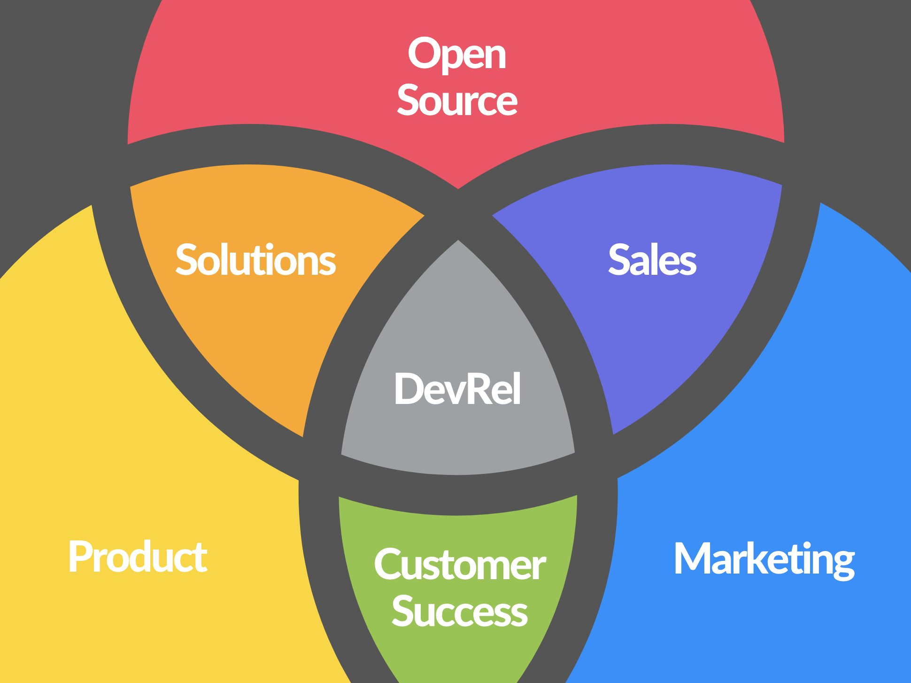

매년을 돌아보기엔 버거웠는지 2021년을 지나보내면서야 두 번째 회고를 쓰게됐습니다. 2017년 보내고 썼었으니 거의 4년 만... 이네요.

너무 오랫만에 글을 쓰다보니 갈무리가 잘 안되네요. 글을 나눠서 이쪽엔 순수하게 제 "커리어"에 대한 회고만 남겨놓으려 합니다. 제 경력 초반을 통째로 돌아보니 조금 적나라한 업무 얘기나 감상이 있어서 전시하기 좋은 내용은 아닌 것 같지만... 제 사이트니 그냥 맘편하게 올려두렵니다. (문체도 바꿨습니다)

2015년 고등학교 3학년에 산학협력으로 처음 일을 시작해서 당근마켓에서 웹 프론트엔드 개발자로 일하고 있는 지금까지 경력 중 이야기 그리고 앞으로에 대한 이야기입니다. 오픈소스 프로젝트나 여타 이야기들도 저한테 꽤나 중요해서 따로 모아서 올릴 예정입니다.

## 나의 첫 이력을 돌아보며

주변 사람들과 어쩌다 커리어 얘기를 하다보면 내가 생각보다 개발자로서 경력이 짧다는데서 놀라는 분들이 종종 있다. 내가 처음 일 했던 솔루션 엔지니어(SE)를 쉽게 "세일즈"라고 대충 소개하니 더더욱 그렇다.

실제로 나는 솔루션 엔지니어로 2년 10개월 가까이 근무했고, 그 후에 바로 개발자로 일을 시작한게 2018년 중순이니 이제서야 개발자로서의 경력이 역전한 셈이다. (주변에 개발자가 SE가 되는 경우는 있어도 그 반대는 그리 흔치 않은 것 같기도하다. 내가 볼 땐 이쪽이 생존자 편향이 상당히 강하게 나타나는 분야같다)

솔루션 엔지니어는 무슨 일을 하는지 먼저 설명을 써본다.

내가 다녔던 곳은 자체 솔루션을 다루지 않았고, 회사 규모가 작았기 때문에 주로 수요층이 확실한 솔루션을 가지고 있으나 국내에 지사나 파트너를 두고 있지 않은 해외 솔루션 업체와 독점 영업 계약을 맺어 중간에서 리셀링 수수료를 얻거나 기술지원 서비스를 제공하는 식으로 돈을 벌었다.

그럼 이 솔루션을 영업을 해야하지 않겠는가, B2B 솔루션 영업은 다른 상품판매와 좀 달라서 고객의 요구사항에 맞는 솔루션인지 복잡한 평가과정을 통해 굉장히 보수적으로 계약을 진행한다 (시스템도 시스템이고 가격도 가격인지라...) 이 계약을 위해 기본적인 사용자 교육을 제공하고, 기존 시스템(소위 "기간계")에 통합(System Integration, 즉 "SI"이다)을 위해 제품을 커스터마이징하거나 PoC를 환경을 구성하는 등 엔지니어링 과정이 필요한데 이런 과정을 Pre-sales engineering (또는 Technical sales, 기술영업)이라고 한다.

회사마다 많이 다르기 때문에 다른 분의 글도 함께 링크한다: [제품을 파는 엔지니어가 되어보니](https://brunch.co.kr/@imagineer/328)

솔직히 말하자면 그 당시는, 고등학교 졸업하기도 전에 시작한 일이라 업무에 대한 이해도가 많이 떨어지는 상태에서 열정만 넘쳤고, 손대는 것마다 일 크게 벌리기 일쑤였다 이 일에 대한 그 당시 감상은 [내가 2017년 말에 작성했던 회고](https://blog.cometkim.kr/posts/2017-to-2018/#%EC%9D%BC-%EC%96%98%EA%B8%B0%EB%8A%94)에 잘 드러나있다.

> 그런데 내가 "문제 해결"을 계속할 수록 뭔가 어긋나는 느낌이 들었다.
>
> ... (중략)
> 회사의 비즈니스는 철저하게 "영업"이였고, 내가 고객의 문제를 고민하는 것은 회사 입장에선 아무 득도 안되는 재능기부로 보이는 듯 하다.

이 후 나는 내 커리어를 평가하기 위해 내 이전 업무들을 여러번 돌아보면서 이해도가 높아지게 되었는데, 지금보면 그 당시 나는 회사입장에선 정말 골칫거리였으리라.

뭐 사고를 친 건 아닌데, 내가 문제만 보면 앞뒤 안가리고 달려들어 에스컬레이션도 없이 직접 해결해버리니 자연스럽게 [기술지원 티어](https://en.wikipedia.org/wiki/Technical_support)가 올라가버리거나 나를 중심으로 이전에 없던 큰 리스크의 프로젝트들을 감당해야 했다. 막 2년차 되가는 뭣모르고 나대는 사원의 어떤 부분을 믿어준건지... 덕분에 나는 그 연차에 쉽게 접할 수 없을 커다란 사이트에서 주도적으로 프로젝트를 지원하고 필드도 들락날락하면서 꽤 큰 성장을 할 수 있었으니 결과적으로는 감사한 일이다. (명목상 내 인건비라고 추가로 비용산정이 들어갔을리는 없으니 회사도 참 손해보는 일이였겠다는 생각이 든다)

애초에 내 손에 다 담을 수 없는 문제들을 다루느라 정말 별 일을 다 해야했고, 꽤 많은 교훈을 얻을 수 있었다.

먼저, **내가 아무리 잘나도 세상의 모든 문제를 기술적으로 해결할 수는 없다**. 특히 사이트가 크고 복잡할 수록 스스로 해결할 수 있는데 한계가 생겼고, 여러 사람이 얽히는 문제는 대부분 "정치적으로" 해결하거나 덮어두고 미루는 수 밖에 없었다.

두 번째, 애초에 나 하나가 눈 앞의 작은 문제를 고민하는 것을 넘어서 **큰 그림에서 톱니바퀴처럼 맞물려야 해결되는 그런 문제가 있다는 것**.

세 번째, **솔루션의 수명과 범위(lifecycle)는 그 자체의 복잡성보다 중요하다**. 요즘에야 많은 소프트웨어 회사들이 DevOps를 얘기하지만, 애초에 공정의 효율화를 중시하는 대기업들이 SI와 SM 조직을 구분하게 된 데는 그만한 배경이 있다. 바텀업으로 기능 개발에만 집중하면 놓치기 쉽지만 사실 이게 훨씬 본질적인 부분이라는 것.

마지막으로 **솔루션은 항상 문제(Problem) 근처에 있다는 것**, 솔루션 영업은 그저 내가 이미 가진 방법론의 우월함을 내세워 포교하는 것이 아니라, 고객의 문제에 뛰어들어 그 상황(use case)을 이해하고 수용하는 것이다.

이 때 같은 자리에서 출발해서 똑같이 해매는게 아니라 내가 가져온 도구가 길찾기에 도움이 되더라고 시연하고 설득하기 위해서는 많은 준비가 필요하고, 요구사항과 잘 맞지 않는 것 같을 때는 솔직하게 물러서서 다른 대안을 제시할 수 있어야 한다. 훌륭한 SE는 고객을 마주보는게 아니라 나란히 서서 문제를 바라본다. 내가 파는게 현자의 돌은 아니기 때문에 당연히 모든 일에 대응하진 못한다. 사례가 준비한 시나리오나 계획된 방향성에 크게 벗어났음에도 욕심을 부려 무리한 커스터마이징을 약속하는 것은 후에 큰 문제를 일으키고 신뢰도 하락으로 이어진다. 모든 영업이 그러하듯 당장 한 번의 성과가 아니라 신용과 파트너십을 보고 전략적으로 행동하는 것이 장기적인 성공으로 이어진다.

이러한 생각들은 그 당시엔 구체적이지 않았지만 모든 상황이 지나간 후 회고를 통해 발굴한 소중한 인사이트들이고, 소프트웨어 개발자로 일하는 지금도 내가 문제를 바라보고 접근하는 방식에 큰 영향을 끼치고 있다.

그 당시엔 눈 앞의 문제에 당장 뛰어들어 가장 단순해보이는 방법으로 풀어내지 못하는걸 답답해했지만, 아이러니하게도 지금와선 문제를 큰 그림에서 바라보고 라이프사이클을 고려해서 전략적으로 접근하는 걸 잘하는게 나의 뚜렷한 강점이 되었다.

> **For every complex problem, there's a solution that is simple, neat, and wrong.**
> 모든 복잡한 문제에는 단순하고 명확하고 잘못된 해답이 있다.
>
> -- H.L. Mencken

개발자가 된 지금도 자주 되새기고 혹시 케이스 스터디가 부족하지 않았는지 문제를 넘겨짚지 않았는지 돌아보게 만들어주는 구절이다.

## 웹 개발자로 다시 경력 쌓기

개발자로서 커리어를 만드는걸 더 지체할 수 없다는 생각에 정말 급하게 이직해서 작은 헬스케어 스타트업에서 약 1년 서버 개발자로 일했다. 당연히 이전의 경험들은 경력으로 인정받지 못했고, 당장 기능개발에 기여해야하는 나에게 큰 그림이 어쩌고..도 당장 아무런 도움도 되지 않는 일이였다. 내 경력은 사실상 백지부터 다시 시작했고, 뒤쳐진 느낌이 들었다. (음 그 때 급여수준을 생각해보면 느낌만 그런건 아니였다)

그 때는 어차피 다시 시작한다는 마음가짐이라 회사가 인정해주는지 아닌지 별로 여의치 않고 기여할 수 있는 부분을 찾고는 했다. [메인 스택은 Ruby on Rails라서 프레임워크 공부를 잠깐 하기도 했으나](https://cometkim.gitbook.io/rails-study-notes) 결국은 과제나 하청받는 프로젝트가 여럿 있어서 PHP던 Spring이던 다양한 레거시 코드베이스들을 얕게 봐야 했다. (이건 솔루션 커스터마이징 하느라 이미 도가 튼 일이라 크게 어려울 게 없었다) 1년이 채 안되는 짧은 근무 기간 동안 백엔드에서 기능을 주도적으로 개발할 프로젝트가 딱 한 번 있었는데, 듣도보도 못한 고객사 전용 프레임워크에 찍어내기에 특화된 그들의 방식을 따르느라 경력에는 별로 도움되지 않을게 분명했다.

그 것보단 내부 복제환경을 구축한다거나 CI/CD를 구성하고 거기에 인수테스트 까지 자동화해서 진행상황을 가시화하는식으로 작업환경을 개선하는 종류의 기여가 많았다. (가장 어려웠던 일은 커스텀된 이클립스 기반 IDE에 하드커플링 되어있는 고객사 프레임워크 구성을 디컴파일러로 뜯어내어 Gradle 프로젝트로 포팅하고 그걸 IntelliJ IDEA에서 디버깅 가능하게 만드는 일이였다. 당연히 아무도 시키지 않았다. 그래도 덕분에 환경 복제와 CI/CD가 가능해졌다)

리소스 문제로 일부 복잡하거나 단순한 기능 몇 부분을 웹뷰를 도입해 내가 화면과 서버 API와 배치 기능 개발까지 세트로 온전히 담당하게 되었는데 이 때 쯤부터 웹 프론트엔드에서 문제해결하는 이야기들을 트위터에 종종 올리곤 했다.

타이틀은 서버 개발자였으나 실제로 기억나는 챌린징한 업무는 거의 웹 프론트엔드 개발이였다. 기능 범위를 격리해서 혼자 개발했기 때문에 꽤 실험적인 접근이라도 마음대로 할 수 있었다. 사실 React를 쓴 것 자체도 회사에서 첫 사례였다. 그 와중에 나는 그 당시 React@experimental 채널에서 아직 베타였던 Hooks와 Suspense를 입맛대로 활용하고 있었고 빌드타임에 Pupeeteer를 사용해 Pre-rendering으로 상당한 수준의 최적화까지 시도했다 (결과는 꽤 좋았지만 이 것 때문에 생기는 웹뷰 버그 잡느라 진짜 개삽질했다)

이런 경험들 덕분인지 내 다음 포지션은 서버 개발자가 아니라 웹 프론트엔드 개발자가 되었고, 그게 지금까지 이어지고 있다.

~~트위터~~ 지인의 소개로 데브시스터즈라는 게임회사에 들어가 1년 8개월 가까이 웹 프론트엔드 개발자로 일했다. 고등학교에선 게임개발을 공부했지만, 빠른 취업을 위해 게임회사 취업을 포기하면서 영영 인연이 없을 거라고 생각했었는데 너무 시야가 좁았다는걸 깨달았다.

그렇게 웹개발을 제대로(?) 하기 시작했는데, 게임회사의 웹개발자라는게 나름 독특한 포지션이라는 걸 알게 됐다. 웹이라는게 회사의 주력 제품과 큰 연관이 없으면서도 접근성이 워낙 뛰어난 플랫폼이라서 온갖 웹 기반 사이드프로젝트가 발생했는데 이걸 모두 지원해야했다.

대외적으로는 회사나 게임의 브랜드 홈페이지부터 대내적으로는 온갖 인하우스 시스템들까지 웹 기반이라는 이유로 담당했으니 여기선 굳이 찾지 않아도 할 일이 넘쳐났다.

아까 내가 소프트웨어의 라이프사이클이 그 자체의 복잡성보다 훨씬 중요하다고 했던가, 겉으로는 단순해보이는 회사 홈페이지조차 그렇게 단순한 프로젝트가 아니라는걸 몸으로 부딪히면서 느끼게 되었다.

코딩을 바라보는 여러 관점이 있지만 메인터넌스 관점으로 바라본다면 **코드를 더하는 행위는 순수하게 부채를 더하는 행위이다**. 회사 홈페이지는 수명이 정말 길다는 것이 자명한 프로젝트 중 하나이기 때문에 최대한 단순하고 빠른 방식으로 접근했다가는 나중에 정말 꾸준하게 부채비용을 치루게 되는데, 문제는 내가 합류한 시점에서 이미 그런 부채들이 쌓여있었다.

다시 생각해보면 이 때가 솔루션 엔지니어로서 경험을 살려 문제를 정리하기 정말 좋은 상황이였지만 안타깝게도 그러지 못했다. 나는 이제서야 개발자로서 제대로 커리어를 시작한다는 고양감에 막 취해있었고, 한창 신작을 쏟고 있는 게임회사의 하드한 스케줄에 발 맞추느라 도저히 체질개선에 많은 리소스를 뺄 수 없었다는 것이 좋은 핑계거리였다.

그나마도 내 기술적인 역량을 앞세워 진행한 몇가지 도전이 굉장히 어정쩡한 결과를 내었고 또 다른 기술부채가 되어버렸다.  내 솔루션 엔지니어로 쌓은 경험과 정체성을 더 빨리 인정하고 강점으로써 활용했으면 좋았을 걸 하는 아쉬움이 남았다.

그래도 이후엔 그렇게 했다. 내가 잘 알고 내 문제를 잘 정의하는 도구가 있다면 적극적으로 팀에 소개하고 적응시켰다.

기능조직으로 많은 의존성과 불확실성에 휘둘려 Estimation이 부정확한게 팀의 고질적인 문제였는데, 마침 Jira 잘쓰려는 조직적인 움직임이 조금 있었다. 나는 Atlassian 솔루션 파트너 하면서 Jira 어드민한테 기능 교육해주는게 업무이던 사람이라 꽤나 적용방식과 효과에 빠삭했고, Estimation 추정치를 얻는 것을 목표로 내 팀에도 Jira 를 적극도입하려고 했다. 근데 이슈트래커 안쓰다가 쓰면 불편하기에 참여도가 떨어지는 것도 있었고, 정확한 추정치를 얻기 까지는 백데이터를 꽤 쌓아야해서 끝내 성과를 보지는 못해 아쉬웠다. (우여곡절 끝에 그럴싸한 번다운이 나오기 시작할 즈음에 내가 퇴사했다)

마케팅 프로젝트 참여하면서 주먹구구식으로 파일 주고 받으면서 진행하던 협업은 그 다음 프로젝트에서 Figma를 밀어서 온라인 협업으로 탈바꿈 시켰다. 이 것도 처음 도입할 때는 그저 일이 늘어나는한 경험적 장벽을 허물기 위해 시간 투자를 많이 했다. 개발하던 시간을 쪼개 프레임이나 프로토타입 정리에 적극적으로 나서고, 아예 이걸 개발자 주도로 하려고 프로토타입 기반 워크플로우를 만들어 프로젝트에 적용했다. 익숙하지 않은 사람들에게 도구의 장점 위주로 노출하는게 분명 도움이 되었다. 새 역할을 떠맡기는게 아니라 일단은 가급적 익숙한 내가 가져가는 것이 힘들지만 분명히 도움이 되었다. 데이터 연동으로 국제화 같이 원래 어려웠던 부분들 날먹하는 장면들을 몇 번 연출한 것이 거부감 줄이는데 도움이 많이 된 것 같다. 페이지 기반 기획과 컴포넌트 기반 개발방식이 잘 맞지 않는데서 오는 어려움이 컸는데 이건... 답이 없어서 해결을 미뤘다.

수 많은 웹사이트 유지보수하는 업무도 이후에 Gatsby 프레임워크의 기능과 현대적인 CMS 솔루션들의 연계로 돌파구가 보였다. 나는 전형적인 분산 컨텐츠 워크플로우에 노출되어있었고, 원래 사용하던 Gatsby는 이 문제영역에서 아주 독보적인 솔루션이였지만 당시에는 이해도가 부족했고, 특정 솔루션에 락인해서 문제를 풀고 싶지 않은 동료의 의견도 있었기에 도입을 피했었다. 이후엔 이 문제영역에 대한 이해도가 굉장히 높아져서 현재 회사에서 같은 문제영역을 다루는데 굉장히 큰 도움이 되고 있다.

아무튼 나는 기술을 큰 그림에서 보고 전략적으로 선택하는데는 능한 사람이였고, 내가 이미 활용하던 기술도 다시보는 계기들을 만들면서 성장하게 된 것 같다. 그게 React던 Gatsby던 GraphQL이던 Figma던 뭐던 원래 다소 얕게 알고 넘어가던 많은 것들이 이면의 전략과 현실의 워크플로우의 이해와 맞물리면서 더 명확해졌다. 이 때부터 트위터에서 내비치는 내 의견들은 다소 강하고 일관성있게 자리 잡았고 덕분에 팔로워가 지속적으로 늘기 시작했다.

대외적인 인지도가 조금 생겨서인지 FEConf 에서 한 세션 잡을 기회도 생겼다.

<iframe width="560" height="315" src="https://www.youtube.com/embed/Hv_PhrfwerQ" title="YouTube video player" frameborder="0" allow="accelerometer; autoplay; clipboard-write; encrypted-media; gyroscope; picture-in-picture" allowfullscreen></iframe>

([최신 슬라이드](https://statecharts-in-webdev.netlify.app/))

발표에서 나의 문제 접근방식과 생각이 드러났던 것 같다. Statecharts라는 도구를 소개하는 건 명분이고 단순히 문제를 바텀업으로 해결하는 걸 벗어나 문제영역을 정의하고 그 (모델링) 과정에 사람들을 참여시키는 것을 발표의 핵심으로 다뤘는데 썩 잘 전달하진 못한 것 같다.

(발표연습 해야하는데 코로나 이후로 기회가 확 쪼그라들어버렸다)

## 새로운 도전을 찾다

데브시스터즈는 꽤 (특히 복지 측면에서) 좋은 회사였지만 내 커리어 정체성을 바로잡아주진 못했다. FEConf 발표 슬라이드에서도 나를 FE라고 명확히 소개하지 못했다 (["What's Next?" 라고 대놓고...](https://statecharts-in-webdev.netlify.app/#2))

이 시기에 [GitHub](https://github.com/cometkim)과 [Twitter](https://twitter.com/KrComet)에서 소셜 활동을 통해 영향력이 쌓이면서 동시에 극심한 가면증후군에 시달렸다. 주변에는 종종 "요즘 거품이 꼈다"라는 표현을 썼다. 내가 잘하는 건 실제로 채용시장이 바라는 것과 거리가 있었는데, 채용시장이 바라는 건 "웹 프론트엔드", "안드로이드", "iOS", "유니티 엔진", "Kubernetes" 등 특정 플랫폼에 능숙한 개발자였고 이 관점에서 나는 남들보다 느렸고, 그나마 내가 강점이라고 인식한 것은 전부 chore한 것들처럼 보였다. (실제로 회사들에게 이전 SE 경험을 경력으로 인정받지 못한 것도 컸다)

나름 규모가 큰 오픈소스 프로젝트([Mattermost](https://github.com/mattermost))에서 코어 커미터로 인정받았다는 자부심은 있었지만, 기여 자체가 뜸해져서 거의 활동을 안하고 있었고, 그 외에는 남들 흔히하는 뭔가 제품스러운 사이드 프로젝트나 포트폴리오 하나 가지고 있지 않았다. 나름 커리어라고 생각했던게 모래성처럼 연약하게 느껴졌다.

지금부터라도 한 플랫폼 잡아서 스페셜리스트로 컨셉을 잡아야 하지 않나? 근데 웹을 계속하는게 맞나? 아직 안해본거(ex. iOS) 마저 해보는게 좋지 않을까? 그런 생각을 왕창했던거 같다. (이 때 고민상담 들어주신 많은 분들에게 정말 감사드립니다)

잠깐 멈춰서 주변을 돌아보니 나는 여전히 비슷한 관점으로 문제를 풀고 있었고, 잘하는거 하겠다고 주변을 계속 푸시하고 있었고, 그러면서 나 자신은 일적으로 전혀 성장하지 않은 거 같았다. (그나마 하드스킬의 성장은 대체로 새벽에 하고싶은 개발이나 오픈소스 기여를 하면서 이뤄졌다) 갑자기 주변에 미안하기도 하고, 아 큰일이네 너무 앞만보고 살았나 싶던 와중 문득 통장을 확인했다. 회사 복지가 좋아서 그런지 아니면 혼자 살면서 생활수준 낮게 유지해서 그런지 그래도 여유가 있다는 걸 확인하고는, 아무 계획 없이 퇴사하겠다고 말해버렸다.

지금은 다른게 아니라 자아성찰이 필요하구나, 필요하면 한 1년 쉬어버리자 이런 생각이였다. 사실 사회 나오고 병특문제도 있고 이직을 워낙 생각없이 덜컥덜컥 하다보니 제대로 쉬어본 적이 없었고, 그렇게 예정에 없던 내 삶의 첫번째 휴식기간을 가지게 되었다.

퇴사만 하면 일바빠서 못한 프로젝트들도 하고 운동도 하면서 최고로 생산적인 나날이 될 줄 알았다. 근데 거의 두 달 동안 잠자고 넷플릭스만 봤다. 내가 워낙 일 좋아하는 사람이라 조기은퇴니 뭐니 하는 얘기 나올 때 잘 공감을 못했는데 이제는 공감할 수 있다. 정말 좋다. 비생산적인 하루하루는 정말 최고였다.

그러면서 마침 코로나 완화로 지수가 요동치던 시기에 현금이 남아 주식투자를 겉핥기로 공부했다. 이 때 (전)자사주가 1년전에 샀으면 1500% 였다는 가정에 배아파하면서 "내부정보"를 어떻게 다뤄야 하는지... 에 대한 힌트를 조금 얻을 수 있었다. 힌트: 적나라한 내부의 상황과 외부의 정보는 잘 구분해 봐야한다... 지나친 비관론 때문에 기회를 놓치지 말자

가만히 누워서 공상하거나, 이런저런 유튜브 찾아보면서 내 커리어 고민은 계속되었다. 내가 거품이라고 불렀던 것이 의외로 좋은 기회들을 물고 왔고 나는 처음으로 회사를 골라서 가는 경험을 해볼 수 있었다. (기회가 어디까지가 내가 만든 거고 어디까지 데브시스터즈라는 회사가 만든 건지 알 수 없어서 혼란스러웠다)

웹 프론트엔드를 다룬다는 공통점은 있었지만, 3달의 자아성찰 기간동안 이건 나한테 큰 의미가 없다고 결론 내렸다. 그냥 채용시장 최적화일 뿐이다. 이걸 제외하니 다른 점이 보였다. 어떤 회사는 내가 이미 잘하는 걸 기여해주길 원했고, 어떤 회사는 나와 새로운 도전을 펼쳐보길 원했다.

최종적으로 오퍼에서도 보상 수준이 큰 폭으로 올랐고 이건 나한테 여러모로 의미가 컸다. 이전 회사들에서 내 실제 열의와 회사의 기대치가 굉장히 따로 논다고 느꼈고 실제로도 이게 보상에서 그대로 드러났기 때문이다. 다음 회사가 내 커리어에 큰 전환점이 될 것이 분명했고 고민이 깊어졌다. 내가 하고싶은 일이 뭔지 어느때보다 명확해야했고 후회없는 선택을 해야했다.

그 때 유튜브에서 본 TBWA라는 광고회사의 Manifesto가 나한테 가장 큰 영향을 미쳤다.

<iframe width="560" height="315" src="https://www.youtube.com/embed/hKx0IDRNfhQ" title="YouTube video player" frameborder="0" allow="accelerometer; autoplay; clipboard-write; encrypted-media; gyroscope; picture-in-picture" allowfullscreen></iframe>

>  **"Do the brave thing"**

가슴뛰는 일, 혁신적인 일을 하라는 메시지가 머릿 속을 멤돌았다. 어느 회사의 제안이 나를 잠못들게 하고 있는지 곰곰히 생각해보니 자연스럽게 가장 높은 보상을 제안한 회사는 잊혀진 후 였다. 결국 그들이 내게 던진 미션만 생각하고 있었다.

결국 나는 어떻게 보면 당시 가장 바보같은(?) 선택을 해버리고 말았다. 안정적인, 잘하는 일, 커리어에 도움될 일들을 다 제치고 가장 알쏭달쏭하고 도전적으로 느껴지는 미션을 제시한 당근마켓에 함류하기로 결정했다.

## 다음 장의 아웃라인을 잡다

결과적으로 구체적으로 하는 일이 바뀌었나하면 당장은 그렇지 않은 것 같다. 9개월 째 당근마켓에서 일하면서 크게 스킬적인 성장을 했나 하면 솔직히 그것도 아닌 것 같다.

이전에 앞만보고 가다가 뚜렷한 성장을 하지 못한 것을 반성하며 조심스럽게, 하지만 또 기여거리가 보이면 그게 프론트던 백이던 시스템이던 잡일일던 가리지 않고 하고 있다. 그래도 그 와중에 내 팀의 문샷 비전을 벼르는데 시간을 조금씩 들여왔다. 거품이 꺼져버리는게 아닐까 노심초사했으나 다행히 그러지 않았다.

당근마켓의 구성원 신뢰는 다소 놀라운 수준이다. 전 직장들은 큰 그림에서 보고 움직임(Movement)을 보일때마다 주변사람들의 회의적인 시선을 상대해야 했고, 온전히 상대하기엔 내 신뢰 자산이 부족해서 결국 실행하지 못하는 경우가 참 많았는데 (그래도 불안한 예감은 잘 맞추는 편이라 나중에 가선 이걸 "예지력"이라고 했다) 여기는 뭔가 다르다. 신뢰하는데 거리낌이 없다고 해야할까, 그리고 목적조직으로 구성되어 있는 것도 잘 동작하고, 유능한 PM의 지원사격이 있으니 내가 문제에 집중 못하는게 오롯히 과제로 남아버렸다.

반 년을 넘게 들여서 ~~깨작깨작~~ 그림은 다 깔아놨고 실행만 남았으니 내년부터는 잡다한 기여로 에너지 분산하던걸 다시 집중하기 위해 노력해야 할 것 같다. 가짓수 줄이는 것 당장은 무리라서 일단 내 집중력 자체를 강화해보고자 한다.

3개월의 공백동안 한가하게 고민해보니 **약점을 보완하는 것 보다는 상대적으로 강점을 살리는게 더 중요**하다는 결론을 내리게되었다. 내 강점은 더 부정할 것 없이 솔루션 세일즈 경험과 다양한 시스템과의 통합 경험에서 온다. 사실 남들보다 오픈소스 프로젝트에 쉽게 진입한 것도 이런 배경이 컸던 거 같다. (오픈소스에 필요한 역량은 절반 엔지니어링, 절반 세일즈에 가깝다)

그리고 나는 예전부터 관심영역이 순수한 엔드유저보다는 커스터머의 관점에 가까웠다. 이전부터 서비스 자체보단 서비스를 구성하는 주변 환경을 개선하는데 더 많은 신경을 써왔다. 그렇다고 다시 SE 할 것 아니면 요즘은 DevRel(Developer Relations)같은 포지션이 떠오르는데, 이 것보단 약간 더 Engineering 비중이 높다. 마침 최근에 실리콘밸리 쪽엔 이쪽의 역량을 위주로 하는 새로운 포지션이 등장했는데 바로 **DX(Developer Experience) Engineer**이다. 팀 또는 고객의 개발 경험을 높이고 유지하는 책임을 가진 엔지니어로써, 외부 고객을 대상으로 할 때는 약간 DevRel 같은 성격도 가진다. 더 나아가 제품 개선을 가속하고 좋은 기준(프레임워크)을 제시하는 역할이 될 수도 있다.

([DX Engineer라는 역할에 대해 자세히 설명하는 아티클](https://www.infoq.com/articles/developer-experience-engineer/))

마침 내 팀의 비전도 이 DX라는 주제와 꽤 깊은 연관을 가지고 있다. 나는 앞으로의 커리어 여정을 이 DX Engineer의 길이라고 정의하고, 가급적 이 쪽 위주로 약점 개선과 강점 강화를 하려고 마음먹었다. 팀 외적인 기여도 연관있다면 손놓지 않고 계속 적극적으로 하게 될 것 같다.

이 여정에 필요하기 때문에 이때까지 쌓은 소셜 인지도를 개인 브랜드 수준으로 강화시키는데도 노력을 해 볼 생각이다. 중심 매체는 당연히 트위터와 깃헙인데 다른 하나를 함께 가져가려고 고민중이다. 최근엔 뉴스레터를 시작해서 한 4개 정도 발행해보았는데 컨셉 고민에 잠깐 중단한 상태이다.

보수적인 플랜도 있어야하기에 웹 프론트엔드 개발자 라는 타이틀도 계속 들고가려고 한다. 그래도 2년 넘게 해보니까, 내가 남들만큼 빠르진 못해도 "잘 하는"건 하는 분야인 듯 하다. 뭐랄까 크로스 플랫폼 인사이트나 시스템 간 통합에 대한 지식은 어딜가나 유용했지만 이쪽은 특히 써먹을 데가 많다. 물론 잘 쓰진 않았지만 UX던 코드 퀄리티던 오버해서 파봤던 경험이 꽤 유효하기도 하다.

## 시작하며

이렇게 써놓고 나서야 긴 방황을 마치고 출발선으로 돌아왔다는 생각이 듭니다. 방향성이 뚜렷하지 않으니 이 때까지 기술적으로 많이 성장하지 못했다고 느낀 것도 그냥 기분탓은 아니였겠지요. 이걸 인지하고 지난 2021년은 약간 느슨한 자아성찰의 해로 보냈는데 한해가 다 지나가기 전에 의미있는 결론을 내려서 정말 다행이라는 생각도 듭니다. 이걸 계기로 2022년부턴 다시 성장하는 내가 될 수 있지 않을까 기대를 품어봅니다.

혹시나 저와 비슷하게 "아, 커리어 꼬였네" 하는 고민이 있으신 분들에게 조심스럽게나마 이런 생각도 있구나 하고 참고가 되었으면 하는 바람입니다. 결국 서로 다른 그 모든 경험들이 모여 나를 지지해주는 강점이 될 수 있을겁니다.
