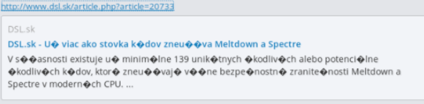

오늘도 Mattermost 컨트리뷰션 중, 개인적으로 인상깊은 경험을하여 급하게 글로 남긴다.

요약: 라이브러리 개발/기여의 영향력이나 파급효과를 항상 고려하고, 관련 **표준**을 꼭 꼼꼼히 찾아보도록 하자!

# 캐릭터셋 이슈

Mattermost는 글에 HTML페이지 링크를 넣으면 서버에서 HTML을 파싱해서 OpenGraph 메타데이터를 저장하고 이걸 미리보기용 데이터로 제공한다.

> OpenGraph는 사이트 미리보기를 지원하기 위한 메타태그 확장 중 하나이다.

하지만 종종 문자셋이 이렇게 깨지는 이슈가 있다.



[GitHub 이슈 링크](https://github.com/mattermost/mattermost-server/issues/8341)

나도 종종 이 문제로 불편해하고 있었으므로 직접 해결해보기로 했다.

문제는 많은 사이트들이, 특히 국내 뉴스 사이트 아직도 UTF-8이 아닌 다른 문자셋을 사용해서 페이지를 제공하기 때문에 발생한다. 서버에서 각자 다른 방식으로 인코딩 된 메타데이터를 주고, 클라이언트는 무조건 UTF-8로 표현하려고 하니 Non-ASCII 글자가 다 깨지는 것이다.

이슈는 클라이언트 사이드로 라벨링 되었지만, 나는 이 이슈가 서버사이드에서 해결하는 것이 더 적절하다고 판단했고, 더 나아가 한 번 파싱한 페이지를 재 파싱하는 것은 매우 비효율적이므로, HTML에서 OpenGraph 정보를 파싱하는 외부 모듈에 기여해서 해결하는 것이 이상적이라고 판단했다.

# 자신있게 PR하기!

문제의 그 모듈이다.

https://github.com/dyatlov/go-opengraph

최근 커밋이 2~3년 전이라 유지보수가 중단된 것은 아닐지 걱정했지만, [이삭줍기 PR](https://github.com/dyatlov/go-opengraph/pull/2)을 보냈더니 엄청나게 빠른 답변을 주었다.

모듈 자체는 매우 간단해서, 메타 태그를 순회하는 구간에 몇 가지 케이스만 추가해주면 될 것 같았다.

먼저 HTML5의 경우

```html
<meta charset="euc-kr">
```

키는 `charset`이고 값을 가져오면 되는 아주 간단한 케이스이다.

```diff
type OpenGraph struct {
 	isArticle        bool
 	isBook           bool
 	isProfile        bool
+	Charset          string   `json:"charset"`
 	Type             string   `json:"type"`
 	URL              string   `json:"url"`
 	Title            string   `json:"title"`
...
```

```go
...
    if keyStr == "charset" {
        og.Charset = valStr
    }
}
og.ProcessMeta(m)
```

하지만 HTML4 방식의 경우 조금 더 복잡했는데,

```html
<meta http-equiv="content-type" content="text/html; charset=windows-1250">
```

이런 식으로 `http-equiv`의 값이 `content-type`이고, MIME 정의를 컨텐트로 가지는 태그에 대응해야 했다.

당황하지 않고 기존 코드의 컨벤션을 살핀 후, 비슷한 스타일로 전용 함수를 작성했다.

```go
func (og *OpenGraph) processCharsetMetaForHTML4(metaAttrs map[string]string) {
	contentType := metaAttrs["content"]
	const key = "charset="
	if i := strings.Index(contentType, key); i > 0 {
		charset := contentType[i+len(key):]
		og.Charset = strings.TrimRight(charset, " ")
	}
}
```

```go
var hasMIME bool
...
    if keyStr == "http-equiv" && strings.EqualFold(valStr, "content-type") {
        hasMIME = true
    }
}
if hasMIME {
    og.processCharsetMetaForHTML4(m)
}
```

좋다. 잘 작동하는지 확인시켜주는 테스트코드도 변경한 후 PR을 보냈다.

https://github.com/dyatlov/go-opengraph/pull/3

이 정도면 꽤나 훌륭하게 처리됐다고 생각했다. 빠른 답변을 주는 메인테이너이기 때문에 보상겸 휴식을 취하면서 기다렸다.

# 의외의 답변, 그리고 표준

> Charset is not part of OpenGraph standard, so I would rather not add it here, it can be parsed separately.
Also, I don't think that you're parsing content-type meta correctly: https://www.w3.org/Protocols/rfc1341/4_Content-Type.html
Encoding definition can be a quoted string.

두 가지 문제를 지적받았다.

첫 번째는, Charset 자체가 OpenGraph 표준에 포함되지 않는다는 것. 이건 어느정도 예상한 답변이였지만 확장 필드 하나만 추가하는 정도였고 나름 합리적인 이유가 있다고 생각했다. 그래도 받을 이유는 충분치 않으니 실제 이슈 링크를 전달하면서 나은 제안이 있으면 알려달라고 했다.

내가 예상치 못한 부분 두 번째, 바로 잘못 파싱했다는 부분이였다.

분명 위의 두 메타태그에 대한 테스트도 해보았지만 문제가 없었다. 그런데 틀렸다고? 메인테이너인 Vitaly([@dyatlov](https://github.com/dyatlov))님이 친절하게 MIME에 대한 RFC 링크까지 주어서 드물게 RFC를 자세히 읽어보았다.

# MIME(Multipurpose Internet Mail Extensions)의 Content-Type 헤더

`Content-Type`은 웹을 한다면 자주 봤을 보게 되는(주로 HTML4 equiv 태그나 HTTP Response Header에서 확인할 수 있는), 전송 컨텐츠의 타입정보를 담는 헤더이다.

[MIME 표준에 대해 기술하고 있는 RFC 1341](https://www.w3.org/Protocols/rfc1341/0_TableOfContents.html)의 4번째 챕터에서 `Content-Type`에 대한 정확한 정의를 확인할 수 있다.

`Content-Type := type "/" subtype *[";" parameter]`

지적받은 잘못 파싱된 부분은 `parameter`였는데, `parameter`는 `attribute "=" value`로 정의되어 있고 여기서 `value`가 다시 `token / quoted-string`으로 정의되어 있다.

`token`의 정의는 일반적으로 쓰는 `utf-8`, `euc-kr`, `windows-1250` 형식이 맞다.

근데 `quoted-string` 이라고? `'UTF 8'` `'EUC KR'`, `'Windows 1250'` 이런식으로도 가능하다는 얘기같은데 이해한게 맞는지 정확히 모르겠다.

(더 자세히 내용을 아시는 분은 부디 알려주시면 감사하겠습니다 :pray:)

왜냐면 저런 형식을 사용하는 것은 HTML이나 웹 서버를 다루면서도 실제로 본적이 없기 때문이다. [MDN 문서에서도 언급이 없다.](https://developer.mozilla.org/ko/docs/Web/HTTP/Basics_of_HTTP/MIME_types)

# 표준의 중요성과 오픈소스

표준의 중요성은 아무리 강조해도 지나치지 않다고 생각한다. 하지만 나름 큰 플랫폼에서 놀다보니 그 플랫폼에서 사용되는 방식이 표준이라고 착각하고 있었다.

MIME은 웹 뿐만 아니라 인터넷 전반을 아우르는 표준이다. 비록 일반적인 환경에서 `token` 형식만 봐왔더라도, 다른 어딘가에서 `quoted-string` 쓰이고 있어 언젠가 문제가 됬을지도 모른다.

플랫폼의 틀에 갖혀 호환성을 놓칠뻔했지만 go-opengraph 모듈의 메인테이너이자, 노련한 웹 개발자로 보이는 Vitaly는 이 부분을 놓치지 않았고, 나에게 잘못된 점과 더 나은 방안을 친절하게 가르쳐 주었다.

감탄과 함께, 또 다시 오픈소스에서 좋은 경험을 얻었다.

후에 라이브러리 개발자가 되고 싶은 사람으로서, 표준에 대한 경각심을 더 가지고 살아야 할 것 같다.

끝. 이제 자야지

# 추가

나중에 생각해보니 굳이 Charset 알아내려고 HTML 태그 파싱할 필요가 없는게, 정상적인 서버면 응답헤더에도 `Content-Type`이 있겠지.

결론: 의미있는(?) 삽질이였다 ㅋㅋ

# 추가 2

캐릭터셋 인코딩 변환을 위해 iconv 부터 찾다니... 내가 Go를 너무 만만히 본 것 같다.

- ["캐릭터셋 인코딩 결정" 구현에 대한 스펙](https://html.spec.whatwg.org/multipage/parsing.html#determining-the-character-encoding)
- [Go의 x/net/html 패키지에 있는 위 표준에 대한 구현](https://godoc.org/golang.org/x/net/html/charset#DetermineEncoding)

결론: 재차 강조하지만 삽질하기 싫으면 표준을 살피자..
