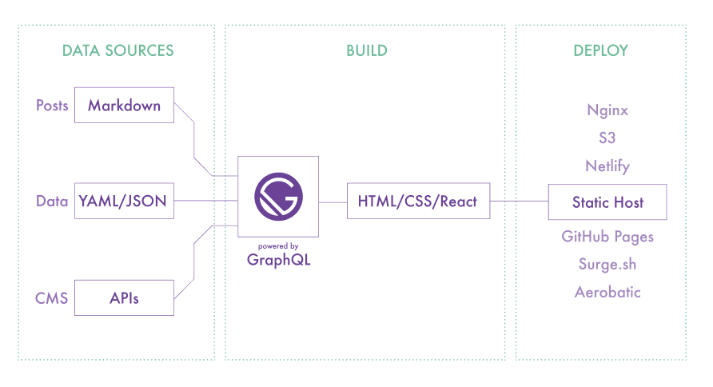
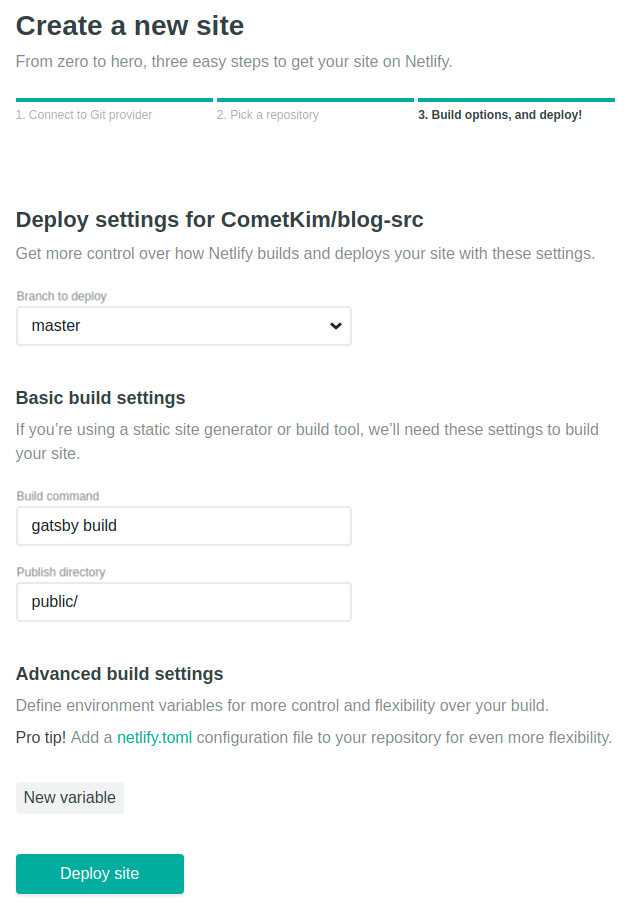

블로그 플랫폼은 Gatsby + Netlify입니다.

[Gatsby](https://www.gatsbyjs.org/)는 무려 React와 GraphQL을 사용해 엄청나게 빠른 퍼포먼스의 사이트를 빌드해주는 정적사이트생성기이고
[Netlify](https://www.netlify.com/)는 정적사이트의 호스팅과 사이트 관리 기능을 제공하는 서비스입니다.

개발 중인 블로그의 [소스코드](https://github.com/CometKim/blog-src)와 [포스트](https://github.com/CometKim/blog-posts)는 100% 오픈소스로 라이센스 동의 하에 자유롭게 사용 및 의견 제시가 가능합니다.

# 들어가며

2018년이 되어 블로깅에 도전, 부끄럽지만 원래는 2017년 신년계획이였다.

이전에도 수 차례 워드프레스로 블로그를 구성하거나 운영해보긴 했으나 테마나 플러그인을 탐색하는데 시간을 들이면서 기술적인 향상을 기대하기도 어려웠고 워낙 게으른 탓에 포스팅도 안하는데 호스팅 비용이 아까워 금방 내리곤 했다.

자칭 웹 개발 공부한다면서 블로그 하나 없으면 안되지, 배운게 안남는 것도 문제고, 돈 안들이고 다시 시작할 방법이 없을까.
가만보니 개발자들은 다들 정적 사이트 생성기로 기술 블로그 만드는게 유행하는 것 같아서 나도 따라해보기로 했다.

# Static Site Generator

잘나가는 개발자들은 다들 GitHub Page로 정적 사이트 하나쯤은 올려두는 것 같다. 이유는 다양하겠지만 일단 평소에 마크다운과 Git을 자주 사용하는 개발자라면 평소에 쓰던 마크다운 에디터 하나로 CMS를 대체하기 충분하기 때문일 것이다.

가장 인기있는 생성기는 [Jekyll](https://jekyllrb.com/)지만, Ruby 언어로 되어있기 때문에 남들이 만들어놓은 테마나 플러그인만 끄적이면서 시간 보내지 않으려면 Ruby를 본격적으로 공부하거나 다른 생성기를 찾아야 할 것 같았다.

어차피 사이트에 자바스크립트는 들어갈테니 요새 파고있는 리액트로 직접 만들면 어떨까 싶었지만 싶었지만 이 경우 서버사이드렌더링이 꼭 필요했다.

> 두번 렌더링한다구요? 네.
>
> <small>사실 서버사이드렌더링은 SPA의 장점을 포기하고 리액트를 템플릿 엔진처럼 사용하는 방법이라고 착각하고 있었지만, [Subicura님의 블로그 글](https://subicura.com/2016/06/20/server-side-rendering-with-react.html)을 읽고 제대로 이해하게 됐다.</small>

하지만 리액트 한 번 써보겠다고 블로그에 백엔드까지 추가하기엔 배보다 배꼽이 더 커지는 것 같다.

# GatsbyJS

> Blazing-fast static site generator for React
>
> <small>기막히게 빠른 정적 사이트 생성기</small>

[한 트친님이 Gatsby로 블로그를 새단장 하셨다는 소식](https://emaren84.github.io/posts/creating-new-blog-with-gatsby/)을 보게 되면서 Gatsby의 존재를 알게 되었다.



Gatsby는 무려 React + GraphQL 조합으로 정적사이트를 만든다. 동작방식은 대략 이렇다.

- 그래프 형태의 데이터 인터페이스를 제공한다.
- 데이터 노드를 구성한다. 프리셋인 플러그인을 통해 확장할 수도 있다.
- 구성한 데이터를 GraphQL로 쿼리해서 페이지 코드에서 사용한다.
- 사이트의 모든 페이지를 사전에 렌더링하여 경로에 `index.html`을 생성한다.

이렇게 해서 서버사이드렌더링을 적용한 리액트 앱과 완전히 동일한 수준의 **정적사이트**가 만들어진다. 렌더링을 위한 추가 백엔드 없이 웹서버와 CDN에 업로드하는 것 만으로 사용할 수 있으며 SPA를 지원하지 않는다고 알려진 GitHub Pages를 사용하는 데에도 문제가 없다.

이미 많은 사이트/블로그들이 사용하고 있어서 커뮤니티도 제법 크고 활발하다. 대표적으로는 [React 홈페이지도](https://reactjs.org/) Gatsby를 사용한다.

```sh
yarn global add gatsby-cli
gatsby new [PROJECT_NAME] [URL_OF_STARTER_GIT_REPO]
```

제공되는 [CLI](https://www.npmjs.com/package/gatsby-cli)와 [Starter 목록](https://www.gatsbyjs.org/docs/gatsby-starters/)을 사용하면 아주 쉽게 시작할 수 있다.

나는 최대한 가볍게 시작하기 위해 [기본 + Typescript 구성이 조금 추가된 스타터](https://github.com/haysclark/gatsby-starter-typescript)를 사용했다. (이 스타터는 더 이상 관리가 안되는 것 같으니 참고)

# Netlify

> Deploy modern static websites with our automated platform. Add best practices like SSL, CDN distribution, caching and continuous deployment with a single click.
>
> <small>자동화된 정적 웹사이트 배포 플랫폼. SSL, CDN, CI/CD를 클릭 한 번에!</small>

[Netlify](https://www.netlify.com/)는 정적 사이트를 호스팅해주는 것은 물론, 자동 빌드/배포, DNS, SSL, CDN 설정 등 온갖 자동화된 사이트 관리 기능들을 **무료**로 제공한다.

Node, Ruby, Python 빌드를 지원하기 때문에 GitHub Pages처럼 직접 빌드하고 업로드 할 필요가 없다.



스크린샷처럼 GitHub / GitLab / BitBucket 계정으로 연결한 후, 소스가 있는 레파지토리를 선택한다. 배포할 브랜치, 빌드 스크립트, 사이트 Output 디렉토리를 선택하면 기본적인 설정이 끝난다.

이 후 사이트 관리에서 DNS, SSL 등을 설정할 수 있는데 이 부분도 대부분 자동화 되어있기 때문에 어렵지 않게 사용할 수 있다.


[](https://app.netlify.com/start/deploy?repository=https://github.com/haysclark/gatsby-starter-typescript)

1분이면 리액트로 멋진 사이트를 만들 수 있으니 위 버튼을 눌러 시작해보자.
