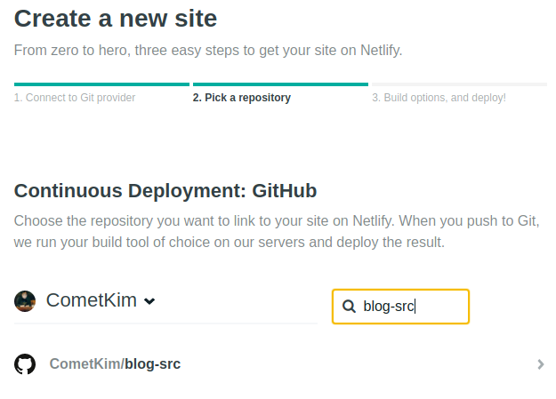

## TL;DR

최종적으로 선정한 플랫폼은 Gatsby + Netlify입니다.

[Gatsby](https://www.gatsbyjs.org/)는 무려 React와 GraphQL을 사용해 개발할 수 있고 엄청나게 빠른 퍼포먼스의 정적 사이트 생성기이고
[Netlify](https://www.netlify.com/)는 정적 사이트의 호스팅과 사이트 관리 기능을 제공하는 서비스입니다.

글 에서 두 플랫폼의 선정 배경과 간단한 소개를 하며, 이 후 다른 포스트에서 사용법이나 연계 방법을 자세히 설명할 예정입니다.

개발 중인 블로그의 [소스코드](https://github.com/CometKim/blog-src)와 [포스트](https://github.com/CometKim/blog-posts)는 100% 오픈소스로 라이센스 동의 하에 자유롭게 사용 및 의견 제시가 가능합니다.

## 들어가며

2018년이 되어 블로깅에 도전, 부끄럽지만 원래는 2017년 신년계획이였다.

이전에도 수 차례 워드프레스로 블로그를 구성하거나 운영해보긴 했으나 
테마나 플러그인을 탐색하는데 시간을 들이면서 기술적인 향상을 기대하기도 어려웠고 워낙 게으른 탓에 포스팅도 안하는데 호스팅 비용이 아까워 금방 다시 내리곤 했다.

자칭 웹 개발 공부한다면서 블로그 하나 없으면 안되지, 글이 안남는 것도 문제고, 돈 안들이고 다시 시작할 방법이 없을까.
가만보니 개발자들은 다들 정적 사이트 생성기로 기술 블로그 만드는게 유행하는 것 같아서 나도 따라해보기로 했다.


## 어떻게 만들지 고민하기
첨부터 정적 사이트로 만들려고 했던건 아니고 좀 ~~쓸 데 없이~~ 고민을 했다.

### CMS (Contents Management System)
처음엔 리액트 기반으로 CMS를 개발하려고 했다. 

하지만 블로그 만드는 프로젝트에선 블로그 자체가 리액트 공부보다 우선순위가 높다. 세상엔 이미 CMS들이 넘치는데 리액트 공부 목적으로 다른 걸 재발명하다가 막상 블로그가 안나오면 큰일이다.

배보다 배꼽이 커질 것 같아 일단 패스  
(나중에 기회가 되면 만들어보고 싶긴 하다) 

### Headless CMS
컨텐츠 관리하는 부분을 백엔드 서비스로 분리하고, 프론트엔드는 또 따로 만드는 방식이다.  
~~이 건 배에 배꼽이 두 개 있는 경우이다.~~

전형적인 마이크로서비스 방식의 진화로, RESTful 또는 GraphQL로 정의한 인터페이스를 중심으로 어드민, 에디터, 사이트 빌더 등의 주요 서비스 간의 의존성을 분리할 수 있고, MVC 방식에서 벗어나 View 구성이 매우 유연해진다.

그 예로, 최근 가장 큰 CMS인 Wordpress 또한 [Calypso](https://developer.wordpress.com/calypso/)라는 프로젝트를 통해 NodeJS API + React SPA 조합으로 탈바꿈을 한 바 있으며, ~~그냥 워드프레스 쓰면 된..~~ 모바일에서는 더 나은 사용자 경험을 위해 별도의 네이티브 앱을 제공한다. 

일단 Swagger나 Apollo로 API 정의부터 시작해야겠지만 API 설계는 제대로 해본적이 없는지라 부담스럽고,

[GraphQL CMS](https://graphcms.com/)도 고려했지만, 오픈소스가 아닌 외부 서비스에 의존하고 싶지 않았다.

### Static Site Generator
결국은 정적 사이트 생성기,

잘나가는 개발자들은 다들 GitHub Page로 정적 사이트 하나쯤은 올려두는 것 같다.

이유는 다양하겠지만 일단 평소에 마크다운과 Git을 자주 사용하는 개발자라면 평소에 쓰던 마크다운 에디터 하나로 CMS를 대체하기 충분하기 때문일 것이다. 

가장 유명한 생성기는 [Jekyll](https://jekyllrb.com/)인데, Ruby 언어로 되어있기 때문에 남들이 만들어놓은 테마나 플러그인만 끄적이면서 시간 보내지 않으려면 Ruby를 본격적으로 공부하거나 다른 생성기를 찾아야 할 것 같았다.

## GatsbyJS
> Blazing-fast static site generator for React
> 
> <small>기막히게 빠른 정적 사이트 생성기</small>

- [홈페이지](https://www.gatsbyjs.org/)
- [GitHub](https://github.com/gatsbyjs/gatsby)
- [문서](https://www.gatsbyjs.org/docs/)

비슷한 시기, [한 트친님이 Gatsby로 블로그를 새단장 하셨다는 소식](https://emaren84.github.io/posts/creating-new-blog-with-gatsby/)을 보게 되면서 Gatsby의 존재를 알게 되었다.

이 때까지만 해도 React는 SPA 개발용이고 정적 컨텐츠와는 안어울리며 서버 사이드 렌더링은 끔찍한 혼종인 줄 알았는데 완전 착각이라는 사실을 알 게 됐다.

> 두번 렌더링한다구요? 네.
>
> <small>[Subicura님 블로그에서 서버 사이드 렌더링에 대한 포스트](https://subicura.com/2016/06/20/server-side-rendering-with-react.html)를 보고 늦게나마 제대로 이해할 수 있었다.</small>


Gatsby는 무려 React + GraphQL 조합으로 정적사이트를 만들 수 있다. 리액트로 페이지를 만들고 빌드하면 서버 사이드 렌더링이 적용된 SPA와 동일한 동작을 하는 정적사이트가 만들어진다.

동작방식은 대략 이렇다.
- 그래프 형태의 데이터 인터페이스를 제공한다.  
- 데이터 노드를 자유롭게 구성한다. 미리 구성된 플러그인을 통해 확장할 수 있다.
- 이 데이터 기반으로 API가 만들어진다. GraphQL로 쿼리해서 페이지 생성할 때 주입할 수 있다.
- 모든 페이지 경로에 렌더링된 인덱스를 생성한다.

[만드신 분](https://github.com/KyleAMathews)께 정말 존경을 표한다.

이미 많은 사이트/블로그들이 사용하고 있어서 커뮤니티도 제법 크고 활발하다. 대표적으로는 React 홈페이지도 Gatsby를 사용한다.

제공되는 [CLI](https://www.npmjs.com/package/gatsby-cli)를 설치하면 [Starter 목록](https://www.gatsbyjs.org/docs/gatsby-starters/) 중 맘에 드는 걸 골라서 아주 쉽게 시작할 수 있다.
```
yarn global add gatsby-cli
gatsby new <PROJECT NAME> [URL_OF_STARTER_GIT_REPO]
```

나는 최대한 가볍게 시작하기 위해 [기본 + Typescript 구성이 조금 추가된 스타터](https://github.com/haysclark/gatsby-starter-typescript)를 사용했다.

## Netlify
> Deploy modern static websites with our automated platform. Add best practices like SSL, CDN distribution, caching and continuous deployment with a single click.
>
> <small>자동화된 정적 웹사이트 배포 플랫폼. SSL, CDN, CI/CD를 클릭 한 번에!</small>

[Netlify](https://www.netlify.com/)는 정적 사이트를 호스팅해주는 것은 물론, 자동 빌드/배포, DNS, SSL, CDN 설정 등 온갖 자동화된 사이트 관리 기능들을 **무료**로 제공한다.

모든 설정이 자동화가 충분히 되있어서 신경쓸게 별로 없다.



사이트를 만들고 싶으면 스크린샷처럼 GitHub / GitLab / BitBucket 계정으로 연결한 후, 소스가 있는 레파지토리를 선택한다.

_소스 코드 레파지토리_가 있으면 된다. Node, Ruby, Python 빌드를 지원하기 때문에 GitHub Pages처럼 직접 빌드 결과물을 레파지토리에 올려야할 필요가 없다.


배포할 브랜치, 빌드 스크립트, 사이트 Output 디렉토리를 선택하면 기본적인 설정이 끝난다. 첫 배포 후 관리메뉴에 가면 더 많은 설정들이 있지만 맹세컨데 어려운 설정은 단 하나도 없다.

1분이면 된다!! 못 믿겠다면 버튼을 눌러보자 

[](https://app.netlify.com/start/deploy?repository=https://github.com/haysclark/gatsby-starter-typescript)

----
